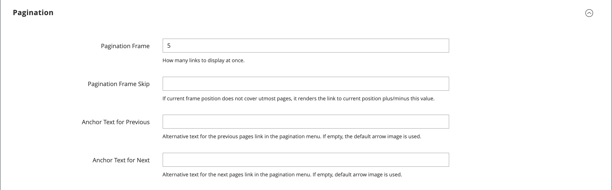

# 产品列表

产品清单可以设置为默认显示为列表或网格。 您还可以确定每页显示的产品数量，以及用于对列表进行排序的属性。 产品列表包含一组控件，可用于对产品进行排序、更改列表格式、按属性排序以及从一页前进到下一页。

>[!NOTE]
>
>按产品属性对类别进行排序时，具有相同属性值的产品也会按其&#x200B;_[!UICONTROL Product ID]_&#x200B;的升序排序。

{width="700" zoomable="yes"}

## 配置产品列表

1. 在&#x200B;_管理员_&#x200B;侧边栏上，转到&#x200B;**[!UICONTROL Stores]** > _[!UICONTROL Settings]_>**[!UICONTROL Configuration]**。

1. 在左侧面板中，展开&#x200B;**[!UICONTROL Catalog]**&#x200B;并在下面选择&#x200B;**[!UICONTROL Catalog]**。

1. 展开&#x200B;**[!UICONTROL Storefront]**&#x200B;部分的。

   {width="600" zoomable="yes"}

   有关这些选项的详细列表，请参阅&#x200B;_配置引用_&#x200B;中的[店面](../configuration-reference/catalog/catalog.md#storefront)。

   >[!NOTE]
   >
   >若要根据&#x200B;_产品按价格排序_&#x200B;正确显示产品及其价格，请确保[增值税配置](../configuration-reference/sales/tax.md)中显示的价格设置具有相同的值（`Excluding Tax` **或** `Including Tax`）。 对于&#x200B;_[!UICONTROL Calculation Settings]_，检查&#x200B;**[!UICONTROL Catalog Prices]**&#x200B;值。 对于&#x200B;_[!UICONTROL Price Display Settings]_，请检查&#x200B;**[!UICONTROL Display Product Prices in Catalog]**&#x200B;值。 如果它们的值不同，则分层导航中的价格过滤器可能无法正确过滤和排序产品。

1. 将默认&#x200B;**[!UICONTROL List Mode]**&#x200B;设置为以下项之一：

   - `Grid Only`
   - `List Only`
   - `Grid (default) / List`
   - `List (default / Grid`

1. 对于&#x200B;**[!UICONTROL Products per Page on Grid Allowed Values]**，输入您希望以网格格式显示时每页显示的产品数。

   要输入一组值，请用逗号分隔每个数字。

1. 对于&#x200B;**[!UICONTROL Products per Page on Grid Default Value]**，输入每页网格中默认显示的产品数。

1. 对于&#x200B;**[!UICONTROL Products per Page on List Allowed Values]**，输入您希望每个页面在列表格式中显示的产品数。

   要输入一组值，请用逗号分隔每个数字。

1. 对于&#x200B;**[!UICONTROL Products per page on List Default Value]**，输入每个页面在列表中显示的默认产品数。

1. 将&#x200B;**[!UICONTROL Product Listing Sorted by]**&#x200B;设置为最初用于对列表进行排序的默认属性。

1. 若要让客户可以选择列出所有产品，请将&#x200B;**[!UICONTROL Allow All Products on Page]**&#x200B;设置为`Yes`。

1. 如果要在客户浏览目录列表时保留所有分页设置，请将&#x200B;**[!UICONTROL Remember Category Pagination]**&#x200B;设置为`Yes`。

   启用此设置可确保当购物者从一个类别浏览到另一个类别时，列表或网格中显示的产品数会保留。 默认情况下，此字段设置为`No`，因为它使用更多的缓存空间，并且可能影响搜索引擎对页面编制索引的方式。

1. 如果使用[平面目录](catalog-flat.md) （**不推荐**），请执行以下操作：

   - 要显示产品的平面类别列表，请将&#x200B;**[!UICONTROL Use Flat Catalog Category]**&#x200B;设置为`Yes`。

   - 要显示平面产品清单，请将&#x200B;**[!UICONTROL Use Flat Catalog Product]**&#x200B;设置为`Yes`。

1. 如果要允许类别和产品URL中的媒体资产使用动态引用，请将&#x200B;**[!UICONTROL Allow Dynamic Media URLs in Products and Categories]**&#x200B;设置为`Yes`。

1. 完成后，单击&#x200B;**[!UICONTROL Save Config]**。

## 页面控件

| 控件 | 描述 |
|--- |--- |
| [!UICONTROL View As] | 以网格或列表格式显示产品。 |
| [!UICONTROL Sort By] | 更改列表的排序顺序。 |
| [!UICONTROL Show Per Page] | 确定每页显示的产品数量。 |
| 分页链接 | 导航链接到其他页面。 |

{style="table-layout:auto"}

## 分页控件

“分页”设置显示在列表的顶部和底部，并控制产品清单的分页链接的格式。 您可以设置控件中显示的链接数量，并配置下一个和上一个链接。 要显示分页链接，列表中必须存在比产品列表配置中每页允许的更多的产品。

{width="700" zoomable="yes"}

### 店面分页控件

| 控件 | 描述 |
|--- |--- |
|  | [!UICONTROL View As] — 以Grid或List格式显示列表。 |
|  | [!UICONTROL Sort By] — 更改列表的排序顺序。 _[!UICONTROL Used for Sorting in Product Listing]_&#x200B;storefront属性确定哪些[产品属性](../catalog/product-attributes.md)可用于对列表进行排序。 |
| 每页 | [!UICONTROL Show Per Page] — 确定每页显示的产品数。 |
|  | 分页链接 — 导航到其他页面的链接。 |

{style="table-layout:auto"}

### 配置分页控件

1. 在&#x200B;_管理员_&#x200B;侧边栏上，转到&#x200B;**[!UICONTROL Content]** > _[!UICONTROL Design]_>**[!UICONTROL Configuration]**。

1. 查找要配置的商店视图，然后在&#x200B;**[!UICONTROL Action]**&#x200B;列中单击&#x200B;**[!UICONTROL Edit]**。

1. 在&#x200B;**[!UICONTROL Other Settings]**&#x200B;下，展开&#x200B;**[!UICONTROL Pagination]**&#x200B;部分的。

   {width="600" zoomable="yes"}

   有关这些设置的详细信息，请参阅[设计配置](../content-design/configuration.md)。

1. 对于&#x200B;**[!UICONTROL Pagination Frame]**，输入要在分页控件中显示的链接数。

1. 对于&#x200B;**[!UICONTROL Pagination Frame Skip]**，输入要在分页控件中显示下一组链接之前预先跳过的链接数。

   例如，如果分页框架有五个链接，而您希望跳转到接下来的五个链接，则您要向前跳过多少个链接？ 如果将该值设置为4 (`4`)，则上一个集合中的最后一个链接是下一个集合中的第一个链接。

1. 对于&#x200B;**[!UICONTROL Anchor Text for Previous]**，输入您想在上一个链接中显示的文本。

   留空将使用默认箭头。

1. 对于&#x200B;**[!UICONTROL Anchor Text for Next]**，输入您要在“下一步”链接中显示的文本。 留空将使用默认箭头。

1. 完成后，单击&#x200B;**[!UICONTROL Save Configuration]**。
