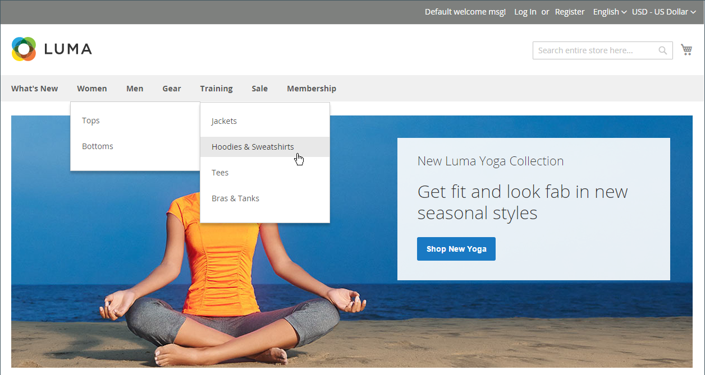

# 顶部导航

商店的主菜单类似于商店中不同部门的目录。 每个选项代表不同的产品类别。 顶部导航的位置和显示方式可能因主题而异，但其工作方式基本上相同。

{width="700" zoomable="yes"}

目录的类别结构会影响搜索引擎为您的网站编制索引的效果。 嵌套的类别越深，就越不可能将其完全编入索引。 通常，使用可见级别一到三个之间是最有效的。 [根类别](category-root.md)计为第一级，但不会显示在菜单中。 顶部导航中可用级别的最大数量由配置决定。 此外，您的商店主题支持的菜单级别数量可能会受到限制。 例如，示例Luma主题最多支持五个级别，包括根。

## 对菜单级别计数

| 项目 | 描述 |
|--- |--- |
| 1级 | 第一级是根类别，在示例数据中将其命名为“Default Category”（默认类别）。 根是菜单的容器，其名称在菜单中不会显示为选项。 |
| 2级 | 在桌面显示屏上，顶部导航是显示在页面顶部的主菜单。 在移动设备上，主菜单通常显示为选项的弹出菜单。 Luma商店中的第二级选项为&#x200B;_新增功能_、_女性_、_男性_、_齿轮_、_培训_&#x200B;和&#x200B;_销售_。 |
| 3级 | 第三级显示在每个主菜单选项的下方。 例如，在&#x200B;_女性_&#x200B;下，第三级选项为&#x200B;_顶部_&#x200B;和&#x200B;_底部_。 |
| 4级 | 第四级选项是从第三级选项弹出来的子类别。 例如，在&#x200B;_Tops_&#x200B;下，第四层菜单选项为&#x200B;_夹克_、_连帽衫和运动衫_、_T恤_&#x200B;和&#x200B;_胸罩和背心_。 |

{style="table-layout:auto"}

## 设置顶部导航

对于要显示在商店顶部导航中的类别，请完成以下步骤：

### 步骤1：创建类别

1. 在&#x200B;_管理员_&#x200B;侧边栏上，转到&#x200B;**[!UICONTROL Catalog]** > **[!UICONTROL Categories]**。

1. 设置&#x200B;**[!UICONTROL Store View]**&#x200B;以确定新类别在何处可用。

1. 在类别树中，选择新类别的父类别。

   如果您从头开始，没有任何数据，则列表中可能只有两个类别：_默认类别_（根）和&#x200B;_示例类别_。

1. 单击&#x200B;**[!UICONTROL Add Subcategory]**。

1. 使用以下设置完成基本信息：

   - **[!UICONTROL Enable Category]**&#x200B;设置为`Yes`
   - **[!UICONTROL Include in Menu]**&#x200B;设置为`Yes`

1. 在“显示设置”中，将&#x200B;**[!UICONTROL Anchor]**&#x200B;设置为`Yes`。

1. 完成任何其他必需的[类别设置](category-create.md)。

1. 完成后，单击&#x200B;**[!UICONTROL Save]**。

对于多存储安装，可以为每个[存储](../stores-purchase/stores.md#add-stores)分配不同的主菜单作为[根类别](category-root.md)。

### 第2步：设置顶部导航的深度

1. 在&#x200B;_管理员_&#x200B;侧边栏上，转到&#x200B;**[!UICONTROL Stores]** > _[!UICONTROL Settings]_>**[!UICONTROL Configuration]**。

1. 在左侧面板中，展开&#x200B;**[!UICONTROL Catalog]**&#x200B;并在下面选择&#x200B;**[!UICONTROL Catalog]**。

1. 展开&#x200B;**[!UICONTROL Category Top Navigation]**&#x200B;部分。

   {width="600" zoomable="yes"}

   由于顶部导航的深度具有全局[配置范围](../getting-started/websites-stores-views.md#scope-settings)，因此该设置适用于Commerce安装中的所有网站、商店和商店视图。 仅当左上角的&#x200B;_[!UICONTROL Store View]_&#x200B;设置为`Default Config`时，_[!UICONTROL Category Top Navigation]_&#x200B;配置部分才可用。

   有关这些选项的详细列表，请参阅&#x200B;_配置引用_&#x200B;中的[类别顶部导航](../configuration-reference/catalog/catalog.md#layered-navigation)。

1. 要限制顶部导航中显示的子类别数，请输入&#x200B;**[!UICONTROL Maximal Depth]**&#x200B;的数字。

   默认值为`0`，该值不限制子类别级别的数量。

1. 完成后，单击&#x200B;**[!UICONTROL Save Config]**。
