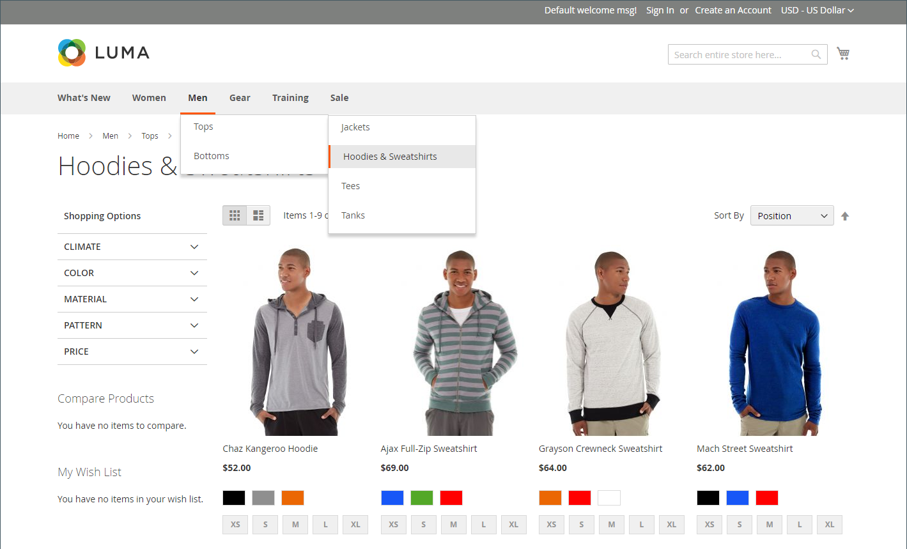

# 目录导航

术语&#x200B;_导航_&#x200B;是指购物者在整个商店中用于在不同页面之间移动的方法。 商店的主菜单或顶部导航实际上是一个类别链接列表，可让您轻松访问目录中的产品。 此外，痕迹导航跟踪中的类别也会出现在大多数页面的顶部，而分层导航中的类别则会出现在某些两列或三列页面的左侧。 有关类别显示选项的更多信息，请参阅[显示设置](categories-display-settings.md)。

要使产品在您的商店中可见，必须将其至少分配给一个类别（请参阅[设置顶部导航](navigation-top.md)）。 每个类别都可以有一个专用的登陆页面，其中包含图像、静态块、描述和类别中的产品列表。 您还可以为只在特定时间段内处于活动状态的类别页面（如假日或促销活动）创建特殊设计。

{width="700" zoomable="yes"}
