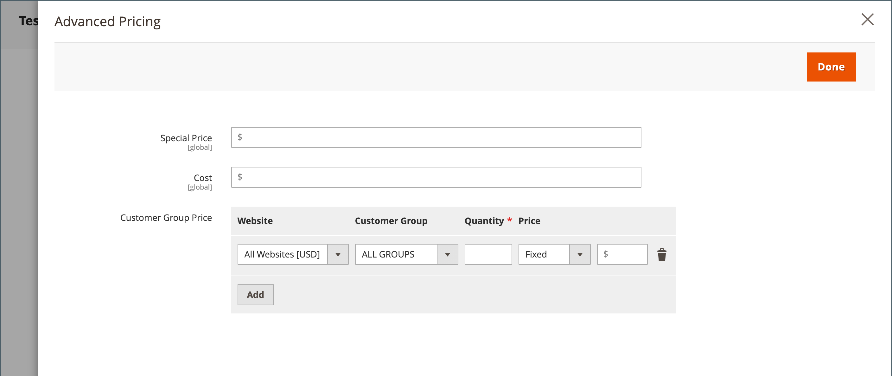

# 高级定价

Adobe Commerce和Magento Open Source支持各种定价选项，可用于促销或满足制造商的最低广告定价要求。 您可以按计划或按在产品级别或购物车中应用的价格规则对产品定价进行更改。

使用高级定价管理产品的价格，为客户提供更高的价格，从而鼓励消费者增加支出、增加网站流量并清理旧库存。

_[!UICONTROL Advanced Pricing]_设置定义了适用于特定客户组或共享目录的特殊定价所需的条件。 高级定价可应用于简单、虚拟、可下载和捆绑销售的产品。 若要将折扣定价应用于其他产品类型，请使用[目录价格规则](../merchandising-promotions/price-rules-catalog.md)。 有关详细信息，请参阅[价格范围](catalog-price-scope.md)。

高级定价数据与产品页面同步。 例如，如果您更新了层价格数量，则系统将更新产品页面上的值。

(仅适用于[Adobe Commerce B2B](./b2b/../introduction.md))如果您使用共享目录，则高级定价数据将与产品页面和共享目录同步。 例如，如果您更新了层价格数量，则系统将更新共享目录和产品页面中的值。 共享目录中指示的任何自定义定价均优先于客户组定价。 另请参阅&#x200B;_Adobe Commerce B2B指南_&#x200B;中的[设置共享目录定价和结构](https://experienceleague.adobe.com/docs/commerce-admin/b2b/shared-catalogs/define/catalog-shared-pricing-structure.html)。

{width="600" zoomable="yes"}

## 访问高级定价选项

1. 在编辑模式下打开产品。

1. 在&#x200B;**[!UICONTROL Price]**&#x200B;下，单击&#x200B;**[!UICONTROL Advanced Pricing]**。

1. 按照说明说明获得所需的高级定价类型。

   - [组价格](product-price-group.md)

   - [特价](product-price-special.md)

   - [层价格](product-price-tier.md)

   - [最低广告价格](product-price-minimum-advertised.md)

## 页面引用

### [!UICONTROL Special Price]

要在指定的时间段或计划的促销活动中提供折扣价格，请输入特殊价格。 如果有特殊价格，则会忽略零售价格，并且特殊价格会显示在下面粗体大文本中。

#### [!UICONTROL Special Price From]日期

{{ce-feature}}

| 字段 | 描述 |
| ---- | ----------- |
| [!UICONTROL From] | 设置特殊价格可用的第一个日期。 您可以输入日期或从日历中选择日期。 |
| [!UICONTROL To] | 设置特殊价格的最后可用日期。 您可以输入日期或从日历中选择日期。 |

{style="table-layout:auto"}

### [!UICONTROL Cost]

输入物料的实际成本。

### [!UICONTROL Customer Group Price]

{width="600" zoomable="yes"}

设置特定客户组的促销和层级价格。

| 项目 | 描述 |
| ---- | ----------- |
| [!UICONTROL Website] | 标识应用组价格规则的网站。 仅当安装有多个网站时，才会显示此选项。 |
| [!UICONTROL Customer Group] | （必需）确定有资格接收折扣价的客户群体。 当组或目录字段中的值发生更改时，与先前设置匹配的相应自定义价格行将从共享目录中删除。  **[!UICONTROL ALL GROUPS]**— 将规则应用于所有客户组。 **[!UICONTROL NOT LOGGED IN]** — 将未登录的规则来宾和客户应用到其帐户。 |
| [!UICONTROL Quantity] | 指定接收层价格所需的数量。 |
| [!UICONTROL Price] | （必需）指定特定网站中客户组成员可使用的固定或折扣产品价格。 选项：  **[!UICONTROL Fixed]**— （默认）折扣价格以固定的小数值输入。 例如，输入`9.99`作为折扣价。 **[!UICONTROL Discount]** — 折扣价格以基本产品价格的百分比(%)输入。 例如，输入`10`获得10%的折扣。 |
|  | 删除当前规则。 |
| **[!UICONTROL Add]** | 为新规则插入另一行。 |

{style="table-layout:auto"}

### [!UICONTROL Catalog and Tier Price]

设置特定共享目录和客户组的促销和层级价格。

{{b2b-feature}}

{width="600" zoomable="yes"}

| 项目 | 描述 |
|----|-----------|
| [!UICONTROL Website] | 标识应用组价格规则的网站。 仅当安装有多个网站时，才会显示此选项。  **_重要信息：_**在[目录价格范围](catalog-price-scope.md)配置中选择_网站&#x200B;_，否则将显示**所有&#x200B;**网站的设置高级价格。 |
| [!UICONTROL Group or Catalog] | （必需）标识有资格接收折扣价的客户组或共享目录。 当组或目录字段中的值发生更改时，与先前设置匹配的相应自定义价格行将从共享目录中删除。  **[!UICONTROL ALL GROUPS]**— 将规则应用于所有客户组。 该值不会应用于共享目录，并且高级定价数据的更改不会与共享目录同步。 **[!UICONTROL NOT LOGGED IN]** — 将未登录的规则来宾和客户应用到其帐户。 **[!UICONTROL Shared Catalogs]**— 将规则应用于特定共享目录。 |
| 数量 | 指定接收层价格所需的数量。 |
| [!UICONTROL Price] | （必需）指定特定网站中客户组成员可使用的固定或折扣产品价格。 选项：  **[!UICONTROL Fixed]**— （默认）折扣价格以固定的小数值输入。 例如，输入`9.99`作为折扣价。 **[!UICONTROL Discount]** — 折扣价格以基本产品价格的百分比(%)输入。 例如，输入`10`获得10%的折扣。 |
|  | 删除当前规则。 |
| **[!UICONTROL Add]** | 为新规则插入另一行。 |

{style="table-layout:auto"}

### [!UICONTROL Minimum Advertised Price]

产品的最低广告价格(MAP)。

### [!UICONTROL Display Actual Price]

确定客户能够看到产品实际价格的位置。

| 项目 | 描述 |
|----|-----------|
| [!UICONTROL Use Config] | 使用当前配置设置进行价格显示。 |
| [!UICONTROL On Gesture] | 在弹出窗口中显示实际产品价格，以响应&#x200B;_单击价格_&#x200B;或&#x200B;_这是什么？_&#x200B;链接。 |
| [!UICONTROL In Cart] | 显示购物车中的实际产品价格。 |
| [!UICONTROL Before Order Confirmation] | 在提交订单之前，显示结账流程结束时的实际产品价格。 |

{style="table-layout:auto"}
