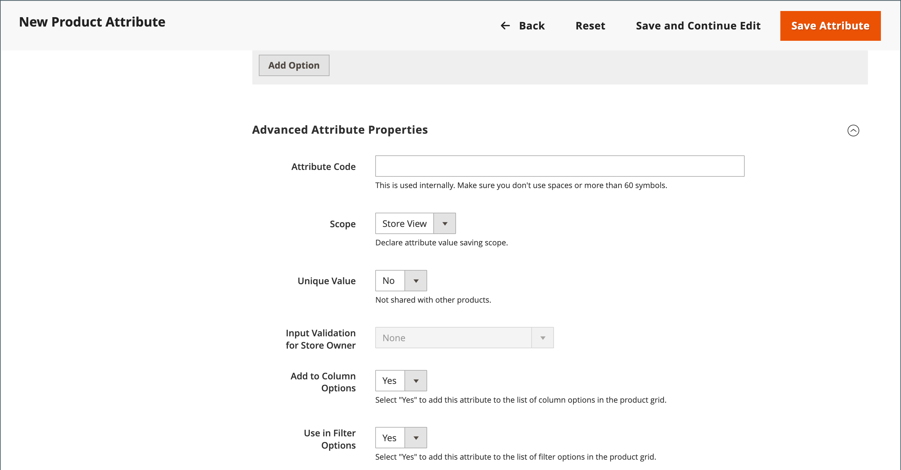

# 将属性添加到产品

虽然属性主要通过[商店](../stores-purchase/stores-menu.md)菜单进行管理，但您也可以在处理产品时即时添加新属性&#x200B;__。 您可以从现有属性列表中进行选择或创建属性。 新属性已添加到产品所基于的[属性集](../catalog/attribute-sets.md)中。

## 步骤1：添加属性

1. 在编辑模式下打开产品。

1. 单击右上角的&#x200B;**[!UICONTROL Add Attribute]**。

   {width="600" zoomable="yes"}

1. 若要向产品添加现有属性，请使用[筛选器控件](../getting-started/admin-grid-controls.md)在网格中查找该属性并执行以下操作：

   - 选中要添加的每个属性的第一列中的复选框。

   - 单击&#x200B;**[!UICONTROL Add Selected]**。

   {width="600" zoomable="yes"}

1. 要定义新属性，请单击&#x200B;**[!UICONTROL Create New Attribute]**&#x200B;并完成步骤2中的项。

## 步骤2：描述基本属性属性

{width="600" zoomable="yes"}

1. 在&#x200B;_[!UICONTROL Attribute Properties]_&#x200B;下，输入&#x200B;**[!UICONTROL Attribute Label]**&#x200B;以标识属性。

1. 将&#x200B;**[!UICONTROL Catalog Input Type for Store Owner]**&#x200B;设置为要用于数据输入的[输入控件](attributes-input-types.md)的类型。

   如果属性用于[可配置产品](product-create-configurable.md)，请选择`Dropdown`。 然后，将&#x200B;**[!UICONTROL Required]**&#x200B;设置为`Yes`。

1. 对于`Dropdown`和`Multiple Select`输入类型，请执行以下操作：

   - 在&#x200B;**[!UICONTROL Values]**&#x200B;下，单击&#x200B;**[!UICONTROL Add Value]**。

   - 输入要显示在列表中的第一个值。

     您可以为管理员输入一个值，并为每个商店视图输入值的转换。 如果您只有一个商店视图，则只能输入管理员值，并且该值也用于店面。

   - 单击&#x200B;**[!UICONTROL Add Value]**&#x200B;并对要包含在列表中的每个选项重复上一步。

   - 选择&#x200B;**[!UICONTROL Is Default]**&#x200B;以使用该选项作为默认值。

   {width="600" zoomable="yes"}

1. 如果要要求客户在购买产品之前选择一个选项，请将&#x200B;**[!UICONTROL Required]**&#x200B;设置为`Yes`。

## 步骤3：描述高级属性（可选）

{width="600" zoomable="yes"}

1. 以小写字符输入唯一&#x200B;**[!UICONTROL Attribute Code]**，且不含空格。

1. 设置&#x200B;**[!UICONTROL Scope]**&#x200B;以指示在存储层次结构中可以使用属性的位置。

   如果属性用于[可配置产品](product-create-configurable.md)，请选择`Global`。

1. 如果此特性仅适用于此产品，请将&#x200B;**[!UICONTROL Unique Value]**&#x200B;设置为`Yes`。

1. 要对输入到文本字段中的任何数据运行有效性测试，请将&#x200B;**[!UICONTROL Input Validation for Store Owner]**&#x200B;设置为字段应包含的数据类型。

   此字段不可用于具有选定值的输入类型。 输入验证可用于以下任意内容：

   - `Decimal Number`
   - `Integer Number`
   - `Email`
   - `URL`
   - `Letters`
   - `Letters (a-z, A-Z) or Numbers (0-9)`

   {width="500"}

1. 如果要在Products网格中作为列包含特性，请将&#x200B;**[!UICONTROL Add to Column Options]**&#x200B;设置为`Yes`。

1. 如果要能够按此列筛选&#x200B;_[!UICONTROL Products]_&#x200B;网格，请将&#x200B;**[!UICONTROL Use in Filter Options]**&#x200B;设置为`Yes`。

## 步骤4：输入字段标签

1. 展开&#x200B;**[!UICONTROL Manage titles]**&#x200B;部分的。

1. 输入要用作字段标签的&#x200B;**[!UICONTROL Title]**。

   如果您的商店以不同的语言提供，则可以为每个视图输入已翻译的标题。

   {width="600" zoomable="yes"}

## 步骤5：描述店面属性

1. 展开&#x200B;**[!UICONTROL Storefront Properties]**&#x200B;部分的。

   {width="600" zoomable="yes"}

1. 若要使该属性可用于搜索，请将&#x200B;**[!UICONTROL Use in Search]**&#x200B;设置为`Yes`。

1. 若要在产品比较中包含该属性，请将&#x200B;**[!UICONTROL Comparable on Storefront]**&#x200B;设置为`Yes`。

1. 要在分层导航中包含下拉列表、多选或价格属性，请将&#x200B;**[!UICONTROL Use in Search Results Layered Navigation]**&#x200B;设置为以下项之一：

   - `Filterable (with results)` — 分层导航仅包含那些可以找到匹配产品的筛选器。 任何已应用于列表中显示的所有产品的属性值都不会显示为可用过滤器。 可用过滤器列表中还会忽略计数为零(0)的产品匹配的属性值。  产品过滤列表只包含与过滤条件匹配的产品。 仅当选定的过滤器更改了显示的内容时，才会更新产品列表。

   - `Filterable (no results)` — 分层导航包含所有可用属性值的筛选器及其产品计数，包括零(0)产品匹配的产品。 如果属性值是样本，则该值将显示为过滤器，但会被划掉。

   >[!NOTE]
   >
   >当&#x200B;_[!UICONTROL Use in Search]_&#x200B;设置设置为`No`时，不显示&#x200B;_[!UICONTROL Use in Search Results Layered Navigation]_&#x200B;设置，并且在具有任何[!UICONTROL Use in Layered Navigation]设置值的搜索中不会使用产品属性。

1. 要在搜索结果页面的分层导航中使用属性，请将&#x200B;**[!UICONTROL Use in Search Results Layered Navigation]**&#x200B;设置为`Yes`并在&#x200B;**[!UICONTROL Position]**&#x200B;字段中输入一个数字。

   位置编号表示属性在分层导航块中的相对位置。

   >[!NOTE]
   >
   >_[!UICONTROL Position]_&#x200B;字段默认呈灰显状态，您必须先保存该属性，然后才能修改此设置。

1. 要在价格规则中使用属性，请将&#x200B;**[!UICONTROL Use for Promo Rule Conditions]**&#x200B;设置为`Yes`。

1. 若要允许使用HTML设置文本格式，请将&#x200B;**[!UICONTROL Allow HTML Tags on Storefront]**&#x200B;设置为`Yes`。

   此设置使WYSIWYG编辑器在编辑字段时可用。

1. 若要在产品页面上包含该属性，请将&#x200B;**[!UICONTROL Visible on Catalog Pages on Storefront]**&#x200B;设置为`Yes`。

1. 按照主题的支持，完成以下设置：

   - 若要在产品列表中包含该属性，请将&#x200B;**[!UICONTROL Used in Product Listing]**&#x200B;设置为`Yes`。

   - 要将属性用作产品清单的排序参数，请将&#x200B;**[!UICONTROL Used for Sorting in Product Listing]**&#x200B;设置为`Yes`。

1. 完成后，单击&#x200B;**[!UICONTROL Save Attribute]**。
