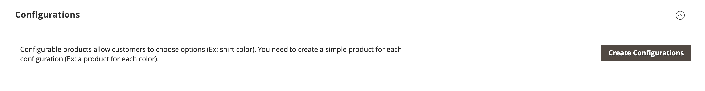

# 产品设置 — [!UICONTROL Configurations]

_[!UICONTROL Configurations]_&#x200B;部分列出了产品的所有现有变体，并可用于生成变体以用于可配置产品类型。 有关详细信息，请参阅[可配置产品](product-create-configurable.md)。

{width="600" zoomable="yes"}

{width="600" zoomable="yes"}

## 字段引用

| 字段 | 描述 |
|--- |--- |
| [!UICONTROL Image] | 产品图像 |
| [!UICONTROL Name] | 产品的唯一名称 |
| [!UICONTROL SKU] | 基于产品名称 |
| [!UICONTROL Price] | 产品价格 |
| [!UICONTROL Quantity] | 每种产品的现有库存量 |
| [!UICONTROL Weight] | 产品重量 |
| [!UICONTROL Status] | 产品状态&#x200B;**[!UICONTROL Enabled]** / **[!UICONTROL Disabled]** |
| [!UICONTROL Attributes] | 用于描述产品的一组属性 |
| [!UICONTROL Actions] | 列出可应用于选定产品的所有操作。 操作：  **[!UICONTROL Choose a different Product]** — 删除当前产品并使用新选择内容替换。  **[!UICONTROL Disable Product]** / **[!UICONTROL Enable Product]** — 禁用或启用所选产品。  **[!UICONTROL Remove Product]** — 从当前配置中删除所选产品。 |

{style="table-layout:auto"}
