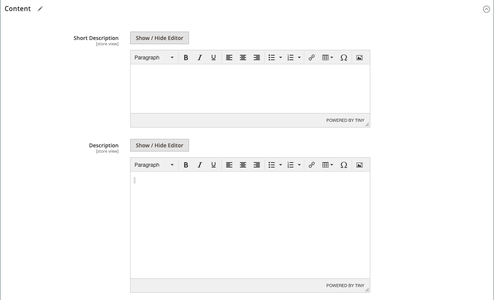

# 产品设置 —  [!UICONTROL Content]

此 _[!UICONTROL Content]_部分用于输入和编辑产品页面上显示的主要产品说明。 简短描述可用于大多数RSS源，也可能显示在目录列表中，具体取决于 [主题](../content-design/themes.md).

## 在中添加产品描述 [!DNL Page Builder]

1. 在编辑模式下打开产品。

1. 向下滚动并展开  该 **[!UICONTROL Content]** 部分。

   {width="600" zoomable="yes"}

1. 输入 **[!UICONTROL Short Description]** ，并使用 [编辑器工具栏](../content-design/editor.md) 以根据需要进行格式化。

1. 在 **[!UICONTROL Description]** 标签，单击 **[!UICONTROL Edit with Page Builder]**.

1. 使用 [[!DNL Page Builder]](../page-builder/introduction.md) 内容工具 [编辑现有文本](../page-builder/text.md) 并添加其他内容（如果需要）。

## [!DNL Page Builder] 预览

当您展开 _[!UICONTROL Content]_现有产品的区域，其中包含创建内容 [!DNL Page Builder]，它显示&#x200B;**[!UICONTROL Description]**产品页面中显示的内容。 打开 [!DNL Page Builder] 工作区，您可以在其中通过单击&#x200B;**[!UICONTROL Edit with Page Builder]**.

{width="600" zoomable="yes"}

默认情况下，产品和类别表单将启用此内容预览。 如果性能因加载预览而受到影响，您可以在中禁用预览 [内容管理配置](../configuration-reference/general/content-management.md#advanced-content-tools) 设置。

## 在编辑器中添加产品说明

如果 [!DNL Page Builder] 您的商店已禁用，请使用文本编辑器添加产品内容。 在文本框中只输入纯ASCII字符。 如果从文字处理器粘贴文本，请首先将其保存为纯.TXT文件，以删除任何不可见的控制字符。 有关更多信息，请参阅 [使用编辑器](../content-design/editor.md).

1. 在编辑模式下打开产品。

1. 向下滚动并展开  该 **[!UICONTROL Content]** 部分。

   {width="600" zoomable="yes"}

1. 输入 **[!UICONTROL Short Description]** 所需的产品和格式。

1. 输入主产品 **[!UICONTROL Description]** 并根据需要使用编辑器工具栏设置格式。

   您可以拖动右下角来更改文本框的高度。
