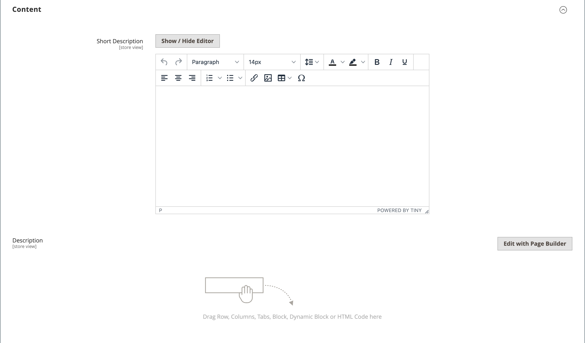

# 产品设置 — [!UICONTROL Content]

_[!UICONTROL Content]_部分用于输入和编辑产品页面上显示的主要产品说明。 简短描述可用于大多数RSS源，也可能出现在目录列表中，具体取决于[主题](../content-design/themes.md)。

## 在[!DNL Page Builder]中添加产品说明

1. 在编辑模式下打开产品。

1. 向下滚动并展开&#x200B;**[!UICONTROL Content]**&#x200B;部分的。

   {width="600" zoomable="yes"}

1. 输入产品的&#x200B;**[!UICONTROL Short Description]**&#x200B;并根据需要使用[编辑器工具栏](../content-design/editor.md)设置格式。

1. 在&#x200B;**[!UICONTROL Description]**&#x200B;标签上，单击&#x200B;**[!UICONTROL Edit with Page Builder]**。

1. 使用[[!DNL Page Builder]](../page-builder/introduction.md)内容工具[编辑现有文本](../page-builder/text.md)并添加其他内容（如果需要）。

## [!DNL Page Builder]预览

当您展开现有产品的&#x200B;_[!UICONTROL Content]_部分时，其中存在使用[!DNL Page Builder]创建的内容，它将显示&#x200B;**[!UICONTROL Description]**内容的预览，就像在产品页面中一样。 单击&#x200B;**[!UICONTROL Edit with Page Builder]**打开[!DNL Page Builder]工作区，您可以在其中进行任何需要的更新。

{width="600" zoomable="yes"}

默认情况下，产品和类别表单将启用此内容预览。 如果性能因加载预览而受到影响，则可以在[内容管理配置](../configuration-reference/general/content-management.md#advanced-content-tools)设置中禁用预览。

## 在编辑器中添加产品说明

如果您的商店禁用了[!DNL Page Builder]，请使用文本编辑器添加产品内容。 在文本框中只输入纯ASCII字符。 如果从文字处理器粘贴文本，请首先将其保存为纯.TXT文件，以删除任何不可见的控制字符。 有关详细信息，请参阅[使用编辑器](../content-design/editor.md)。

1. 在编辑模式下打开产品。

1. 向下滚动并展开&#x200B;**[!UICONTROL Content]**&#x200B;部分的。

   {width="600" zoomable="yes"}

1. 根据需要输入产品和格式的&#x200B;**[!UICONTROL Short Description]**。

1. 输入主产品&#x200B;**[!UICONTROL Description]**，并根据需要使用编辑器工具栏设置格式。

   您可以拖动右下角来更改文本框的高度。
