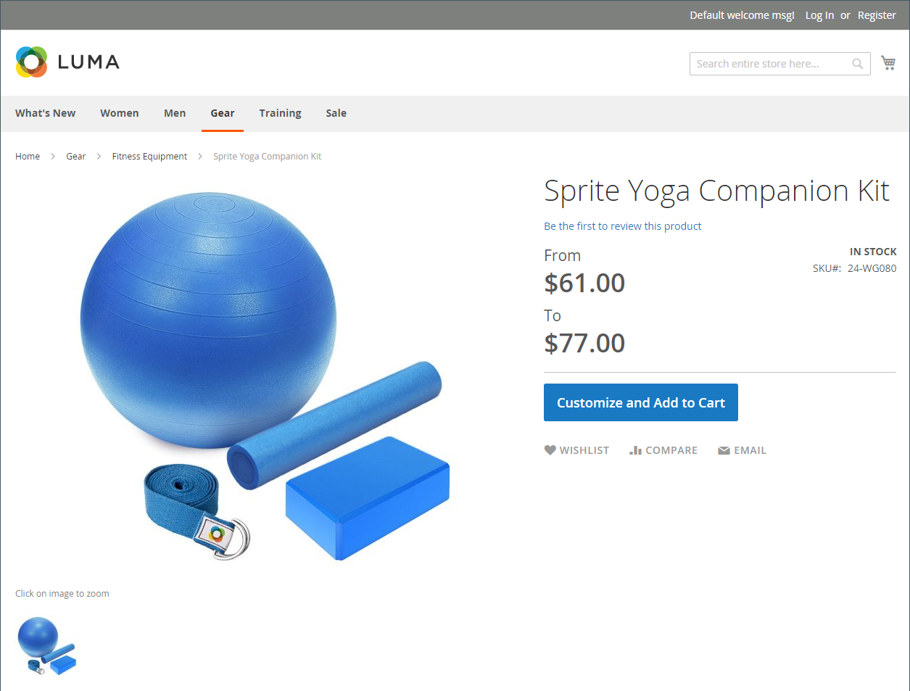
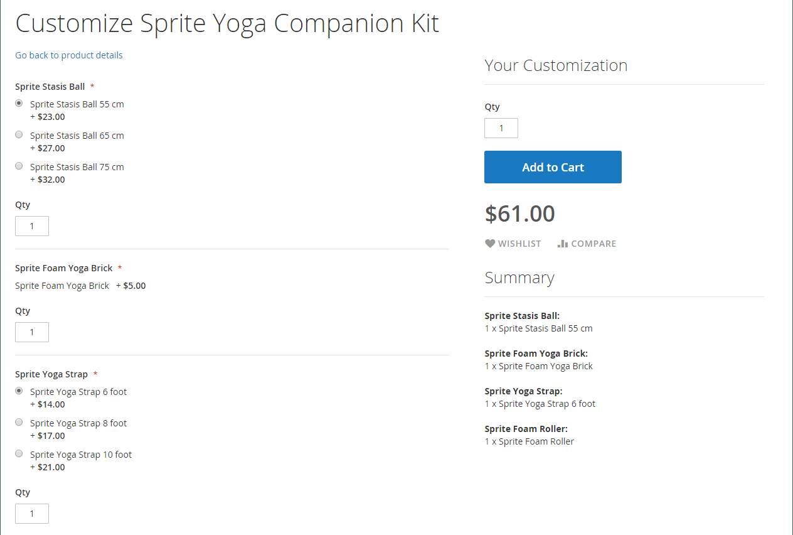
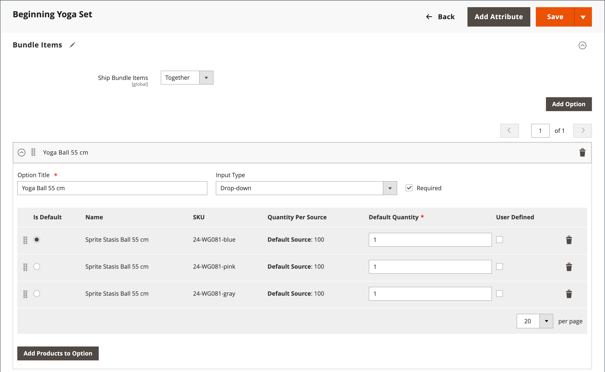
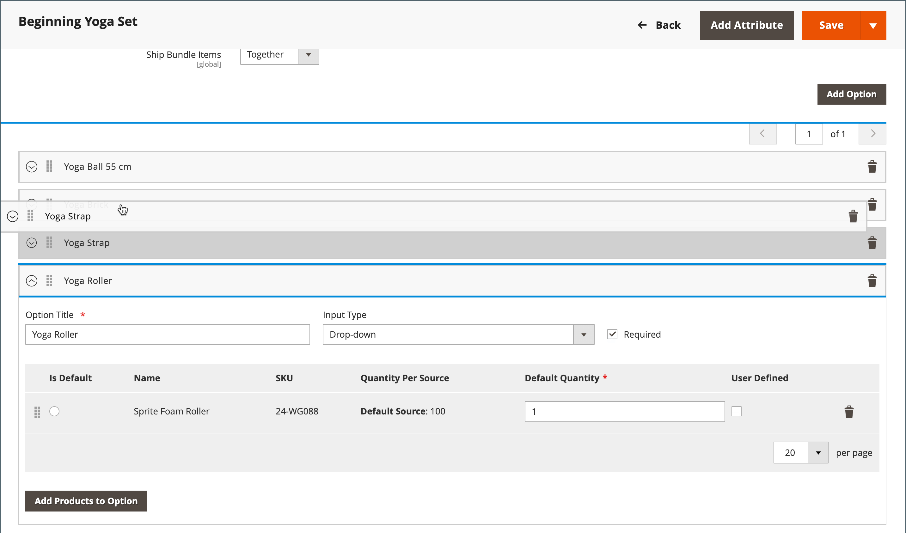

# 捆绑产品

捆绑包是&#x200B;_构建您自己的_&#x200B;可自定义的产品。 捆绑包中的每个项目可以基于以下产品类型之一：

- [简单产品](product-create-simple.md)
- [虚拟产品](product-create-virtual.md)

{width="700" zoomable="yes"}

当客户单击&#x200B;**[!UICONTROL Customize]**&#x200B;或&#x200B;**[!UICONTROL Add to Cart]**&#x200B;时，将显示这些选项。 由于捆绑包中包含的产品各不相同，因此SKU、价格和重量可以设置为动态值或固定值。

>[!NOTE]
>
>最小广告价(MAP)不适用于使用动态定价的捆绑销售产品。

>[!NOTE]
>
>父捆绑产品始终自动显示为其所有子产品的追加销售产品。

如果[即时购买](../stores-purchase/checkout-instant-purchase.md)可用，则捆绑包中每个项目的&#x200B;_添加到购物车_&#x200B;按钮下方会显示&#x200B;_即时购买_&#x200B;按钮。

{width="600" zoomable="yes"}

以下说明将引导您完成使用[产品模板](attribute-sets.md)、必填字段和基本设置创建捆绑产品的过程。 每个必填字段都标有红色星号(`*`)。 完成基础知识后，您可以根据需要完成其他产品设置。

## 步骤1：选择产品类型

1. 在&#x200B;_管理员_&#x200B;侧边栏上，转到&#x200B;**[!UICONTROL Catalog]** > **[!UICONTROL Products]**。

1. 在&#x200B;_[!UICONTROL Add Product]_（ {width="25"} ）菜单的右上角，选择&#x200B;**[!UICONTROL Bundle Product]**。

   {width="700" zoomable="yes"}

## 步骤2：选择属性集

要选择用作产品模板的[属性集](attribute-sets.md)，请执行以下操作之一：

- 对于&#x200B;**[!UICONTROL Search]**，输入属性集的名称，
- 在列表中，选择要使用的属性集。

将更新表单以反映更改。

{width="600" zoomable="yes"}

## 第3步：完成所需的设置

1. 输入产品&#x200B;**[!UICONTROL Product Name]**。

1. 接受基于产品名称的默认&#x200B;**[!UICONTROL SKU]**&#x200B;或输入其他值。

   要确定分配给每个捆绑项目的SKU类型，请执行以下操作：

   - 通过为默认SKU添加后缀，可以将&#x200B;**[!UICONTROL Dynamic SKU]**&#x200B;自动分配给每个捆绑项。 默认情况下，它设置为`Yes`。

   - 如果您希望为每个捆绑包项目分配唯一的SKU，请将&#x200B;**[!UICONTROL Dynamic SKU]**&#x200B;设置为`No`。

   {width="600" zoomable="yes"}

1. 要确定捆绑包的价格，请执行下列操作之一：

   - 要使价格反映客户选择的选项，请将&#x200B;**[!UICONTROL Dynamic Price]**&#x200B;设置为`Yes`并将&#x200B;**[!UICONTROL Price]**&#x200B;留空。 在这种情况下，捆绑产品在目录中没有自己的价格，产品价格是从捆绑中包含的单个产品的价格中派生出来的。

   - 若要对捆绑包收取固定价格，请将&#x200B;**[!UICONTROL Dynamic Price]**&#x200B;设置为`No`并输入要为捆绑包收取的&#x200B;**[!UICONTROL Price]**。

   >[!NOTE]
   >
   >始终将[!UICONTROL Special Price]和[!UICONTROL Customer Group Price]（层价格）设置为所有捆绑产品类型的折扣百分比。

1. 由于产品尚未准备好发布，请将&#x200B;**[!UICONTROL Enable Product]**&#x200B;设置为`No`。

1. 单击&#x200B;**[!UICONTROL Save]**&#x200B;并继续。

   保存产品后，[商店视图](introduction.md#product-scope)选择器将显示在左上角。

1. 选择要提供产品的&#x200B;**[!UICONTROL Store View]**。

   {width="600" zoomable="yes"}

## 步骤4：完成基本设置

1. 如果捆绑包具有固定定价，请将&#x200B;**[!UICONTROL Tax Class]**&#x200B;设置为以下值之一：

   - `None`
   - `Taxable Goods`

   如果捆绑包具有动态定价，则针对&#x200B;**_每个_**&#x200B;捆绑项确定税额。 如果捆绑包具有固定定价，则针对&#x200B;**_整个_**&#x200B;捆绑包产品确定税额。

1. 请注意以下事项：

   - **[!UICONTROL Quantity]**&#x200B;不可用，因为每个捆绑项目的值已确定。

   - 默认情况下，**[!UICONTROL Stock Status]**&#x200B;设置为`In Stock`。

1. 要确定束的重量，请执行下列操作之一：

   - 要使权重反映客户选择的选项，请设置&#x200B;**[!UICONTROL Dynamic Weight]**&#x200B;设置`Yes`并将&#x200B;**[!UICONTROL Weight]**&#x200B;留空。

   - 若要为包分配固定权重，请将&#x200B;**[!UICONTROL Dynamic Weight]**&#x200B;设置为`No`并输入包的&#x200B;**[!UICONTROL Weight]**。

   {width="600" zoomable="yes"}

1. 若要在[新产品](../content-design/widget-new-products-list.md)的列表中包含该产品，请选中&#x200B;**[!UICONTROL Set Product as New]**&#x200B;复选框。

1. 接受`Catalog, Search`的默认&#x200B;**[!UICONTROL Visibility]**&#x200B;设置。

1. 要将&#x200B;_[!UICONTROL Categories]_分配给产品，请单击&#x200B;**[!UICONTROL Select…]**框并执行以下任一操作：

   **选择现有类别：**

   - 在框中开始键入，直到找到匹配项为止。

   - 选中要分配的每个类别的复选框。

   {width="600" zoomable="yes"}

   **创建类别：**

   - 单击&#x200B;**[!UICONTROL New Category]**。

   - 输入&#x200B;**[!UICONTROL Category Name]**&#x200B;并选择&#x200B;**[!UICONTROL Parent Category]**&#x200B;以确定其在菜单结构中的位置。

   - 单击&#x200B;**[!UICONTROL Create Category]**。

1. 选择&#x200B;**[!UICONTROL Country of Manufacture]**。

   可能有其他属性用于描述产品。 所选内容会改变属性集，您可以稍后完成它们。

## 步骤5：添加捆绑项目

_[!UICONTROL Bundle Items]_部分用于将项目添加到捆绑包产品类型并编辑当前选择的项目。

为产品定义了{width="600" zoomable="yes"}

1. 向下滚动到&#x200B;_捆绑包项目_&#x200B;部分，并将&#x200B;**[!UICONTROL Ship Bundle Items]**&#x200B;设置为以下项之一：

   - `Separately`
   - `Together`

   如果选择`Together`，则必须为所有捆绑包项分配相同的[源](../inventory-management/sources-manage.md)。

1. 单击&#x200B;**[!UICONTROL Add Option]**&#x200B;并执行以下操作：

   - 输入要用作字段标签的&#x200B;**[!UICONTROL Option Title]**。

   - 将&#x200B;**[!UICONTROL Input Type]**&#x200B;设置为以下项之一：

      - `Drop-down`
      - `Radio buttons`
      - `Checkbox`
      - `Multiple Select`

   - 要使该字段成为必填项，请选中&#x200B;**[!UICONTROL Required]**&#x200B;复选框。

   - 单击&#x200B;**[!UICONTROL Add Products to Option]**&#x200B;并选中要包含在此选项中的每个产品的复选框。

     如果有多种产品，请使用列表过滤器和分页控件来查找所需的产品。

   - 单击&#x200B;**[!UICONTROL Add Selected Products]**。

     {width="600" zoomable="yes"}

   - 在&#x200B;_选项_&#x200B;部分中显示这些项后，选择一个项作为&#x200B;**[!UICONTROL Default]**&#x200B;选定项。

   - 在&#x200B;_默认数量_&#x200B;列中，输入客户选择项目时要添加到捆绑包的每个项目的数量。

   - 若要允许客户更改捆绑项目的数量，请选择&#x200B;**[!UICONTROL User Defined]**。

     >[!NOTE]
     >
     >量可以是预设值或用户定义的值。 但是，不要将&#x200B;_[!UICONTROL User Defined]_属性分配给复选框或多选输入类型。

     默认情况下，客户不能更改捆绑项目中包含的“默认数量”。 但是，客户可以输入要包括在捆绑中的物料数量。

     例如，如果Sprite状态球的默认数量设置为`2`，并且客户订购了该包选项的`4`，则购买的总球数为`8`。

     {width="600" zoomable="yes"}

1. 对要添加到捆绑包中的每个项目重复这些步骤。

1. 要更改捆绑包部分中项目的顺序，请单击行首的&#x200B;_移动_ （ ）图标，然后将项目拖到适当位置。

   {width="600" zoomable="yes"}

   也可以在导出的捆绑产品的数据中更改项目的顺序，然后重新导入到目录中。 有关详细信息，请参阅[导入捆绑包产品](../systems/data-transfer-bundle-products.md)。

   为了更好地查看工作区，请先折叠每个部分，然后将它们拖动到适当位置。

1. 要从捆绑包中删除任何项，请单击&#x200B;**[!UICONTROL Delete]** （  ）图标。

1. 完成后，单击&#x200B;**[!UICONTROL Save]**。

## 步骤6：完成产品信息

根据需要向下滚动并完成以下部分中的信息：

- [内容](product-content.md)
- [图像和视频](product-images-and-video.md)
- [搜索引擎优化](product-search-engine-optimization.md)
- [相关产品、向上销售和交叉销售](related-products-up-sells-cross-sells.md)
- [可自定义的选项](settings-advanced-custom-options.md)
- [网站中的产品](settings-basic-websites.md)
- [设计](settings-advanced-design.md)
- [礼品选项](product-gift-options.md)

## 步骤7：Publish产品

1. 如果您已准备好发布目录中的产品，请将&#x200B;**[!UICONTROL Enable Product]**&#x200B;设置为`Yes` （ ）。

1. 执行以下操作之一：

   **方法1：**&#x200B;保存并预览

   - 单击右上角的&#x200B;**[!UICONTROL Save]**。

   - 要查看您商店中的产品，请在&#x200B;_管理员_ （ ）菜单上选择&#x200B;**[!UICONTROL Customer View]**。

     该存储将在新的浏览器选项卡中打开。

   {width="600" zoomable="yes"}

   **方法2：**&#x200B;保存并关闭

   在&#x200B;_[!UICONTROL Save]_（{width="25"} ）菜单中，选择&#x200B;**[!UICONTROL Save & Close]**。

## 输入控件

| 控件 | 描述 | 示例 |
|--- |--- |--- |
| [!UICONTROL Drop-down] | 显示包含产品名称和价格的选项下拉列表。 只能选择一个项目。 | {width="200"} |
| [!UICONTROL Radio Buttons] | 显示每个选项的单选按钮，其后是产品名称和价格。 只能选择一个项目。 | {width="200"} |
| [!UICONTROL Checkbox] | 显示每个选项的复选框，后跟产品名称和价格。 可以选择多个项目。 | {width="200"} |
| [!UICONTROL Multiple Select] | 显示选项列表以及产品名称和价格。 要选择多个项目，请按住Ctrl键(PC)或Command键(Mac)并单击每个项目。 | {width="200"} |

{style="table-layout:auto"}

## 字段描述

| 字段 | 描述 |
|--- |--- |
| [!UICONTROL SKU] | 确定每个项目是否分配了变量或动态SKU，或者是否为捆绑包使用固定SKU。 选项： `Fixed` / `Dynamic` |
| [!UICONTROL Weight] | 指定权重是根据所选项目计算的，还是为整个包的固定权重。 选项： `Fixed` / `Dynamic` |
| [!UICONTROL Price View] | 确定产品价格是显示为从最低价到最贵（价格范围）的某个范围，还是显示为最低价（最低价）。 选项： `Price Range` / `As Low As` |
| 发运捆绑包项目 | 指定是否可单独装运单个物料。 |

{style="table-layout:auto"}

## 捆绑产品库存状态

出现以下任一情况时，捆绑产品库存状态为&#x200B;**_自动更改为缺货_**：

- 所有选项都是可选的，所有关联产品均为&#x200B;_缺货_。

- 需要某些期权，并且与任何所需期权关联的产品为&#x200B;_缺货_。

出现以下任一情况时，捆绑产品库存状态为&#x200B;**_不会自动更改为缺货_**：

- 所有选项都是可选的，并且至少有一个关联产品为&#x200B;_库存_。

- 某些选件是必需的，并且每个必需选件中至少有一个关联产品是&#x200B;_库存_。

## 注意事项

客户可以&#x200B;_构建自己的_&#x200B;捆绑包产品。

捆绑包项目可以是简单产品或没有自定义选项的虚拟产品。

价格视图可以设置为`Price Range`或`As Low As`。

 SKU和权重可以是`Fixed`或`Dynamic`。

数量可以是预设值或用户定义的值。 但是，不要将&#x200B;_[!UICONTROL User Defined]_属性分配给复选框或多选输入类型。

捆绑包项目可以一起发运或单独发运。

父捆绑产品始终自动显示为其所有子产品的追加销售产品。

 [!UICONTROL Special Price]和[!UICONTROL Customer Group Price]（层价格）始终设置为所有捆绑产品类型的折扣百分比。
