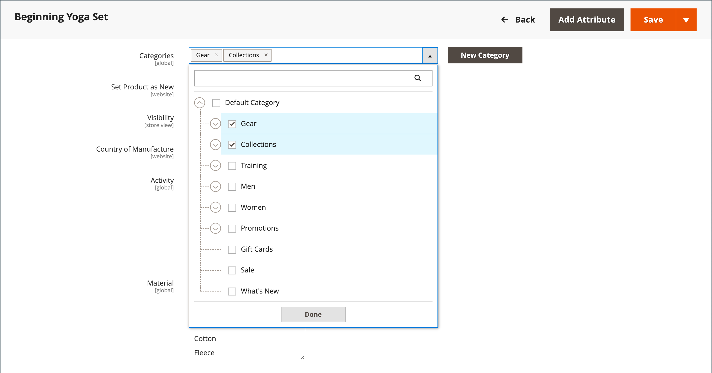
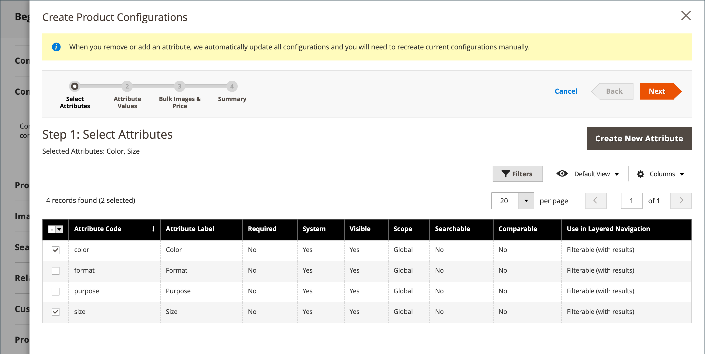
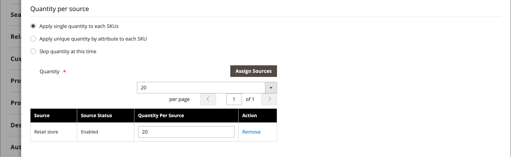

# 可配置产品

可配置产品看起来像单个产品，带有每个变体的下拉列表。 每个列表项实际上是一个单独的简单产品，具有唯一的SKU，因此可以跟踪每个产品变体的库存。 通过使用带有自定义选项的简单产品，但无法跟踪每个变体的库存，可以实现类似的效果。

以下说明演示了使用[产品模板](attribute-sets.md)、必填字段和基本设置创建可配置产品的过程。 每个必填字段都标有红色星号(`*`)。 完成基础知识后，您可以根据需要完成其他产品设置。

{width="700" zoomable="yes"}

## 第1部分：创建可配置产品

尽管可配置产品使用更多的SKU，并且最初可能需要更长的时间进行设置，但最终仍可以节省您的时间。 如果您计划拓展业务，那么可配置的产品类型对于具有多种选项的产品来说是一个不错的选择。

在开始之前，请准备一个[属性集](attribute-sets.md)，其中包含设置为每个产品变体允许的输入类型之一的属性。 例如，属性集可能包含颜色和大小的下拉属性。

用于可配置产品变体的每个属性的属性必须具有以下设置：

### 产品变型属性要求

| 属性 | 设置 |
|--- |--- |
| [!UICONTROL Scope] | `Global` |
| [!UICONTROL Catalog Input Type for Store Owner] | 用于产品变体的任何属性的输入类型必须是以下类型之一： `Dropdown`、`Visual Swatch`或`Text Swatch`。 |
| [!UICONTROL Values Required] | `Yes` |
| [!UICONTROL Use for Promo Rule Conditions] | `Yes` |

{style="table-layout:auto"}

### 步骤1：选择产品类型

1. 在&#x200B;_管理员_&#x200B;侧边栏上，转到&#x200B;**[!UICONTROL Catalog]** > **[!UICONTROL Products]**。

1. 在右上角的&#x200B;_[!UICONTROL Add Product]_（{width="25"} ）菜单中，选择&#x200B;**[!UICONTROL Configurable Product]**。

   {width="700" zoomable="yes"}

### 步骤2：选择属性集

[属性集](attribute-sets.md)确定产品中使用的字段选择。 以下示例中使用的属性集具有颜色和大小属性。 属性集的名称指示在页面顶部，最初设置为`Default`。

1. 要选择产品的属性集，请单击页面顶部的字段，然后执行下列操作之一：

   - 对于&#x200B;**[!UICONTROL Search]**，输入属性集的名称。
   - 在列表中，选择要使用的属性集。

   将更新表单以反映更改。

1. 如果要向属性集添加其他属性，请单击&#x200B;**[!UICONTROL Add Attribute]**&#x200B;并按照[添加属性](product-attributes-add.md)中的说明操作。

   {width="600" zoomable="yes"}

### 第3步：完成所需的设置

1. 输入产品&#x200B;**[!UICONTROL Product Name]**。

1. 接受基于产品名称的默认&#x200B;**[!UICONTROL SKU]**&#x200B;或输入其他名称。

1. 输入产品&#x200B;**[!UICONTROL Price]**。

1. 由于产品尚未准备好发布，请将&#x200B;**[!UICONTROL Enable Product]**&#x200B;设置为`No`。

1. 单击&#x200B;**[!UICONTROL Save]**&#x200B;并继续。

   保存产品后，[商店视图](introduction.md#product-scope)选择器将显示在左上角。

1. 选择要提供产品的&#x200B;**[!UICONTROL Store View]**。

   {width="600" zoomable="yes"}

### 步骤4：完成基本设置

1. 将&#x200B;**[!UICONTROL Tax Class]**&#x200B;设置为以下项之一：

   - `None`
   - `Taxable Goods`

1. **[!UICONTROL Quantity]**&#x200B;由产品变体决定，因此您可以将其留空。

1. 保留&#x200B;**[!UICONTROL Stock Status]**&#x200B;设置。

   可配置产品的Stock状态由每个关联的配置决定。 由于保存产品时未输入数量，因此&#x200B;**[!UICONTROL Stock Status]**&#x200B;设置为`Out of Stock`。

   >[!NOTE]
   >
   >可配置产品的&#x200B;**库存状态**&#x200B;是&#x200B;**_半手动_**&#x200B;控制的设置。 它部分受其子产品的库存状态控制。 它是&#x200B;**_多条件_**&#x200B;库存状态计算的一部分，该计算在[配置库存状态](#configure-the-stock-status)部分中描述。

1. 输入产品&#x200B;**[!UICONTROL Weight]**。

>[!NOTE]
>
>可配置产品必须始终具有权重。 如果您从下拉列表中选择&#x200B;**[!UICONTROL This item has no weight]**，则在保存产品后它会自动更改为&#x200B;**[!UICONTROL This item has weight]**。

1. 接受`Catalog, Search`的默认&#x200B;**[!UICONTROL Visibility]**&#x200B;设置。

1. 若要在[新产品](../content-design/widget-new-products-list.md)的列表中包含该产品，请选中&#x200B;**[!UICONTROL Set Product as New]**&#x200B;复选框。

1. 要将类别分配给产品，请单击&#x200B;**[!UICONTROL Select…]**&#x200B;框并执行以下任一操作：

   **选择现有类别**：

   - 在框中开始键入，直到找到匹配项为止。

   - 选中要分配的类别的复选框。

   {width="600" zoomable="yes"}

   **创建类别**：

   - 单击&#x200B;**[!UICONTROL New Category]**。

   - 输入&#x200B;**[!UICONTROL Category Name]**&#x200B;并选择&#x200B;**[!UICONTROL Parent Category]**&#x200B;以确定其在菜单结构中的位置。

   s — 单击&#x200B;**[!UICONTROL Create Category]**。

1. 选择&#x200B;**[!UICONTROL Country of Manufacture]**。

   可能会有其他属性用于描述产品。 选择因属性集而异，您可以稍后完成它们。

### 步骤5：保存并继续

现在是保存您工作的好时机。 单击右上角的&#x200B;**[!UICONTROL Save]**。 在接下来的一系列步骤中，您将为产品的每个变体设置配置。

## 第2部分：添加配置

以下示例说明如何添加三种颜色和三种大小的配置。 总共有9种简单的产品使用独一无二的SKU创建，以涵盖各种变体的可能组合。 默认情况下，每个变体的产品名称和SKU都基于属性值和父产品名称或SKU。

页面顶部的进度栏显示您在流程中的位置，并指导您完成每个步骤。

### 步骤1：选择属性

1. 从上面继续，向下滚动到&#x200B;_[!UICONTROL Configurations]_部分，然后单击&#x200B;**[!UICONTROL Create Configurations]**。

   {width="600" zoomable="yes"}

1. 选中要作为配置包含的每个属性的复选框。

   对于此示例，已选择`color`和`size`。

   {width="600" zoomable="yes"}

   该列表包括可在可配置产品中使用的属性集中的所有属性。

1. 如果要添加属性，请单击&#x200B;**[!UICONTROL Create New Attribute]**&#x200B;并执行以下操作：

   - 填写属性属性。

   - 单击&#x200B;**[!UICONTROL Save Attribute]**。

   - 选中属性的复选框。

1. 单击右上角的&#x200B;**[!UICONTROL Next]**。

### 步骤2：输入属性值

1. 对于每个属性，选中应用于产品的值的复选框。

   {width="600" zoomable="yes"}

1. 要重新排列属性，请抓住&#x200B;_重新排序_ （  ）图标，并将节移动到新位置。

   顺序确定下拉列表在产品页面上的位置。

1. 在进度条中，单击&#x200B;**[!UICONTROL Next]**。

### 步骤3：配置图像、价格和数量

此步骤可确定每个配置的图像、定价和数量。 每个选项提供的选项都相同，您只能选择一个。 您可以将相同的设置应用于所有SKU，将唯一的设置应用于每个SKU，或者暂时跳过这些设置。

选择适用的配置选项。

使用以下方法之一配置&#x200B;**[!UICONTROL images]**：

**方法1：**&#x200B;将一组图像应用于所有SKU

1. 选择&#x200B;**[!UICONTROL Apply single set of images to all SKUs]**。

1. 浏览到要包含在产品库中的每个图像，或将其拖到框中。

{width="600" zoomable="yes"}

**方法2：**&#x200B;为每个SKU应用唯一的图像

由于父产品的图像已上传，因此您可以使用此选项上传每种颜色的图像。 当有人以特定颜色购买商品时，您可以添加显示在购物车中的其他图像。

1. 选择&#x200B;**[!UICONTROL Apply unique images by attribute to each SKU]**。

1. 选择图像说明的&#x200B;**[!UICONTROL Attribute]**，如`color`。

1. 对于每个属性值，浏览到要用于该配置的图像或将它们拖到框中。

   如果将图像拖到值框中，它也会出现在其他值的部分中。 如果要删除图像，请单击&#x200B;_垃圾桶_ （）图标。

   每个SKU {width="600" zoomable="yes"}

使用以下方法之一配置&#x200B;**[!UICONTROL prices]**：

>[!NOTE]
>
>可配置产品在目录中没有自己的价格。 可配置产品价格派生自其[!UICONTROL In Stock]子产品。

**方法1：**&#x200B;对所有SKU应用相同的价格

1. 如果所有变体的价格相同，请选择&#x200B;**[!UICONTROL Apply single price to all SKUs]**。

1. 输入&#x200B;**[!UICONTROL Price]**。

   {width="600" zoomable="yes"}

**方法2：**&#x200B;为每个SKU应用不同的价格

1. 如果产品的每个变体或某些变体的价格不同，请选择&#x200B;**[!UICONTROL Apply unique prices by attribute to each SKU]**。

1. 选择作为价差基础的&#x200B;**[!UICONTROL Attribute]**。

1. 为每个属性值输入&#x200B;**[!UICONTROL Price]**。

   在本例中，XL大小的成本较高。

   每个SKU的{width="600" zoomable="yes"}

使用以下方法之一配置&#x200B;**[!UICONTROL Quantity]**：

**方法1：**&#x200B;对所有SKU应用相同的数量

如果所有SKU的数量相同，请选择&#x200B;**[!UICONTROL Apply single quantity to each SKU]**&#x200B;并指定数量。

_单一来源商家_ — 输入&#x200B;**[!UICONTROL Quantity]**。

_使用[Inventory management](../inventory-management/introduction.md)_&#x200B;的多Source商家 — 为所有生成的产品变体分配源并添加数量：

1. 选择&#x200B;**[!UICONTROL Apply single quantity to each SKU]**&#x200B;选项。

1. 要添加源，请单击&#x200B;**[!UICONTROL Assign Sources]**。

1. 浏览或搜索要添加的源。 选中要为产品添加的源旁边的复选框。

1. 输入每个来源的现有库存量。

   所有SKU的{width="600" zoomable="yes"}

**方法2：**&#x200B;按属性应用不同的数量

_单一来源商家_ — 输入&#x200B;**[!UICONTROL Quantity]**。

_使用[Inventory management](../inventory-management/introduction.md)_&#x200B;的多Source商家 — 为所有生成的产品变体分配源并添加数量：

1. 如果每个SKU的数量不同，请选择&#x200B;**[!UICONTROL Apply unique quantity by attribute to each SKU]**。

1. 为每个输入&#x200B;**[!UICONTROL Quantity]**。

   {width="600" zoomable="yes"}

完成图像、价格和数量的配置后，单击右上角的&#x200B;**[!UICONTROL Next]**。

### 步骤4：生成产品配置

请等待片刻，以便显示产品列表，然后执行以下操作之一：

- 如果您对配置满意，请单击&#x200B;**[!UICONTROL Generate Products]**。

- 要进行更正，请单击&#x200B;**[!UICONTROL Back]**。

{width="600" zoomable="yes"}

当前产品变体显示在&#x200B;_配置_&#x200B;部分的底部。

{width="600" zoomable="yes"}

### 步骤5：添加产品图像

1. 向下滚动并展开&#x200B;_[!UICONTROL Images and Videos]_部分的。

1. 单击&#x200B;_摄像头_&#x200B;图块，并浏览到要用于可配置产品的主图像。

有关详细信息，请参阅[图像和视频](product-images-and-video.md)。

### 步骤6：完成产品信息

根据需要向下滚动并完成以下部分中的信息：

- [内容](product-content.md)

- [相关产品、向上销售和交叉销售](related-products-up-sells-cross-sells.md)

- [搜索引擎优化](product-search-engine-optimization.md)

- [可自定义的选项](settings-advanced-custom-options.md)

- [网站中的产品](settings-basic-websites.md)

- [设计](settings-advanced-design.md)

- [礼品选项](product-gift-options.md)

### 步骤7：发布产品

1. 如果您已准备好发布目录中的产品，请将&#x200B;**[!UICONTROL Enable Product]**&#x200B;设置为`Yes`并执行以下操作之一：

   - **方法1：**&#x200B;保存并预览

      - 单击右上角的&#x200B;**[!UICONTROL Save]**。

      - 要查看您商店中的产品，请在&#x200B;_管理员_ （ ）菜单上选择&#x200B;**[!UICONTROL Customer View]**。

     该存储将在新的浏览器选项卡中打开。

     {width="600" zoomable="yes"}

   - **方法2：**&#x200B;保存并关闭

     在&#x200B;_[!UICONTROL Save]_（{width="25"} ）菜单中，选择&#x200B;**[!UICONTROL Save & Close]**。

### 步骤8：配置购物车缩略图

如果您对每个变体具有不同的图像，则可以设置配置以将正确的图像用于购物车缩略图。

1. 在&#x200B;_管理员_&#x200B;侧边栏上，转到&#x200B;**[!UICONTROL Stores]** > _[!UICONTROL Settings]_>**[!UICONTROL Configuration]**。

1. 在左侧面板中，展开&#x200B;**[!UICONTROL Sales]**&#x200B;并在下面选择&#x200B;**[!UICONTROL Checkout]**。

1. 展开&#x200B;_[!UICONTROL Shopping Cart]_部分的。

1. 将&#x200B;**[!UICONTROL Configurable Product Image]**&#x200B;设置为`Product Thumbnail Itself`。

1. 完成后，单击&#x200B;**[!UICONTROL Save Config]**。

   {width="600" zoomable="yes"}

## 配置Stock状态

可配置产品库存状态不同于简单产品的库存状态，后者是产品可用性的直接表示。 对于可配置产品，库存状态是&#x200B;**_多条件_**&#x200B;库存状态计算的一部分。

### 概述

“库存状态”关系的主要原则如下：

- 当您将可配置产品的&#x200B;**[!UICONTROL Stock Status]**&#x200B;更改为`Out of Stock`并单击&#x200B;**[!UICONTROL Save]**&#x200B;时，它&#x200B;**_不受其子产品的库存状态控制_**。 在管理员和店面中它始终显示为`Out of Stock`。

- 当您将可配置产品的&#x200B;**[!UICONTROL Stock Status]**&#x200B;设置为`In Stock`并单击&#x200B;**[!UICONTROL Save]**&#x200B;时，它将仅由其子产品的库存状态部分控制&#x200B;**__**，这些库存状态反映在管理员和店面中。

### 详细说明

可配置产品的&#x200B;_库存状态_&#x200B;部分由其子产品的库存状态控制，并根据以下&#x200B;**_多条件_**&#x200B;库存状态计算：

#### 仅使用默认源/库存：

- 如果管理员用户、文件导入或API调用将可配置产品的库存状态为&#x200B;**_手动_**&#x200B;设置为`Out of Stock`，它将在&#x200B;**_管理员_**&#x200B;和&#x200B;**_店面_**&#x200B;上保持为`Out of Stock`，直到管理员用户、文件导入或API调用将库存状态手动更改为&#x200B;**__**。 `In stock`它不能由其子产品的库存状态控制。

- 如果管理员用户、文件导入或API调用将可配置产品的库存状态为&#x200B;**_手动_**&#x200B;设置为`In Stock`，则其库存状态将由&#x200B;**_管理员_**&#x200B;和&#x200B;**_店面_**&#x200B;上其子产品的库存状态自动控制&#x200B;**__**。

>[!NOTE]
>
>自定义库存和来源是[Inventory management](../inventory-management/sources-stocks.md)扩展的一部分，强烈建议您专门使用此工具来管理库存和来源。 默认的source和stock函数是`CatalogInventory`模块的一部分，该模块现已弃用。

#### 至少具有一个自定义源/库存：

- 如果管理员用户、文件导入或API调用将可配置的产品库存状态值设置为&#x200B;**_手动_**(`Out of Stock`)，它将在&#x200B;**_管理员_**&#x200B;和&#x200B;**_店面_**&#x200B;上保持为`Out of Stock`，直到管理员用户、文件导入或API调用将其手动设置为&#x200B;**__**(`In Stock`)。 它&#x200B;**_不能由其子产品的库存状态控制_**。

- 如果管理员用户、文件导入或API调用将可配置产品库存状态值设置为&#x200B;**_手动_**`In Stock`，则其库存状态将为&#x200B;**_自动_**，且仅由&#x200B;**_店面_**&#x200B;上其子产品的库存状态控制。

- 如果管理员用户、文件导入或API调用将可配置的产品库存状态值设置为&#x200B;**_手动_**`In Stock`，它将在&#x200B;**_管理员_**&#x200B;中保留为`In Stock`，直到管理员用户、文件导入或API调用将该值设置为&#x200B;**_手动_**&#x200B;更改为`Out of Stock`。 它&#x200B;**_不能由其子产品的库存状态控制_**。

## 注意事项

- 可配置的产品允许购物者从下拉列表、多选、可视色板和文本色板输入类型中选择选项。 每个选项都是一个单独的简单产品。

- 可配置产品的[库存状态](../inventory-management/sources-stocks.md)是半手动控制的设置。 它与简单产品的库存状态不同，在库存状态，产品库存是产品可用性的直接表示。 对于可配置产品，库存状态是多标准库存状态计算的一部分。

- 可配置的子产品可以是简单或虚拟产品&#x200B;**而无需自定义选项**。 若要使自定义子产品成为虚拟产品，您必须为每个产品的&#x200B;**[!UICONTROL Weight]**&#x200B;设置选择`Тhis item has no weight`。

- 所有子产品同时从所有网站、商店和商店视图的可配置产品&#x200B;**_全局分配_**&#x200B;和取消分配。

- 可配置产品在目录中没有自己的价格。 可配置产品价格派生自其[!UICONTROL In Stock]子产品。

- 用于产品变体的属性必须具有全局范围，并且必须要求客户选择一个值。 产品变体属性必须包含在用作可配置产品的模板的属性集中。

- 用作可配置产品的模板的属性集必须包括包含每个产品变体所需值的属性。

- 可将购物车中的缩略图图像设置为显示来自可配置产品记录或来自产品变体的图像。

- 通过将Admin属性编辑页面上的&#x200B;**[!UICONTROL Update Product Preview Image]**&#x200B;选项值设置为`No`，可以将[样本属性](swatches.md#create-swatches-for-products)配置为在选择样本时不显示相应的简单产品图像。

- 主题控制用户在不同产品配置之间切换时图像库的行为。 _空白_&#x200B;主题的默认行为是使用选定的产品变体覆盖父可配置产品图像。 对于Luma主题，默认行为是将选定的产品变体图像附加到父可配置产品图像之前。
