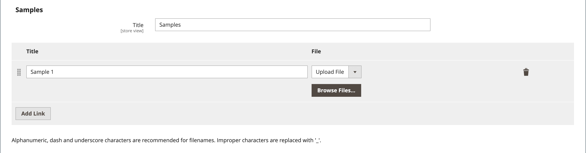

# 可下载的产品

可下载的产品可以是任何可以作为文件提供的产品，例如电子书、音乐、视频、软件应用程序或更新。 您可以提供专辑进行销售，并单独销售每首歌曲。 您还可以使用可下载的产品来交付产品目录的电子版本。

由于下载在购买之后才可用，因此您可以提供示例，例如书籍中的摘录、音频文件中的剪辑或视频中的预告片。 示例是客户在购买产品之前可以尝试的东西。 可供下载的文件可以上载到您的服务器或从其他服务器上载。

{width="700" zoomable="yes"}

可下载的产品可以配置为要求客户登录到帐户以接收链接，也可以通过电子邮件发送并与他人共享。 下载可用之前的订单状态，在配置中设置默认值和其他提交选项。 在计划可下载的目录添加时，请注意以下事项：

- 可下载的产品可以上传到服务器，也可以从Internet上的其他服务器链接到。

- 您可以确定客户下载产品的次数。

- 购买可下载产品的客户可能需要先登录，然后才能结帐。

- 当订单处于`Pending`或`Invoiced`状态时，可以交付可下载的产品。

- 由于可下载产品未发货，因此当购物车仅包含可下载产品时，将跳过结帐的&#x200B;_发货_&#x200B;步骤。

## 配置下载选项

可下载配置设置可确定可下载产品的默认值和交付选项，并指定来宾是否可以购买下载。

1. 在&#x200B;_管理员_&#x200B;侧边栏上，转到&#x200B;**[!UICONTROL Stores]** > _[!UICONTROL Settings]_>**[!UICONTROL Configuration]**。

1. 在左侧面板中，展开&#x200B;**[!UICONTROL Catalog]**&#x200B;并在下面选择&#x200B;**[!UICONTROL Catalog]**。

1. 展开&#x200B;_[!UICONTROL Downloadable Product Options]_部分的。

   {width="700" zoomable="yes"}

   有关这些配置选项的详细列表，请参阅&#x200B;_配置引用_&#x200B;中的&#x200B;[_可下载的产品选项_](../configuration-reference/catalog/catalog.md#downloadable-product-options)。

1. 要确定下载可用时订单流程的状态，请将&#x200B;**[!UICONTROL Order Item Status to Enable Downloads]**&#x200B;设置为以下任一项：

   - `Pending`
   - `Invoiced`

1. 要设置单个客户可进行的下载次数的默认限制，请输入&#x200B;**[!UICONTROL Default Maximum Number of Downloads]**&#x200B;的数字。

1. 将&#x200B;**[!UICONTROL Shareable]**&#x200B;设置为以下项之一：

   - `Yes` — 允许客户通过电子邮件将下载链接发送给其他人。
   - `No` — 通过要求客户登录其帐户以访问下载链接，阻止客户与他人共享下载链接。

1. 对于&#x200B;**[!UICONTROL Default Sample Title]**，输入要显示在样本选择上方的标题。

   {width="400"}

1. 对于&#x200B;**[!UICONTROL Default Link Title]**，输入要用于下载链接的默认文本。

1. 如果希望下载链接在新的浏览器窗口中打开，请将&#x200B;**[!UICONTROL Opens Links in New Window]**&#x200B;设置为`Yes`。

   此设置用于保持商店的浏览器窗口处于打开状态。

1. 要确定可下载内容的交付方式，请将&#x200B;**[!UICONTROL Use Content Disposition]**&#x200B;设置为以下项之一：

   - `Attachment` — 通过电子邮件将下载链接作为附件发送。
   - `Inline` — 将下载链接作为网页上的链接交付。

1. 如果您希望要求购买者在购买下载之前注册客户帐户并登录，请将&#x200B;**[!UICONTROL Disable Guest Checkout if Cart Contains Downloadable Items]**&#x200B;设置为`Yes`。

1. 完成后，单击&#x200B;**[!UICONTROL Save Config]**。

## 创建可下载的产品

以下说明演示了使用[产品模板](attribute-sets.md)、必填字段和基本设置创建可下载产品的过程。 每个必填字段都标有红色星号(`*`)。 完成基础知识后，您可以根据需要完成其他产品设置。

>[!NOTE]
>
>可下载的文件名可包含字母和数字。 可以使用短划线或下划线字符来表示单词之间的空格。 文件名中的任何无效字符都将替换为下划线。

### 步骤1：选择产品类型

1. 在&#x200B;_管理员_&#x200B;侧边栏上，转到&#x200B;**[!UICONTROL Catalog]** > **[!UICONTROL Products]**。

1. 在右上角的&#x200B;_[!UICONTROL Add Product]_（{width="25"} ）菜单中，选择`Downloadable Product`。

   {width="700" zoomable="yes"}

### 步骤2：选择属性集

示例数据包含名为&#x200B;_可下载的_&#x200B;的[属性集](attribute-sets.md)，该属性集具有可下载产品的特殊字段。 您可以使用现有模板或在保存产品之前创建另一个模板。

要选择用作产品模板的属性集，请执行下列操作之一：

- 对于&#x200B;**[!UICONTROL Search]**，输入属性集的名称。

- 在列表中，选择`Downloadable`属性集。

将更新表单以反映更改。

{width="600" zoomable="yes"}

### 第3步：完成所需的设置

1. 输入&#x200B;**[!UICONTROL Product Name]**。

1. 接受基于产品名称的默认&#x200B;**[!UICONTROL SKU]**&#x200B;或输入其他名称。

1. 输入产品&#x200B;**[!UICONTROL Price]**。

1. 由于产品尚未准备好发布，请将&#x200B;**[!UICONTROL Enable Product]**&#x200B;设置为`No`。

1. 单击&#x200B;**[!UICONTROL Save]**&#x200B;并继续。

   保存产品后，[商店视图](introduction.md#product-scope)选择器将显示在左上角。

1. 选择要提供产品的&#x200B;**[!UICONTROL Store View]**。

   {width="600" zoomable="yes"}

### 步骤4：完成基本设置

1. 将&#x200B;**[!UICONTROL Tax Class]**&#x200B;设置为以下项之一：

   - `None`
   - `Taxable Goods`

1. 输入有库存的产品的&#x200B;**[!UICONTROL Quantity]**。

   请注意以下事项：

   - 默认情况下，**[!UICONTROL Stock Status]**&#x200B;设置为`Out of Stock`。

   - 由于未发送可下载的产品，因此未使用&#x200B;**[!UICONTROL Weight]**&#x200B;字段。 如果启用此功能，它将变为[简单产品](product-create-simple.md)，并且&#x200B;_此产品是否可下载？无法使用_&#x200B;选项卡。

   >[!NOTE]
   >
   >如果启用[Inventory management](../inventory-management/introduction.md)，则Single Source商家将设置此部分中的数量。 多Source商家在“来源”部分添加来源和数量。 请参阅以下&#x200B;_分配来源和数量(Inventory management)_&#x200B;部分。

1. 接受`Catalog, Search`的默认&#x200B;**[!UICONTROL Visibility]**&#x200B;设置。

1. 若要在新产品的[列表](../content-design/widget-new-products-list.md)中显示该产品，请选中&#x200B;**[!UICONTROL Set Product as New]**&#x200B;复选框。

1. 要将&#x200B;_[!UICONTROL Categories]_分配给产品，请单击&#x200B;**[!UICONTROL Select…]**框并执行以下任一操作：

   **选择现有类别**：

   - 在框中开始键入，直到找到匹配项为止。

   - 选中要分配的每个类别的复选框。

   **创建类别**：

   - 单击&#x200B;**[!UICONTROL New Category]**。

   - 输入&#x200B;**[!UICONTROL Category Name]**&#x200B;并选择&#x200B;**[!UICONTROL Parent Category]**，这将确定它在[菜单结构](category-root.md)中的位置。

   - 单击&#x200B;**[!UICONTROL Create Category]**。

1. 将&#x200B;**[!UICONTROL Format]**&#x200B;设置为以下项之一：

   - `Download`
   - `DVD`

   如有必要，您可以编辑[属性](attribute-product-create.md)以添加更多值。

   可能有其他属性用于描述产品。 选择因属性集而异，您可以稍后完成它们。

#### 分配来源和数量([!DNL Inventory Management])

{{$include /help/_includes/inventory-assign-sources.md}}

### 步骤5：完成可下载的信息

向下滚动，展开&#x200B;_[!UICONTROL Downloadable Information]_部分的，然后选中&#x200B;**[!UICONTROL Is this downloadable product?]**复选框。

启用后，_[!UICONTROL Downloadable Information]_部分包含两部分。 第一部分描述了每个下载链接，第二部分描述了每个示例文件。 其中许多选项的默认值可以在[配置](#configure-the-download-options)中设置。

{width="600" zoomable="yes"}

#### 完成链接

1. 在&#x200B;_[!UICONTROL Links]_部分中，输入要用作下载链接标题的&#x200B;**[!UICONTROL Title]**。

1. 如果适用，请选中&#x200B;**[!UICONTROL Links can be purchased separately]**&#x200B;复选框。

1. 单击&#x200B;**[!UICONTROL Add Link]**&#x200B;并执行以下操作：

   - 输入下载的&#x200B;**[!UICONTROL Title]**&#x200B;和&#x200B;**[!UICONTROL Price]**。

   - 对于&#x200B;**[!UICONTROL File]**&#x200B;和&#x200B;**[!UICONTROL Sample]**&#x200B;文件，请选择以下分发方法之一进行下载：

      - `Upload File` — 选择此方法以将分发文件上载到服务器。 浏览到文件并选择要上传的文件。
      - `URL` — 选择此方法以从URL访问分发文件。 输入下载文件的完整URL。

   >[!NOTE]
   >
   >不能将指向外部资源的链接用作可下载的产品。 有效链接域在`env.php`文件中以编程方式预定义（请参阅&#x200B;_配置指南_&#x200B;中的[env.php引用](https://experienceleague.adobe.com/docs/commerce-operations/configuration-guide/files/config-reference-envphp.html)）。

   - 将&#x200B;**[!UICONTROL Shareable]**&#x200B;设置为以下项之一：

      - `No` — 要求客户登录其帐户以访问下载链接。

      - `Yes` — 通过电子邮件发送链接，客户可以与其他人共享。

      - `Use Config` — 使用在[可下载的产品选项](../configuration-reference/catalog/catalog.md)配置中指定的方法。

   - 执行以下操作之一：

      - 要限制每个客户的下载次数，请输入&#x200B;**[!UICONTROL Max. Downloads]**&#x200B;的最大数量。
      - 要允许无限制下载，请选中&#x200B;**[!UICONTROL Unlimited]**&#x200B;复选框。

   {width="600" zoomable="yes"}

1. 要添加其他链接，请单击&#x200B;**[!UICONTROL Add Link]**&#x200B;并重复这些步骤。

#### 完成示例

1. 在&#x200B;_[!UICONTROL Samples]_部分中，输入要用作示例标题的&#x200B;**[!UICONTROL Title]**。

1. 要完成每个示例的信息，请单击&#x200B;**[!UICONTROL Add Link]**。

   {width="600" zoomable="yes"}

1. 按如下方式填写链接详细信息：

   - 输入单个样本的&#x200B;**[!UICONTROL Title]**。

   - 选择以下分配方法之一：

      - `Upload File` — 选择此方法以将分发文件上载到服务器。 浏览到文件并选择要上传的文件。
      - `URL` — 选择此方法以从URL访问分发文件。 输入下载文件的完整URL。

   - 要添加另一个示例，请单击&#x200B;**[!UICONTROL Add Link]**&#x200B;并重复这些步骤。

   - 若要更改样本的顺序，请抓住&#x200B;_更改顺序_ （  ）图标，然后将样本拖到新位置。

### 步骤6：完成产品信息

根据需要向下滚动并完成以下部分中的信息：

- [内容](product-content.md)
- [图像和视频](product-images-and-video.md)
- [搜索引擎优化](product-search-engine-optimization.md)
- [相关产品、向上销售和交叉销售](related-products-up-sells-cross-sells.md)
- [可自定义的选项](settings-advanced-custom-options.md)
- [网站中的产品](settings-basic-websites.md)
- [设计](settings-advanced-design.md)
- [礼品选项](product-gift-options.md)

### 步骤7：Publish产品

如果您已准备好发布目录中的产品，请将&#x200B;**[!UICONTROL Enable Product]**&#x200B;设置为`Yes`并执行以下操作之一：

**方法1：**&#x200B;保存并预览

- 单击右上角的&#x200B;**[!UICONTROL Save]**。

- 要查看您商店中的产品，请在&#x200B;_管理员_ （ ）菜单上选择&#x200B;**[!UICONTROL Customer View]**。

  该存储将在新的浏览器选项卡中打开。

  {width="600" zoomable="yes"}

**方法2：**&#x200B;保存并关闭

在&#x200B;_[!UICONTROL Save]_（{width="25"} ）菜单中，选择&#x200B;**[!UICONTROL Save & Close]**。

## 店面体验

在客户帐户仪表板中，_[!UICONTROL My Downloadable Products]_页面链接到每个可下载的产品订单。 订购完成后，可以从客户帐户下载内容。

{width="700" zoomable="yes"}

下表描述了&#x200B;_我的可下载产品_&#x200B;的值：

| 列 | 描述 |
|--- |--- |
| [!UICONTROL Order#] | 购买可下载产品的[订单](../stores-purchase/orders.md)。 提供订单详细信息的链接。 |
| [!UICONTROL Date] | 订单创建日期。 |
| [!UICONTROL Title] | 与订单一起购买的可下载产品的名称。 提供指向可下载产品的链接。 |
| [!UICONTROL Status] | 订单处理状态。 |
| [!UICONTROL Remaining Downloads] | 已下载产品的可用下载次数。 |

_**要从帐户仪表板下载产品文件**_

1. 客户在其帐户信息板中选择&#x200B;**[!UICONTROL My Downloadable Products]**。

1. 查找列表中的顺序，然后单击标题后的链接。

1. 在下载窗口的右下角，单击&#x200B;_下载_&#x200B;图标。

1. 在其下载位置查找文件，并将文件保存到所需位置。
