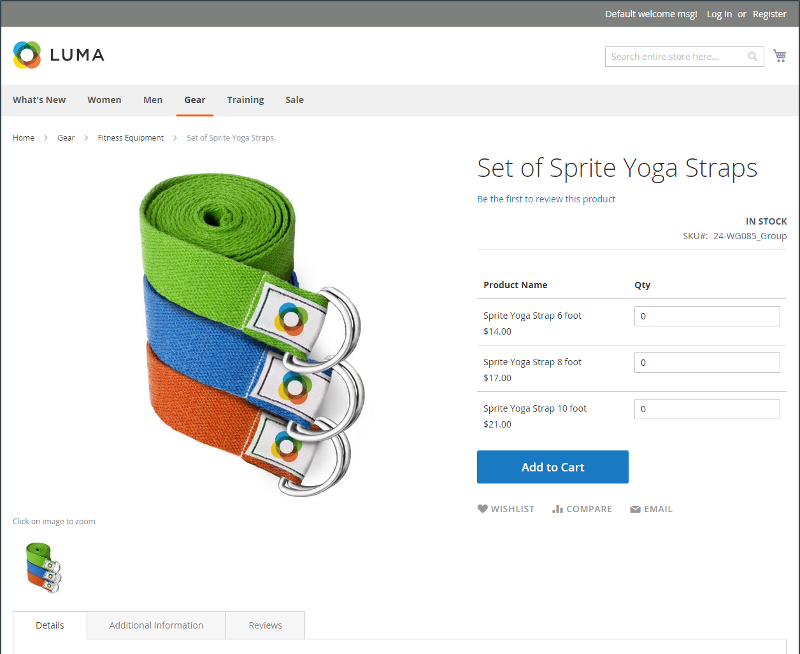
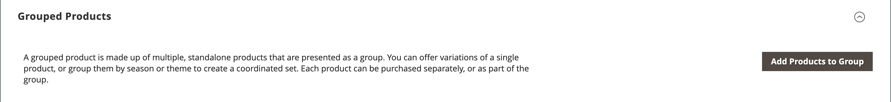
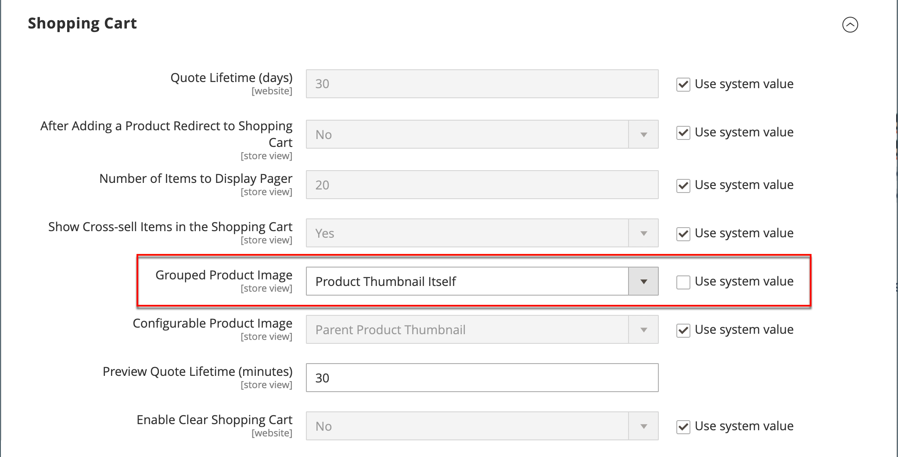

# 已分组的产品

分组产品由简单独立产品组成，这些产品以组形式显示。 您可以提供单个产品的变体或按季节或主题对它们进行分组。 展示分组产品可以鼓励客户购买附加产品。 通过分组产品，可以轻松提供产品的变体并在同一页面上列出所有变体。

例如，您可以销售未售出的餐具，并列出在正式位置设置中使用的每种类型的餐具。 有些人可能会点多份沙拉叉、鱼叉、晚餐叉、晚餐刀、鱼刀、黄油刀、汤匙和甜点勺子。 其他客户可能会订购一个简单的叉子、刀和勺子。 客户可以根据需要订购任意数量的每个项目。

尽管它们以组形式呈现，但组中的每个产品都是作为单独的项目购买的。 在购物车中，每个项目和购买的数量都显示为单独的行项目。

以下说明演示了使用[产品模板](attribute-sets.md)、必填字段和基本设置创建分组产品的过程。 每个必填字段都标有红色星号(`*`)。 完成基础知识后，您可以根据需要完成其他产品设置。

{width="700" zoomable="yes"}

## 步骤1：选择产品类型

1. 在&#x200B;_管理员_&#x200B;侧边栏上，转到&#x200B;**[!UICONTROL Catalog]** > **[!UICONTROL Products]**。

1. 在右上角的&#x200B;_[!UICONTROL Add Product]_（{width="25"} ）菜单中，选择&#x200B;**[!UICONTROL Grouped Product]**。

   {width="700" zoomable="yes"}

## 步骤2：选择属性集

要选择用作产品模板的[属性集](attribute-sets.md)，请执行以下操作之一：

- 要搜索，请输入&#x200B;**[!UICONTROL Attribute Set]**&#x200B;的名称。
- 在列表中，选择要使用的属性集。

将更新表单以反映更改。

{width="600" zoomable="yes"}

如果所需属性不存在，则可以在创建产品时添加新属性：

- 单击右上角的&#x200B;**[!UICONTROL Add Attribute]**。
- 定义新属性（请参阅[将属性添加到产品](product-attributes-add.md)）。

  {width="600" zoomable="yes"}

若要向产品添加现有属性，请使用[筛选器控件](../getting-started/admin-grid-controls.md)在网格中查找该属性并执行以下操作：

- 选中要添加的每个属性的第一列中的复选框。
- 单击&#x200B;**[!UICONTROL Add Selected]**。

## 第3步：完成所需的设置

1. 输入&#x200B;**[!UICONTROL Product Name]**。

1. 接受基于产品名称的默认&#x200B;**[!UICONTROL SKU]**&#x200B;或输入其他名称。

   请注意，**[!UICONTROL Quantity]**&#x200B;字段不可用，因为该值派生自组成该组的各个产品。

   分组的产品在目录中没有自己的价格。 分类产品价格乃按本集团所包含个别产品之价格计算。

1. 由于产品尚未准备好发布，请将&#x200B;**[!UICONTROL Enable Product]**&#x200B;设置为`No` （ ）。

1. 单击&#x200B;**[!UICONTROL Save]**&#x200B;并继续。

   保存产品后，产品名称将显示在页面顶部，[商店视图](introduction.md#product-scope)选择器将显示在左上角。

1. 选择要提供产品的&#x200B;**[!UICONTROL Store View]**。

   {width="600" zoomable="yes"}

## 步骤4：完成基本设置

1. 接受`In Stock`的&#x200B;**[!UICONTROL Stock Status]**&#x200B;设置。

1. 要将&#x200B;**[!UICONTROL Categories]**&#x200B;分配给产品，请单击&#x200B;**[!UICONTROL Select…]**&#x200B;框并执行以下任一操作：

   **选择现有类别：**

   - 在框中开始键入，直到找到匹配项为止。

   - 选中要分配的类别的复选框。

   **创建类别：**

   - 单击&#x200B;**[!UICONTROL New Category]**。

   - 输入&#x200B;**[!UICONTROL Category Name]**&#x200B;并选择&#x200B;**[!UICONTROL Parent Category]**&#x200B;以确定其在菜单结构中的位置。

   - 单击&#x200B;**[!UICONTROL Create Category]**。

1. 接受`Catalog, Search`的&#x200B;**[!UICONTROL Visibility]**&#x200B;设置。

1. 若要在新产品的[列表](../content-design/widget-new-products-list.md)中显示该产品，请选择日历上的&#x200B;**[!UICONTROL Set Product as New]** **[!UICONTROL from]**&#x200B;和&#x200B;**[!UICONTROL to]**&#x200B;日期。

1. 选择&#x200B;**[!UICONTROL Country of Manufacture]**。

   可能有其他单个属性用于描述产品。 所选内容会改变属性集，您可以稍后完成它们。

## 步骤5：将产品添加到组

1. 向下滚动到&#x200B;**[!UICONTROL Grouped Products]**&#x200B;部分，然后单击&#x200B;**[!UICONTROL Add Products to Group]**。

   {width="600" zoomable="yes"}

1. 如有必要，请使用[筛选器](../getting-started/admin-grid-controls.md)查找要包含在组中的产品。

1. 在列表中，选中要包含在组中的每个项目的复选框。

   >[!NOTE]
   >
   >只有简单、可下载且没有可配置选项的虚拟产品才能分组为子产品。 其他产品类型不会显示在选择列表中。

   {width="600" zoomable="yes"}

1. 要将它们添加到产品组，请单击&#x200B;**[!UICONTROL Add Selected Products]**。

   选定的产品将显示在&#x200B;_[!UICONTROL Grouped Products]_&#x200B;部分中。

   对于具有[Inventory management](../inventory-management/sources-stocks.md)的Multi Source商家，网格包含&#x200B;**[!UICONTROL Quantity per Source]**&#x200B;列，每个列都有分配的来源和库存库存量。

   组{width="600" zoomable="yes"}中的产品

1. 为任何项目输入&#x200B;**[!UICONTROL Default Quantity]**。

1. 要更改产品的顺序，请抓住第一列中的&#x200B;_更改顺序_&#x200B;图标（），然后将产品拖到列表中的新位置。

1. 要从组中删除产品，请单击&#x200B;**[!UICONTROL Remove]**。

## 第5步：完成产品信息

根据需要完成以下部分中的信息：

- [内容](product-content.md)
- [图像和视频](product-images-and-video.md)
- [搜索引擎优化](product-search-engine-optimization.md)
- [相关产品、向上销售和交叉销售](related-products-up-sells-cross-sells.md)
- [可自定义的选项](settings-advanced-custom-options.md)
- [网站中的产品](settings-basic-websites.md)
- [设计](settings-advanced-design.md)
- [礼品选项](product-gift-options.md)

## 步骤6：Publish产品

1. 如果您已准备好发布目录中的产品，请将&#x200B;**[!UICONTROL Enable Product]**&#x200B;设置为`Yes`。

1. 执行以下操作之一：

   **方法1：**&#x200B;保存并预览

   - 单击右上角的&#x200B;**[!UICONTROL Save]**。

   - 要查看您商店中的产品，请在&#x200B;_管理员_ （ ）菜单上选择&#x200B;**[!UICONTROL Customer View]**。

     该存储将在新的浏览器选项卡中打开。

     {width="700" zoomable="yes"}

   **方法2：**&#x200B;保存并关闭

   - 在&#x200B;_[!UICONTROL Save]_（{width="25"} ）菜单中，选择&#x200B;**[!UICONTROL Save & Close]**。

## 步骤7：配置购物车缩略图（可选）

如果您组中的每个产品具有不同的图像，则可以设置配置以将正确的图像用于购物车缩略图。

1. 在&#x200B;_管理员_&#x200B;侧边栏上，转到&#x200B;**[!UICONTROL Stores]** > _[!UICONTROL Settings]_>**[!UICONTROL Configuration]**。

1. 在左侧面板中，展开&#x200B;**[!UICONTROL Sales]**&#x200B;并选择&#x200B;**[!UICONTROL Checkout]**。

1. 展开&#x200B;**[!UICONTROL Shopping Cart]**&#x200B;的。

   有关这些配置选项的详细列表，请参阅&#x200B;_配置引用_&#x200B;中的[购物车](../configuration-reference/sales/checkout.md#shopping-cart)。

1. 将&#x200B;**[!UICONTROL Grouped Product Image]**&#x200B;设置为`Product Thumbnail Itself`。

   {width="600" zoomable="yes"}

   如有必要，请取消选中&#x200B;**[!UICONTROL Use system value]**&#x200B;复选框以设置此选项。

1. 单击&#x200B;**[!UICONTROL Save Config]**。

## 注意事项

- 分组产品本质上是一组简单的关联产品。

- 同时从所有网站、商店和商店视图的分组产品&#x200B;**_全局_**&#x200B;中分配和取消分配所有子产品。

- 分组的子产品可以是简单、可下载或虚拟产品&#x200B;**[!UICONTROL without custom options]**。

- 每个购买的项目单独出现在购物车中，而不是作为组的一部分出现。

- 分组的产品在目录中没有自己的价格。 分类产品价格乃按本集团所包含个别产品之价格计算。

- 可将购物车中的缩略图图像设置为显示来自分组的父产品或相关产品的图像。
