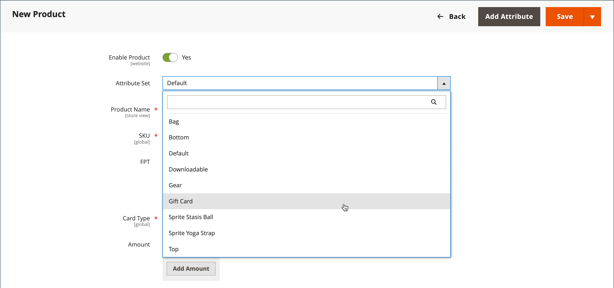
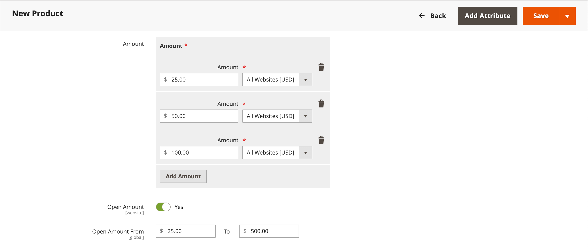
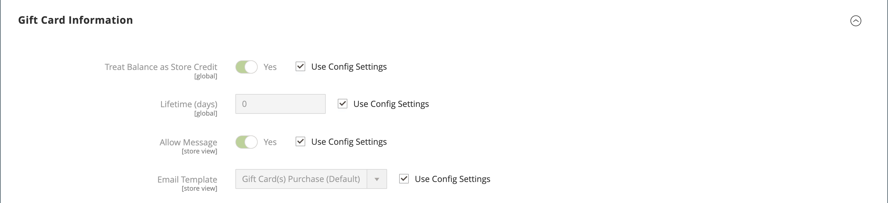
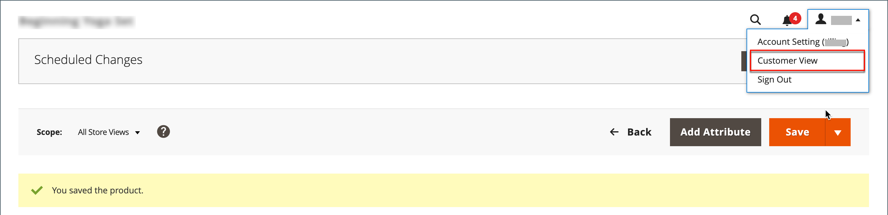

# 礼品卡产品

{{ee-feature}}

每个礼品卡都有一个唯一代码，在结账时只能由一位客户兑换。 A [代码池](../stores-purchase/product-gift-card-accounts.md#step-3-establish-the-gift-card-code-pool) 必须先建立才能销售礼品卡。 请参阅 [礼品卡工作流](../stores-purchase/product-gift-card-workflow.md) 有关如何兑换购物车中的礼品卡的信息。

{width="700" zoomable="yes"}

礼品卡产品有三种：

- **虚拟**  — 将虚拟礼品卡发送到收件人的电子邮件地址，在购买礼品卡时需要此地址。 送货地址不是必需的。

- **物理**  — 将实际礼品卡运送到接收者的地址，在购买礼品卡时需要使用该地址。

- **已合并**  — 将组合礼品卡发运，并通过电子邮件发送给收件人。 购买礼品卡时需要收件人的电子邮件和送货地址。

## 创建礼品卡产品

以下说明演示了使用创建礼品卡的过程 [产品模板](attribute-sets.md)、必填字段和基本设置。 每个必填字段都标有红色星号(`*`)。 完成基础知识后，您可以根据需要完成其他产品设置。

### 步骤1：选择产品类型

1. 在 _管理员_ 侧栏，转到 **[!UICONTROL Catalog]** > **[!UICONTROL Products]**.

1. 在右上角 _[!UICONTROL Add Product]_( {width="25"}  )菜单，选择&#x200B;**[!UICONTROL Gift Card]**.

   {width="700" zoomable="yes"}

### 步骤2：选择属性集

您可以使用默认值 `Gift Card` 属性集或选择其他属性。 要选择用作产品模板的属性集，请执行下列操作之一：

- 单击 **[!UICONTROL Attribute Set]** 字段并输入属性集的全部或部分名称。

- 在显示的列表中，选择要使用的属性集。

{width="600" zoomable="yes"}

### 第3步：完成所需的设置

1. 输入 **[!UICONTROL Product Name]** 作为礼品卡。

   您还可以在名称中指明礼品卡的类型。 例如， _Luma虚拟礼品卡_.

1. 输入 **[!UICONTROL SKU]** 以购买产品。

   默认情况下，产品名称用作默认SKU。

1. 设置 **[!UICONTROL Card Type]** 更改为以下任一项：

   - `Virtual`  — 虚拟礼品卡通过电子邮件发送给收件人。
   - `Physical`  — 实物礼品卡可以预先大量生产，并印有独特代码。
   - `Combined`  — 组合式礼品卡具有虚拟和实体礼品卡的特征。

   {width="600" zoomable="yes"}

1. 要为客户提供固定金额选择，请单击 **[!UICONTROL Add Amount]** 并输入卡片的第一个固定值作为小数。

   要输入固定金额的选择，请为每个重复此步骤。

1. 为了让客户能够设置礼品卡的值，请执行以下操作：

   - 设置 **[!UICONTROL Open Amount]** 到 `Yes`.

   - 要定义最小和最大可接受值的范围，请输入 **[!UICONTROL Open Amount From]** 和 **[!UICONTROL To]** 值。

   您可以创建具有固定定价和/或未结金额定价的礼品卡。

   >[!NOTE]
   >
   >礼品卡产品在目录中没有自己的价格。 礼品卡价格由采购期间选定的礼品卡金额得出。

   {width="600" zoomable="yes"}

### 步骤4：完成基本设置

1. 对于实际或组合礼品卡，请输入 **[!UICONTROL Quantity]** 有存货。

1. 如果要发运的礼品卡，请输入 **[!UICONTROL Weight]** 包的。

1. 在 **[!UICONTROL Categories]** 字段，选择 `Gift Card`.

可能有其他单个属性用于描述产品。 所选内容会改变属性集，您可以稍后完成它们。

### 步骤5：填写礼品卡信息

此 _[!UICONTROL Gift Card Information]_部分产品设置可用于覆盖 [礼品卡配置](../configuration-reference/sales/gift-cards.md) 确定如何管理卡片的设置。

1. 向下滚动到 _[!UICONTROL Gift Card Information]_部分。

   此部分中的默认设置由系统配置决定。

   {width="600" zoomable="yes"}

1. 根据您希望礼品卡正常工作的方式更改其他字段：

   - **[!UICONTROL Treat Balance as Store Credit]**  — 确定礼品卡持有人是否可以将余额兑换为商店贷项。

   - **[!UICONTROL Lifetime (days)]**  — 确定购买后到礼品卡过期的天数。 如果您不想为信息卡的生命周期设置限制，请将此字段留空。

   - **[!UICONTROL Allow Message]**  — 确定礼品卡的购买者是否可以为收件人输入消息。 虚拟（通过电子邮件）和实体（已发货）礼品卡均可包含礼品消息。

   - **[!UICONTROL Email Template]**  — 确定用于发送给礼品卡收件人的通知的电子邮件模板。

### 步骤6：完成产品信息

根据需要完成以下部分中的信息：

- [内容](product-content.md)
- [图像和视频](product-images-and-video.md)
- [相关产品、向上销售和交叉销售](related-products-up-sells-cross-sells.md)
- [搜索引擎优化](product-search-engine-optimization.md)
- [可自定义的选项](settings-advanced-custom-options.md)
- [网站中的产品](settings-basic-websites.md)
- [设计](settings-advanced-design.md)
- [礼品选项](product-gift-options.md)

### 步骤7：发布产品

1. 如果您已准备好在目录中发布产品，请设置 **启用产品** 切换到 `Yes`.

1. 执行以下操作之一：

   **方法1：** 保存并预览

   - 在右上角，单击 **[!UICONTROL Save]**.

   - 要查看您商店中的产品，请选择 **[!UICONTROL Customer View]** 在 _管理员_ (  )菜单，

   {width="600" zoomable="yes"}

   **方法2：** 保存并关闭

   在 _[!UICONTROL Save]_( {width="25"} )菜单，选择&#x200B;**[!UICONTROL Save & Close]**.

## 注意事项

- A _代码池_ 在礼品卡可供销售之前，必须生成唯一编号的。

- 礼品卡可以设置为 `Redeemable` 或 `Non-Redeemable`.

- 税是 **_未应用_** 在购买礼品卡时购买礼品卡。 只有当购买的礼品卡用于购买产品时，才会对产品征税。

- 礼品卡的存留期可以不受限制，也可以设置为指定的天数。

- 礼品卡的值可以设置为固定金额，也可以设置为具有最小值和最大值的未结金额。

- 礼品卡产品在目录中没有自己的价格。 礼品卡价格由采购期间选定的礼品卡金额得出。

- 可以在下订单时或开票时为客户创建礼品卡帐户。
