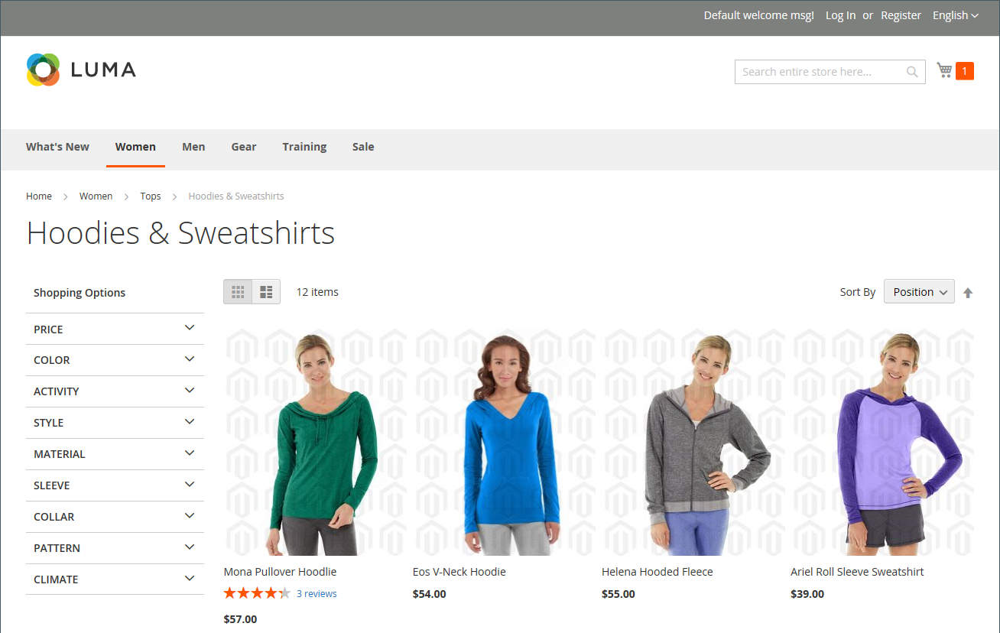

# 管理产品图像和视频

对于每个产品，您可以上传多个图像和视频，重新排列其顺序，并控制每个产品的使用方式。 如果要管理大量图像，您可能希望将它们作为批次导入，而不是单独上载每个图像。 有关详细信息，请参阅[导入产品映像](../systems/data-import-product-images.md)。

如果您计划上载大型图像以供在&#x200B;_[!UICONTROL Product Details]_&#x200B;页面上查看，则可能需要考虑设置最大像素大小（宽度和高度），并在上载时自动调整文件大小。 有一个选项，可在您上传大型图像文件时自动调整其大小。 有关详细信息，请参阅[调整产品图像大小](product-image-config.md#product-image-resizing)。

## 更新产品图像

1. 在编辑模式下打开产品。

1. 要使用特定的商店视图，请将左上角的&#x200B;**[!UICONTROL Store View]**&#x200B;选择器设置为适用的视图。

   >[!NOTE]
   >
   >新产品图像是&#x200B;**_始终_**&#x200B;已上传并在&#x200B;**_所有_**&#x200B;商店视图中可见，即使未使用`All Store Views`范围进行上传。   要从特定商店视图中隐藏任何产品图像，您必须切换到该商店视图，选中图像的&#x200B;**[!UICONTROL Hide from Product Page]**&#x200B;复选框，然后单击&#x200B;**[!UICONTROL Save]**。

1. 向下滚动并展开&#x200B;_[!UICONTROL Images and Videos]_&#x200B;部分。

### 上传图像

为获得最佳兼容性，建议使用`sRGB`颜色配置文件上载所有产品图像。 所有其他颜色配置文件在产品图像上传期间自动转换为`sRGB`颜色配置文件，这可能导致上传的图像出现颜色不一致。

图像文件名的长度（包括扩展名）不能超过90个字符。

要上传图像，请执行以下操作之一：

- 从桌面拖动图像，并将其放到&#x200B;_[!UICONTROL Images And Videos]_&#x200B;框中的_&#x200B;摄像机&#x200B;_（  ）图块上。

- 在&#x200B;_[!UICONTROL Images And Videos]_&#x200B;框中，单击_&#x200B;照相机&#x200B;_（ ）拼贴，选择计算机上的图像文件，然后单击&#x200B;**[!UICONTROL Open]**。

  {width="600" zoomable="yes"}

### 重新排列图像

要更改图库中图像的顺序，请单击图像拼贴底部的&#x200B;_[!UICONTROL Sort]_（ ）图标，并将图像拖到&#x200B;_[!UICONTROL Images And Videos]_&#x200B;框中的其他位置。

{width="600" zoomable="yes"}

### 删除图像

要从图片库中删除图像，请单击图像图块右上角的&#x200B;**[!UICONTROL Delete]** （  ）图标，然后单击&#x200B;**[!UICONTROL Save]**。

### 设置图像详细信息

单击要在详细信息视图中打开的图像，然后执行以下任一操作：

{width="600" zoomable="yes"}

要关闭详细信息视图，请单击右上角的&#x200B;_关闭_ （ ）图标。

完成后，单击&#x200B;**[!UICONTROL Save]**。

#### 输入替换文本

图像替换文本被屏幕阅读器引用，以改进Web辅助功能，并且在为网站编制索引时，被搜索引擎引用。 某些浏览器会在鼠标悬停时显示替换文字。 替换文本可以是多个字长，并包含仔细选择的关键字。

在&#x200B;_[!UICONTROL Alt Text]_&#x200B;框中，输入映像的简要说明。

#### 分配角色

默认情况下，所有角色都会分配给上传到产品的第一个图像。 要将角色重新分配给另一个图像，请执行以下操作：

在&#x200B;_[!UICONTROL Role]_&#x200B;框中，选择要分配给图像的角色。

当您返回&#x200B;_图像和视频_&#x200B;部分时，当前分配的角色将显示在每个图像的下方。

{width="600" zoomable="yes"}

#### 隐藏图像

要从缩略图库中排除图像，请选中&#x200B;**[!UICONTROL Hidden]**&#x200B;复选框，然后单击&#x200B;**[!UICONTROL Save]**。

{width="600" zoomable="yes"}

## 图像角色

| 图像角色 | 描述 |
|--- |--- |
| [!UICONTROL Thumbnail] | 缩略图图像显示在缩略图图库、购物车和一些块中，例如“相关项目”。 示例大小：50 x 50像素 |
| [!UICONTROL Small Image] | 小图像用于类别和搜索结果页面上列出的产品图像，并显示追加销售、交叉销售和新产品列表等部分所需的产品图像。 示例大小：470 x 470像素 |
| [!UICONTROL Base Image] | 基本图像是产品详细信息页面上的主图像。 如果您上传的图像大于图像容器，则会激活图像缩放。 根据要达到的缩放级别，基本图像应当是容器大小的两倍或三倍。 示例大小：470 x 470像素（无缩放），1100 x 1100像素（带缩放） |
| [!UICONTROL Swatch] | [样本](swatches.md)可用于说明颜色、图案或纹理。 示例大小：50 x 50像素 |

{style="table-layout:auto"}

## 水印

如果你不惜一切代价去创造你自己的原始产品形象，你没有什么办法阻止不择手段的竞争对手用鼠标点击来窃取它们。 但是，您可以通过在每个图像上放置水印来将其标识为您的资产，从而使图像成为一个不那么吸引人的目标。 水印文件可以是JPG(JPEG)、GIF或PNG图像。 GIF和PNG文件类型都支持透明图层，可用于为水印提供透明背景。

以下示例中用于&#x200B;_small_&#x200B;图像的水印是带有透明背景的黑色徽标，并通过以下设置保存为PNG文件：

- 大小：50x50
- 不透明度：5
- Position：拼贴

{width="700" zoomable="yes"}

### 向产品图像添加水印

1. 在&#x200B;_管理员_&#x200B;侧边栏上，转到&#x200B;**[!UICONTROL Content]** > _[!UICONTROL Design]_>**[!UICONTROL Configuration]**。

   有关设计配置的更多信息，请参阅[设计配置](../content-design/configuration.md)。

1. 查找要配置的商店视图，然后单击&#x200B;_[!UICONTROL Action]_&#x200B;列中的&#x200B;**[!UICONTROL Edit]**。

1. 在&#x200B;_[!UICONTROL Other Settings]_&#x200B;下，展开&#x200B;**[!UICONTROL Product Image Watermarks]**&#x200B;部分的。

   {width="600" zoomable="yes"}

   **[!UICONTROL Base]**、**[!UICONTROL Thumbnail]**、**[!UICONTROL Small]**&#x200B;和&#x200B;**[!UICONTROL Swatch Image]**&#x200B;图像设置相同。

1. 使用以下方法之一添加水印图像资源：

   - 单击&#x200B;**[!UICONTROL Upload]**&#x200B;并在系统上选择要上载用作水印的图像文件。
   - 单击&#x200B;**[!UICONTROL Select from Gallery]**&#x200B;并从[媒体集](../content-design/media-gallery.md)中选择图像资产。

1. 完成水印显示的设置：

   - 输入&#x200B;**[!UICONTROL Image Opacity]**&#x200B;百分比。 例如： `40`

   - 输入&#x200B;**[!UICONTROL Image Size]**&#x200B;像素。 例如： `200 x 200`

   - 设置&#x200B;**[!UICONTROL Image Position]**&#x200B;以确定水印出现的位置。

1. 完成后，单击&#x200B;**[!UICONTROL Save Config]**。

1. 提示刷新缓存时，在系统消息中单击&#x200B;**[!UICONTROL Cache Management]**&#x200B;并刷新无效缓存。

   {width="600" zoomable="yes"}

>[!TIP]
>
>您可以单击&#x200B;**[!UICONTROL Use Default Value]** 以恢复默认值。

### 删除水印

1. 在图像的左下角，单击&#x200B;**[!UICONTROL Delete]** （  ）图标。

   {width="300"}

1. 单击&#x200B;**[!UICONTROL Save Config]**。

1. 提示刷新缓存时，在系统消息中单击&#x200B;**[!UICONTROL Cache Management]**&#x200B;并刷新无效缓存。

   如果水印图像在店面中持续存在，请返回到缓存管理并单击&#x200B;**[!UICONTROL Flush Magento Cache]**。
