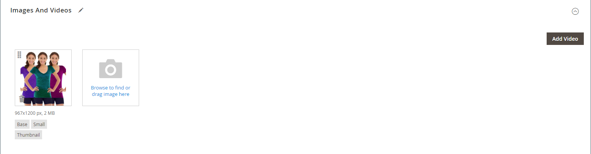

# 管理产品图像和视频

对于每个产品，您可以上传多个图像和视频，重新排列其顺序，并控制每个产品的使用方式。 如果要管理大量图像，您可能希望将它们作为批次导入，而不是单独上载每个图像。 有关更多信息，请参阅 [导入产品图像](../systems/data-import-product-images.md).

如果您计划上传大图像以供在 _[!UICONTROL Product Details]_页面时，您可能需要考虑设置最大像素大小（宽度和高度），并在上传时自动调整文件大小。 有一个选项，可在您上传大型图像文件时自动调整其大小。 有关更多信息，请参阅 [产品图像大小调整](product-image-config.md#product-image-resizing).

## 更新产品图像

1. 在编辑模式下打开产品。

1. 要使用特定的商店视图，请设置 **[!UICONTROL Store View]** 选择器位于适用的视图的左上角。

   >[!NOTE]
   >
   >新产品图像为 **_始终_** 已上传并在中可见 **_所有_** 商店视图，即使 `All Store Views` 范围不用于上传。   要从特定商店视图中隐藏任何产品图像，您必须切换到商店视图，选择 **[!UICONTROL Hide from Product Page]** 复选框，然后单击 **[!UICONTROL Save]**.

1. 向下滚动并展开 _[!UICONTROL Images and Videos]_部分。

### 上传图像

为获得最佳兼容性，建议将所有产品图像与 `sRGB` 颜色配置文件。 所有其他颜色配置文件会自动转换为 `sRGB` 产品图像上传期间的颜色配置文件，这可能导致上传的图像颜色不一致。

图像文件名的长度（包括扩展名）不能超过90个字符。

要上传图像，请执行以下操作之一：

- 将图片从桌面拖放到 _相机_ (  )图块 _[!UICONTROL Images And Videos]_盒子。

- 在 _[!UICONTROL Images And Videos]_框中，单击_&#x200B;相机&#x200B;_(  )磁贴，选择计算机上的图像文件，然后单击&#x200B;**[!UICONTROL Open]**.

  {width="600" zoomable="yes"}

### 重新排列图像

要更改图库中的图像顺序，请单击 _[!UICONTROL Sort]_(  )图标，然后将图像拖到中的其他位置_[!UICONTROL Images And Videos]_ 盒子。

{width="600" zoomable="yes"}

### 删除图像

要从图库中删除图像，请单击 **[!UICONTROL Delete]** (  )图标，然后单击 **[!UICONTROL Save]**.

### 设置图像详细信息

单击要在详细信息视图中打开的图像，然后执行以下任一操作：

{width="600" zoomable="yes"}

要关闭详细视图，请单击 _关闭_ (  )图标。

完成后，单击 **[!UICONTROL Save]**.

#### 输入替换文本

图像替换文本被屏幕阅读器引用，以改进Web辅助功能，并且在为网站编制索引时，被搜索引擎引用。 某些浏览器会在鼠标悬停时显示替换文字。 替换文本可以是多个字长，并包含仔细选择的关键字。

在 _[!UICONTROL Alt Text]_框中，输入图像的简要说明。

#### 分配角色

默认情况下，所有角色都会分配给上传到产品的第一个图像。 要将角色重新分配给另一个图像，请执行以下操作：

在 _[!UICONTROL Role]_框中，选择要分配给图像的角色。

当您返回 _图像和视频_ 部分，当前分配的角色将显示在每个图像的下方。

{width="600" zoomable="yes"}

#### 隐藏图像

要从缩略图库中排除图像，请选择 **[!UICONTROL Hidden]** 复选框，然后单击 **[!UICONTROL Save]**.

{width="600" zoomable="yes"}

## 图像角色

| 图像角色 | 描述 |
|--- |--- |
| [!UICONTROL Thumbnail] | 缩略图图像显示在缩略图图库、购物车和一些块中，例如“相关项目”。 示例大小：50 x 50像素 |
| [!UICONTROL Small Image] | 小图像用于类别和搜索结果页面上列出的产品图像，并显示追加销售、交叉销售和新产品列表等部分所需的产品图像。 示例大小：470 x 470像素 |
| [!UICONTROL Base Image] | 基本图像是产品详细信息页面上的主图像。 如果您上传的图像大于图像容器，则会激活图像缩放。 根据要达到的缩放级别，基本图像应当是容器大小的两倍或三倍。 示例大小：470 x 470像素（无缩放），1100 x 1100像素（带缩放） |
| [!UICONTROL Swatch] | A [色板](swatches.md) 可用于说明颜色、图案或纹理。 示例大小：50 x 50像素 |

{style="table-layout:auto"}

## 水印

如果你不惜一切代价去创造你自己的原始产品形象，你没有什么办法阻止不择手段的竞争对手用鼠标点击来窃取它们。 但是，您可以通过在每个图像上放置水印来将其标识为您的资产，从而使图像成为一个不那么吸引人的目标。 水印文件可以是JPG(JPEG)、GIF或PNG图像。 GIF和PNG文件类型都支持透明图层，可用于为水印提供透明背景。

用于的水印 _小_ 以下示例中的图像是一个具有透明背景的黑色徽标，并保存为PNG文件，其设置如下：

- 大小：50x50
- 不透明度：5
- Position：拼贴

{width="700" zoomable="yes"}

### 向产品图像添加水印

1. 在 _管理员_ 侧栏，转到 **[!UICONTROL Content]** > _[!UICONTROL Design]_>**[!UICONTROL Configuration]**.

   有关设计配置的更多信息，请参阅 [设计配置](../content-design/configuration.md).

1. 查找要配置的商店视图，然后单击 **[!UICONTROL Edit]** 在 _[!UICONTROL Action]_列。

1. 下 _[!UICONTROL Other Settings]_，展开  该&#x200B;**[!UICONTROL Product Image Watermarks]**部分。

   {width="600" zoomable="yes"}

   此 **[!UICONTROL Base]**， **[!UICONTROL Thumbnail]**， **[!UICONTROL Small]**、和 **[!UICONTROL Swatch Image]** 图像设置相同。

1. 使用以下方法之一添加水印图像资源：

   - 单击 **[!UICONTROL Upload]** 并选择要上传的系统中用作水印的图像文件。
   - 单击 **[!UICONTROL Select from Gallery]** 并从中选择图像资产 [媒体集](../content-design/media-gallery.md).

1. 完成水印显示的设置：

   - 输入 **[!UICONTROL Image Opacity]** 以百分比显示。 例如： `40`

   - 输入 **[!UICONTROL Image Size]** 以像素为单位。 例如： `200 x 200`

   - 设置 **[!UICONTROL Image Position]** 以确定水印出现的位置。

1. 完成后，单击 **[!UICONTROL Save Config]**.

1. 提示刷新缓存时，单击 **[!UICONTROL Cache Management]** 并刷新无效缓存。

   {width="600" zoomable="yes"}

>[!TIP]
>
>您可以单击 **[!UICONTROL Use Default Value]**  以恢复默认值。

### 删除水印

1. 在图像的左下角，单击 **[!UICONTROL Delete]** (  )图标。

   {width="300"}

1. 单击 **[!UICONTROL Save Config]**.

1. 提示刷新缓存时，单击 **[!UICONTROL Cache Management]** 并刷新无效缓存。

   如果水印图像持续保留在店面中，请返回到缓存管理并单击 **[!UICONTROL Flush Magento Cache]**.
