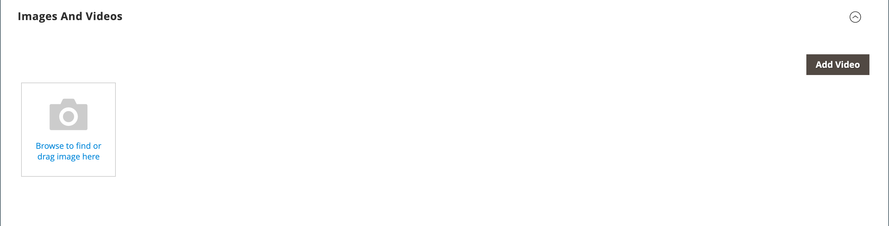

# 产品设置 — [!UICONTROL Images and Videos]

从&#x200B;_[!UICONTROL Images and Videos]_部分，您可以执行基本的图像管理任务，例如上传多个图像、重新排列图像以及控制每个图像的使用方式。 若要进一步控制各个图像，您可以在_&#x200B;详细信息视图&#x200B;_中打开每个图像。 有关详细信息，请参阅[目录图像和视频](catalog-images-video.md)。

## 上传新图像

1. 在编辑模式下打开产品。

1. 向下滚动并展开&#x200B;_[!UICONTROL Images and Videos]_部分的。

   {width="600" zoomable="yes"}

1. 如果您已准备好添加产品图像，请执行以下操作之一：

   - 从桌面拖动图像，并将其放在&#x200B;_摄像机_ （）图块上。

   - 单击&#x200B;_照相机_ （）拼贴，选择图像文件，然后单击&#x200B;**[!UICONTROL Open]**。

在产品图像可用之前，目录中会显示[占位符](product-image-config.md#image-placeholders)图像。

## 图像详细信息

添加产品图像时，可以自定义&#x200B;_[!UICONTROL Image Detail]_窗口中的图像显示。

{width="600" zoomable="yes"}

要设置产品的图像显示选项，请执行以下操作：

1. 单击产品图像。

1. 输入&#x200B;**[!UICONTROL Alt text]**。

1. 选择一个&#x200B;**[!UICONTROL Role]**&#x200B;用于显示图像（可以为一个图像选择所有角色）：

   - `Swatch`
   - `Base`
   - `Small`
   - `Thumbnail`

   默认情况下，所有这些角色都将被选为第一个添加的图像。

   {width="600" zoomable="yes"}

要从产品页面中隐藏产品图像，请选中&#x200B;**[!UICONTROL Hide from Product Page]**&#x200B;复选框。
