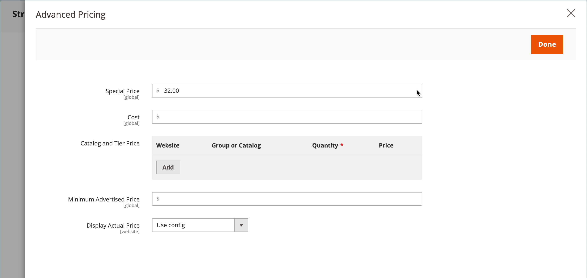

# 组定价

您可以使用管理员中的产品配置设置，根据商店中的客户组设置折扣价格。 此策略定价模型称为 _组定价_.

当购物者登录其帐户时，任何产品的折扣价均可提供给特定客户组的成员。 客户组价格与正常价格一起显示在产品页面上，以便购物者可以轻松地比较价格并相应地采取行动。 将产品添加到购物车后，常规价格将由基于其客户组的组价格取代。

客户组的定价是的组成部分 [分层定价](product-price-tier.md) 和以类似方式设置。 唯一的区别是客户组价格的数量为1。

{width="600" zoomable="yes"}

## 使用组定价的好处

- 适合批发买家

- 激励客户提升其客户群以利用折扣

- 有针对性的营销活动

- 通过奖励忠诚客户来建立信任和信誉

## 设置组价格

1. 在编辑模式下打开产品。

1. 在 _[!UICONTROL Price]_字段，请单击&#x200B;**[!UICONTROL Advanced Pricing]**.

1. 在 _[!UICONTROL Customer Group Price]_部分，单击&#x200B;**[!UICONTROL Add]**.

   如果您的商店包括 [Adobe Commerce B2B](../b2b/introduction.md) 并且具有 [共享目录](../b2b/catalog-shared.md) 已启用，此部分被标记为 _[!UICONTROL Catalog and Tier Price]_.

   {width="600" zoomable="yes"}

1. 配置组价格：

   - 对于多站点安装，请选择 **[!UICONTROL Website]** 集团价格。

   - 选择 **[!UICONTROL Customer Group]** 就是要得到折扣。

   - 输入 **[!UICONTROL Quantity]** 之 `1`.

   - 对象 **[!UICONTROL Price]**，设置定价类型和金额：

      - `Fixed`  — 输入折扣产品价格。

      - `Discount`  — 输入折扣价格（产品价格的百分比）。

     {width="600" zoomable="yes"}

1. 要添加其他组价格，请单击 **[!UICONTROL Add]** 并重复上一步骤。

1. 完成后，单击 **[!UICONTROL Done]** 然后 **[!UICONTROL Save]**.

>[!NOTE]
>
>此 **_最终_** 产品价格的计算方式为 **_最小值_** 相关价格，使用下列公式：  `Final Price=Min(Regular(Base) Price, Group(Tier) Price, Special Price, Catalog Price Rule) + Sum(Min Price per each required custom option)`

>[!NOTE]
>
>**_固定价格_** 产品可自定义选项包括 _非_ 受组价格、层价格、特殊价格或目录价格规则影响。
