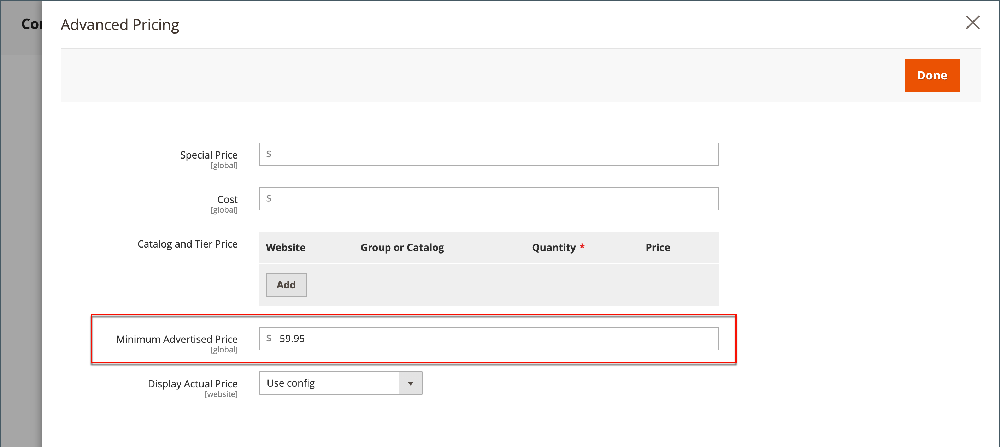

# 最低广告价格

商家有时被禁止显示低于制造商建议零售价(MSRP)的价格。 最低广告价格(MAP)让您能够保持符合制造商的要求，同时为您的客户提供更好的价格。 由于要求因制造商而异，因此您可以配置商店以防止在不允许显示实际价格的页面上显示该价格。

MAP功能添加了专用的&#x200B;_Click for Price_&#x200B;链接，而不是常规产品价格。 如果商店中的价格低于该产品的最低设定价格，则可以通过两种方式在店面中处理定价信息。 第一种方式是不显示价格。 如果买方单击&#x200B;_单击价格_&#x200B;按钮，则只有这样才能显示您销售产品的实际价格。 第二种方式是标价/市场价格以删除线显示，以强调您的价格较低。

此外，MAP功能允许您提出一些改进建议。 例如，当客户将此类产品添加到购物车时，他们不会被重定向到购物车，而是会显示一些选件，允许买家：

- 从购物车中删除商品（如果买方只是想澄清价格并且尚未做出购买决定，则可以执行此操作）

- 将其保留在购物车中并继续购物

- 继续以结账

## MAP逻辑

某些产品的价格取决于所选的选项，例如自定义选项或具有自己的SKU和库存管理的简单产品)。 对于这些产品，将根据产品类型和价格设置应用以下逻辑。 实际价格用于订单管理、客户管理工具和报表。

## 将MAP与产品类型配合使用

| 产品类型 | 描述 |
|--- |--- |
| [简单](product-create-simple.md)，[虚拟](product-create-virtual.md) | 实际价格不会自动显示在目录列表和产品页面上，而是仅根据[!UICONTROL Display Actual Price]设置包括在内。 自定义选项价格正常显示。 |
| [已分组](product-create-grouped.md) | 关联的简单产品的价格不会自动显示在目录列表和产品页上，但仅根据[!UICONTROL Display Actual Price]设置包括在内。 |
| [可配置](product-create-configurable.md) | 实际价格不会自动显示在目录列表和产品页面上，而是仅根据[!UICONTROL Display Actual Price]设置包括在内。 期权价格正常显示。 |
| [捆绑包](product-create-bundle.md)（固定价格） | 实际价格不会自动显示在目录页面上，而是仅根据[!UICONTROL Display Actual Price]设置包括在内。 捆绑项目的价格正常显示。 MAP不适用于具有动态定价的捆绑产品。 |
| [可下载](product-create-downloadable.md) | 实际价格不会自动显示在目录列表和产品页面上，而是仅根据[!UICONTROL Display Actual Price]设置包括在内。 与每个下载链接关联的价格会正常显示。 |

{style="table-layout:auto"}

## 将MAP与价格设置结合使用

| 价格设置 | 描述 |
|--- |--- |
| 主价格 | 当将MAP应用于主价格时，期权、捆绑产品和相关产品的价格（在主价格中增加或减少）将正常显示。 |
| 关联产品价格 | 如果产品没有主价格，并且其价格从相关联的产品价格（例如在分组产品中）衍生，则应用相关联产品的MAP设置。 |
| [MSRP](product-price-minimum-advertised.md) | 如果购物车中的产品指定了制造商建议零售价(MSRP)，则不会忽略该价格。 |
| [层价格](product-price-tier.md) | 如果设置了层定价，则目录中将不显示层定价消息。 在产品页上，会显示通知，指明订购超过特定数量时价格可能较低，但折扣仅以百分比显示。 对于分组产品的关联产品，折扣不会显示在产品页面上。 分层价格根据“显示实际价格”设置显示。 |
| [特价](product-price-special.md) | 如果指定了“特价”，则根据“显示实际价格”设置显示特价。 |

## 映射配置

默认情况下，不启用最低广告价格(MAP)功能。 如果要将此功能添加到应用商店，则必须启用它并配置产品的MAP设置。 MAP设置可应用于目录中的所有产品，或针对特定产品进行配置。 在全球启用MAP时，店面中的所有产品价格都会隐藏起来。 您可以使用各种配置选项来保持与制造商的协议条款的合规性，同时仍为客户提供更好的价格。

{width="700" zoomable="yes"}

在全局级别，您可以启用或禁用MAP，将其应用于所有产品，定义实际价格的显示方式。 您还可以编辑存储中显示的相关消息和信息提示的文本。

启用MAP后，产品级别的MAP设置将变为可用。 您可以通过输入MSRP并选择您希望实际价格在商店中的显示方式，将MAP应用于单个产品。 产品级MAP设置会覆盖全局MAP设置。

{width="700" zoomable="yes"}

### 步骤1：为商店视图启用MAP

1. 在&#x200B;_管理员_&#x200B;侧边栏上，转到&#x200B;**[!UICONTROL Stores]** > _[!UICONTROL Settings]_>**[!UICONTROL Configuration]**。

1. 如果适用，将右上角的&#x200B;**[!UICONTROL Store View]**&#x200B;设置为应用配置的视图。

1. 在左侧面板中，展开&#x200B;**[!UICONTROL Sales]**&#x200B;并在下面选择&#x200B;**[!UICONTROL Sales]**。

1. 展开&#x200B;_[!UICONTROL Minimum Advertised Price]_&#x200B;部分的。

1. 如有必要，请将&#x200B;**启用MAP**&#x200B;设置为`Yes`。

   {width="600" zoomable="yes"}

   有关这些配置选项的详细列表，请参阅&#x200B;_配置引用_&#x200B;中的&#x200B;[_最低广告价格_](../configuration-reference/sales/sales.md#minimum-advertised-price)。

### 步骤2：配置MAP设置

使用以下方法之一配置MAP设置：

#### 方法1：为所有产品配置MAP

1. 要确定客户何时何地能够看到实际价格，请执行以下操作：

   - 要更改默认值，请取消选中&#x200B;**[!UICONTROL Use system value]**&#x200B;复选框。

   - 将&#x200B;**显示实际价格**&#x200B;设置为以下值之一：
      - `In Cart`
      - `Before Order Confirmation`
      - `On Gesture (on click)`

1. 输入要显示在&#x200B;**[!UICONTROL Default Popup Text Message]**&#x200B;中的文本。

1. 输入您希望在&#x200B;**[!UICONTROL Default "What's This" Text Message]**&#x200B;中显示的任何其他说明。

1. 完成后，单击&#x200B;**[!UICONTROL Save Config]**。

#### 方法2：为单个产品配置MAP

1. 在&#x200B;_管理员_&#x200B;侧边栏上，转到&#x200B;**[!UICONTROL Catalog]** > **[!UICONTROL Inventory]** > **[!UICONTROL Products]**。

1. 以&#x200B;**[!UICONTROL Edit]**&#x200B;模式打开产品。

1. 在左侧面板中，展开&#x200B;**[!UICONTROL Advanced Settings]**&#x200B;并选择&#x200B;**[!UICONTROL Advanced Pricing]**。

   >[!NOTE]
   >
   >只有在配置中启用了[最低广告价格](../configuration-reference/sales/sales.md#minimum-advertised-price)时，[!UICONTROL Manufacturer's Suggested Retail Price]和[!UICONTROL Display Actual Price]字段才会显示。

1. 输入&#x200B;**[!UICONTROL Manufacturer's Suggested Retail Price]** (MSRP)。

   在此示例中，产品价格为54.00美元，MSRP为59.95。

   {width="600" zoomable="yes"}

1. 将&#x200B;**[!UICONTROL Display Actual Price]**&#x200B;设置为以下项之一：

   - `Use config` - （默认）将显示设置应用为[为存储配置的](../configuration-reference/sales/sales.md#minimum-advertised-price)。 |
   - `On Gesture` — 当客户单击&#x200B;_单击以获取价格_&#x200B;或&#x200B;_这是什么时，在弹出窗口中显示实际产品价格？_&#x200B;链接。
   - `In Cart` — 显示购物车中的实际产品价格。
   - `Before Order Confirmation` — 在订单确认之前显示结账流程结束时的实际产品价格。

1. 完成后，单击&#x200B;**[!UICONTROL Done]**，然后单击&#x200B;**[!UICONTROL Save]**。
