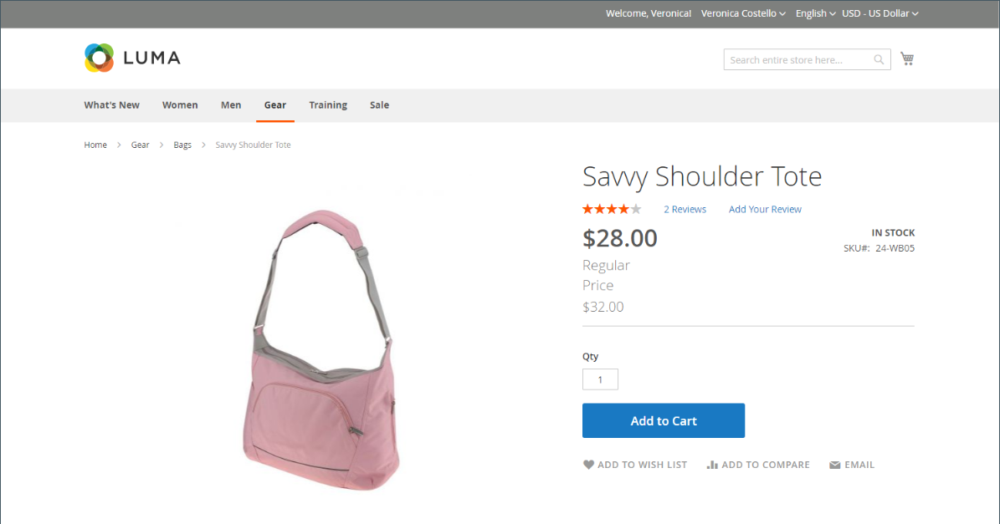
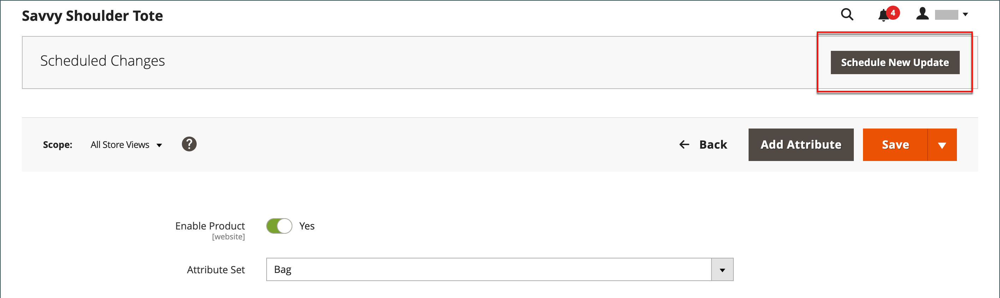
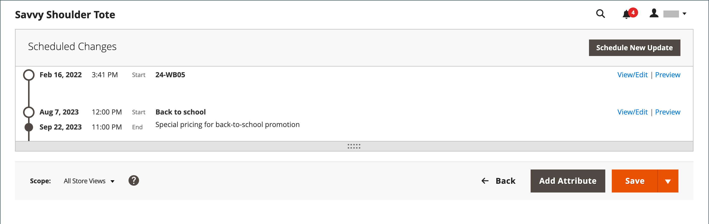
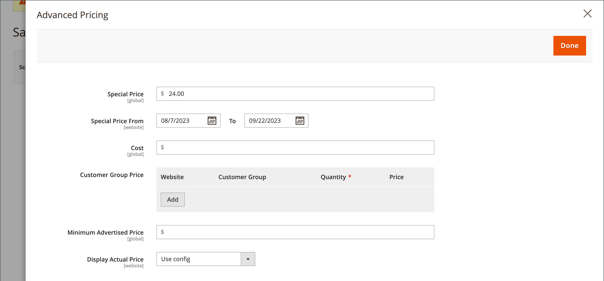
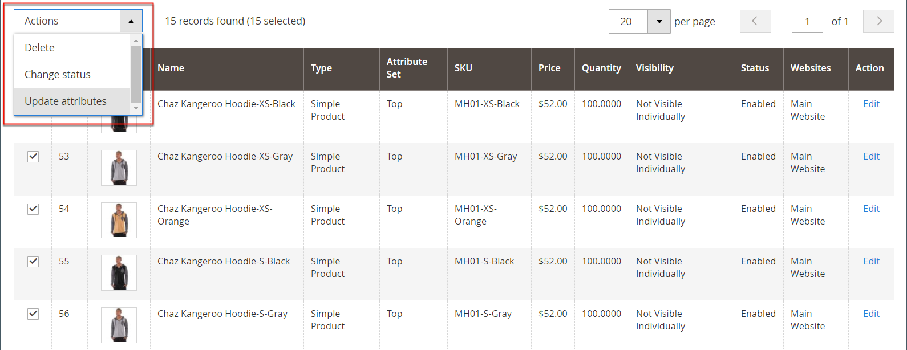

# 特别价格

可以在指定的时间段内提供特别价格。 在指定的时间段内，将显示特殊价格而不是常规价格，随后将显示表示法，该表示法显示常规价格。

产品页面上的{width="700" zoomable="yes"}

## 对单个产品应用特殊价格

您可以轻松地为目录中的单个产品设置特殊价格。

### 使用计划更新

{{ee-feature}}

Adobe Commerce包含对[计划更新](../content-design/content-staging-scheduled-update.md)的支持。 使用这些促销工具在特定时间段内对特定产品应用特殊价格。

1. 在编辑模式下打开产品。

1. 单击&#x200B;**[!UICONTROL Scheduled Update]**。

   {width="600" zoomable="yes"}

1. 对于&#x200B;**更新名称**，请输入特殊价格促销的名称。

1. 输入简短&#x200B;**[!UICONTROL Description]**。

1. 使用&#x200B;_日历_ （ ）图标为特殊价格促销选择&#x200B;**[!UICONTROL Start Date]**&#x200B;和&#x200B;**[!UICONTROL End Date]**。

   您还可以使用&#x200B;**[!UICONTROL Hour]**&#x200B;和&#x200B;**[!UICONTROL Minute]**&#x200B;滑块选择开始时间和结束时间。 设置开始和结束日期后，单击&#x200B;**[!UICONTROL Close]**。

   {width="600" zoomable="yes"}

1. 向下滚动到&#x200B;_价格_&#x200B;字段，单击&#x200B;**[!UICONTROL Advanced Pricing]**，然后输入要根据计划更新应用的&#x200B;**[!UICONTROL Special Price]**&#x200B;金额。

   {width="600" zoomable="yes"}

1. 完成后，单击&#x200B;**[!UICONTROL Done]**，然后单击&#x200B;**[!DNL Save]**。

   在店面，特价应同时出现在目录列表和产品页面上。

   _[!UICONTROL Scheduled Change]_&#x200B;显示在页面顶部。

   {width="600" zoomable="yes"}

### 使用简单的开始和结束日期

{{ce-feature}}

Magento Open Source包括高级定价选项中的简单起始日期和终止日期选项。

1. 在编辑模式下打开产品。

1. 向下滚动到&#x200B;_[!UICONTROL Price]_&#x200B;字段，单击&#x200B;**[!UICONTROL Advanced Pricing]**，然后输入&#x200B;**[!UICONTROL Special Price]**&#x200B;金额。

1. 使用&#x200B;_日历_ （ ）图标为特殊价格促销选择&#x200B;**[!UICONTROL Start Date]**&#x200B;和&#x200B;**[!UICONTROL End Date]**。

   特价从开始日期的午夜开始(00:01)立即生效，一直持续到结束日期前一天的午夜之前(23:59)。

   {width="600" zoomable="yes"}

1. 完成后，单击&#x200B;**[!UICONTROL Done]**，然后单击&#x200B;**[!UICONTROL Save]**。

   在店面，特价应同时出现在目录列表和产品页面上。

## 对多个产品应用特殊价格

您还可以为多个产品指定特殊价格，例如[可配置产品](product-create-configurable.md)的多个变体。

### 为所选产品设置特殊价格

{{ee-feature}}

以下示例显示如何在Adobe Commerce中为可配置产品的多个产品变体分配相同的特殊价格。

1. 在&#x200B;_[!UICONTROL Products]_&#x200B;页面上，单击&#x200B;**[!UICONTROL Filters]**&#x200B;并输入可配置产品的&#x200B;**[!UICONTROL Name]**。

1. 将&#x200B;**[!UICONTROL Type]**&#x200B;设置为`Configurable Product`并单击&#x200B;**[!UICONTROL Apply Filters]**。

1. 如果要对所有产品分配相同的特殊价格，请将第一列标题中的控件设置为`Select All`。

   作为替代方法，您可以选中要包含的每个产品的复选框。

1. 将&#x200B;**[!UICONTROL Actions]**&#x200B;控件设置为`Update attributes`。

1. 向下滚动到&#x200B;_[!UICONTROL Special Price]_&#x200B;字段，选中&#x200B;_[!UICONTROL Special Price]_&#x200B;字段下的&#x200B;**[!UICONTROL Change]**&#x200B;复选框，然后输入要提供的特殊价格。

   {width="600" zoomable="yes"}

1. 完成后，单击&#x200B;**[!UICONTROL Save]**。

商店中可用的特殊价格会显示在目录清单和产品页面中。 对于可配置产品，在选择相关选项时，产品页面上也会显示常规价格。

### 为所选产品设置特殊价格和日期范围

{{ce-feature}}

以下示例显示了如何在Magento Open Source中为可配置产品的多个产品变体分配相同的特殊价格。

1. 在&#x200B;_管理员_&#x200B;侧边栏上，转到&#x200B;**[!UICONTROL Catalog]** > **[!UICONTROL Products]**。

1. 单击&#x200B;**[!UICONTROL Filters]**。

1. 输入可配置产品的&#x200B;**[!UICONTROL Name]**。

1. 将&#x200B;**[!UICONTROL Type]**&#x200B;设置为`Simple Product`。

   {width="600" zoomable="yes"}

1. 单击&#x200B;**[!UICONTROL Apply Filters]**。

   该网格列出了作为可配置产品的变体关联的所有简单产品。

1. 如果要对所有产品分配相同的特殊价格，请将第一列标题中的控件设置为`Select All`。

   作为替代方法，您可以选中要包含的每个产品的复选框。

1. 将&#x200B;**[!UICONTROL Actions]**&#x200B;控件设置为`Update attributes`。

   {width="600" zoomable="yes"}

1. 向下滚动到_[!UICONTROL Special Price]**字段并执行以下操作：

   - 选中_[!UICONTROL Special Price]字段下的&#x200B;**[!UICONTROL Change]**&#x200B;复选框**然后输入要提供的特殊价格。

   - 选中&#x200B;_特殊价格起始日期_&#x200B;字段下的&#x200B;**[!UICONTROL Change]**&#x200B;复选框，单击&#x200B;_日历_ （），然后选择特殊价格促销的第一个日期。

     特价从开始日期的午夜开始(00:01)立即生效，一直持续到结束日期前一天的午夜之前(23:59)。

   - 选中&#x200B;_特别价格截止日期_&#x200B;字段下的&#x200B;**[!UICONTROL Change]**&#x200B;复选框，单击&#x200B;_日历_ （），然后选择特别价格促销的最后日期。

   {width="600" zoomable="yes"}

1. 完成后，单击&#x200B;**[!UICONTROL Save]**。

   一条消息指示有多少条记录使用特殊价格进行了更新。

   特殊价格将在指定的日期出现在商店中，并显示在目录清单和产品页面上。 对于可配置产品，在选择相关选项时，产品页面上也会显示常规价格。

   可配置产品的{width="600" zoomable="yes"}

## 测试

如果特殊价格未在目录列表和产品页面的店面中正确显示，请清除浏览器缓存：

1. 在&#x200B;_管理员_&#x200B;侧边栏上，转到&#x200B;**[!UICONTROL System]** > **[!UICONTROL Cache Management]**。

1. 单击&#x200B;**[!UICONTROL Flush Magento Cache]**。

>[!NOTE]
>
>使用以下公式计算&#x200B;**_最终_**&#x200B;产品价格为&#x200B;**_最低_**&#x200B;相关价格：  `Final Price=Min(Regular(Base) Price, Group(Tier) Price, Special Price, Catalog Price Rule) + Sum(Min Price per each required custom option)`

>[!NOTE]
>
>**_固定价格_**&#x200B;产品可自定义选项&#x200B;_不_&#x200B;受组价格、层价格、特殊价格或目录价格规则的影响。
