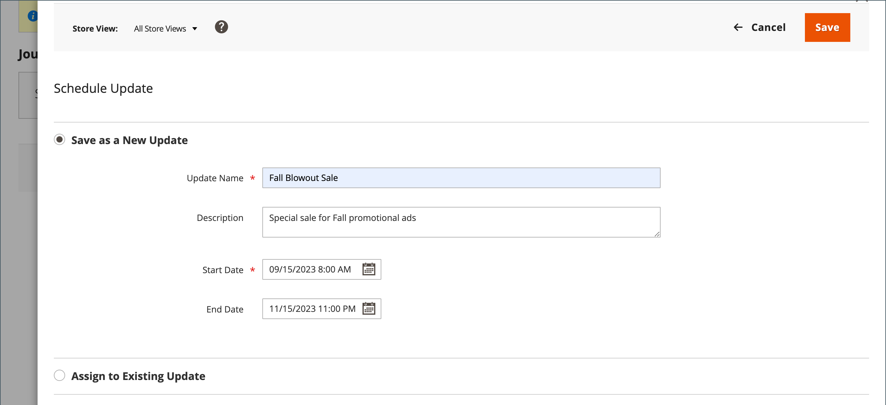

# 计划产品更新

{{ee-feature}}

产品更新可以按计划应用，并与其他内容更改分组。 您可以使用[内容暂存](../content-design/content-staging.md)来根据对产品的计划更改创建营销活动，或将更改应用于现有营销活动。

>[!NOTE]
>
>[!UICONTROL Set Product as New From]和[!UICONTROL To]字段以及[!UICONTROL Schedule Design Update]选项卡已在 Adobe Commerce中移除，无法直接在产品上修改。 您必须为这些激活创建计划的更新。

>[!NOTE]
>
>所有计划的更新都连续应用，这意味着任何实体一次只能有一个计划的更新。 任何计划的更新将应用于其时间范围内的所有存储视图。 因此，实体无法同时对不同存储视图进行不同的计划更新。 所有存储视图中的所有实体属性值（不受当前计划更新影响）均从默认值获取，而不是从上次计划更新获取。

>[!NOTE]
>
>计划更新的暂存预览始终从&#x200B;**默认**&#x200B;存储视图开始，该视图模拟客户在暂存更新营销活动中导航的体验。

## 创建计划的更新

1. 在&#x200B;_管理员_&#x200B;侧边栏上，转到&#x200B;**[!UICONTROL Catalog]** > **[!UICONTROL Products]**。

1. 选择现有产品并单击&#x200B;**[!UICONTROL Edit]**。

1. 单击&#x200B;**[!UICONTROL Schedule New Update]**。

1. 选择&#x200B;**[!UICONTROL Save as a New Update]**。

1. 为&#x200B;**[!UICONTROL Update Name]**&#x200B;输入新内容暂存营销活动的名称。

1. 输入更新的简短&#x200B;**[!UICONTROL Description]**&#x200B;及其使用方式。

1. 使用日历（）工具为营销活动选择&#x200B;**[!UICONTROL Start Date]**&#x200B;和&#x200B;**[!UICONTROL End Date]**。

   >[!NOTE]
   >
   >营销活动&#x200B;**[!UICONTROL Start Date]**&#x200B;和&#x200B;**[!UICONTROL End Date]**&#x200B;必须使用从每个网站的本地时区转换而来的&#x200B;**_默认_**&#x200B;管理时区进行定义。 例如，对于位于不同时区的多个网站，如果您希望根据美国时区启动促销活动，则必须为每个本地时区计划单独的更新。 设置&#x200B;**[!UICONTROL Start Date]**&#x200B;和&#x200B;**[!UICONTROL End Date]**&#x200B;作为每个时区，并将其从本地网站时区转换为默认管理时区。

   {width="600" zoomable="yes"}

1. 向下滚动到&#x200B;_[!UICONTROL Price]_并单击&#x200B;**[!UICONTROL Advanced Pricing]**。

1. 在计划的营销活动期间输入产品的&#x200B;**[!UICONTROL Special Price]**，然后单击&#x200B;**[!UICONTROL Done]**。

1. 完成后，单击&#x200B;**[!UICONTROL Save]**。

## 分配给现有更新

1. 在&#x200B;_管理员_&#x200B;侧边栏上，转到&#x200B;**[!UICONTROL Catalog]** > **[!UICONTROL Products]**。

1. 选择现有产品并单击&#x200B;**[!UICONTROL Edit]**。

1. 单击&#x200B;**[!UICONTROL Schedule New Update]**。

1. 选择&#x200B;**[!UICONTROL Assign to Existing Campaign]**。

1. 在列表中，选择要修改的营销策划。

   {width="600" zoomable="yes"}

1. 展开 **[!UICONTROL Content]**。

1. 完成后，单击&#x200B;**[!UICONTROL Save]**。

## 查看计划的更改

计划的更改将出现在产品页面的顶部，其中包含营销活动的开始和结束日期。

{width="600" zoomable="yes"}

## 编辑计划的更改

1. 在页面顶部的&#x200B;_[!UICONTROL Scheduled Changes]_框中，单击&#x200B;**[!UICONTROL View/Edit]**。

1. 对计划更新进行任何必要的更改。

1. 单击&#x200B;**[!UICONTROL Save]**。

## 删除计划的更改

1. 在页面顶部的&#x200B;_[!UICONTROL Scheduled Changes]_框中，单击&#x200B;**[!UICONTROL View/Edit]**。

1. 单击顶部栏上的&#x200B;**[!UICONTROL Remove from Update]**。

   {width="600" zoomable="yes"}

1. 在对话框中，选择&#x200B;**[!UICONTROL Delete the Update]**&#x200B;并单击&#x200B;**[!UICONTROL Done]**。

   >[!NOTE]
   >
   >产品将从更新中删除，并且所有计划的更改都将丢失。

## 计划设计更新

{{ce-feature}}

_[!UICONTROL Schedule Design Update]_部分允许您对产品页面的外观进行临时更改。 您可以安排在某一季节、促销活动中进行设计更改，也可以只进行更改以更新内容。 设计更改可以提前计划，以便按照您定义的计划生效，即_&#x200B;放置&#x200B;_。

{width="600" zoomable="yes"}

| 字段 | 描述 |
|--- |--- |
| [!UICONTROL Schedule Update From/To] | 确定将自定义布局应用于产品时的日期范围。 |
| [!UICONTROL New Theme] | 将自定义主题应用于产品。 |
| [!UICONTROL New Layout] | 将不同的布局应用于产品页面。 选项：  **[!UICONTROL No layout updates]**— 默认情况下，产品页面不提供布局更新。 **[!UICONTROL Empty]** — 允许您定义自己的布局，如4列页面。 （需要了解XML。）  **[!UICONTROL 1 column]**— 将一列布局应用于产品页面。 **[!UICONTROL 2 columns with left bar]** — 将带有左侧栏的两列布局应用于产品页面。  **[!UICONTROL 2 columns with right bar]**— 将带有右侧栏的两列布局应用于产品页面。 **[!UICONTROL 3 columns]** — 将三列布局应用于产品页面。 |

{style="table-layout:auto"}
