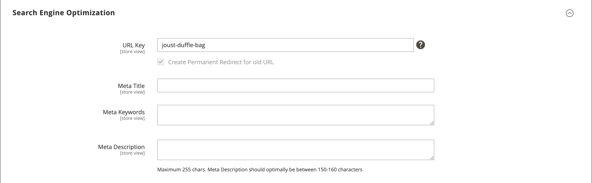

# 产品设置 — [!UICONTROL Search Engine Optimization]

_搜索引擎优化_ (SEO)是微调网站的内容和呈现方式以改进搜索引擎对页面进行索引的方式。

产品的&#x200B;_[!UICONTROL Search Engine Optimization]_设置指定搜索引擎用于索引产品的[URL键](catalog-urls.md)和[元数据](../merchandising-promotions/meta-data.md)字段。 尽管一些搜索引擎会忽略元关键字，但其他搜索引擎会继续使用它们。 当前[SEO最佳实践](../merchandising-promotions/seo-overview.md)是在元标题和元描述中并入高值关键字。

每个元数据字段的默认值可根据配置中指定的值自动生成。 每个字段都包含一个用实际值替换的占位符。 有关详细信息，请参阅[产品字段自动生成](../configuration-reference/catalog/catalog.md#uicontrol-product-fields-auto-generation)。

## 填写SEO字段

1. 在编辑模式下打开产品。

1. 向下滚动并展开&#x200B;_[!UICONTROL Search Engine Optimization]_部分的。

{width="600" zoomable="yes"}

1. 输入&#x200B;**[!UICONTROL URL Key]**（可选）。

   默认URL密钥基于产品名称。 您可以使用缺省值，也可以根据需要更改缺省值。 有关详细信息，请参阅[目录URL](catalog-urls.md)。

1. 输入&#x200B;**[!UICONTROL Meta Title]**（可选）。

   元标题是出现在浏览器窗口顶部的文本。 您可以使用基于产品名称的默认值，也可以根据需要进行更改。

1. 添加&#x200B;**[!UICONTROL Meta Keywords]**（可选）。

   某些搜索引擎比其他搜索引擎使用元关键字更多。 最佳实践是输入几个高价值的关键词，以帮助产品获得更多可视性。

1. 输入&#x200B;**[!UICONTROL Meta Description]**。

   元描述是出现在搜索结果列表中的文本。 要获得最佳结果，请输入长度在150-160个字符之间的描述。

## 字段引用

| 字段 | [作用域](../getting-started/websites-stores-views.md#scope-settings) | 描述 |
|--- |--- |------------------|
| [!UICONTROL URL Key] | 商店视图 | 确定产品的联机地址。 该URL密钥将添加到商店的基本URL中，并显示在浏览器的地址栏中。 Commerce最初创建了一个基于产品名称的&#x200B;_搜索引擎友好_ URL。 URL键应为全部小写字符，在这些字符之间使用非尾随连字符，而不是空格。 请勿在URL密钥中包含后缀，例如`.html`，因为它在配置中受管理。 |
| [!UICONTROL Meta Title] | 商店视图 | 标题显示在浏览器的标题栏和选项卡中，并用作搜索引擎结果页面(SERP)上的标题。 元标题对于页面应是唯一的，且长度应小于70个字符。 自动生成的值： `{{name}}` |
| [!UICONTROL Meta Keywords] | 商店视图 | 产品的相关关键词。 考虑使用客户可能用于查找产品的关键字。 自动生成的值： `{{name}}` |
| [!UICONTROL Meta Description] | 商店视图 | 元描述提供搜索结果列表的页面的简要概述。 理想的长度应介于150-160个字符之间，最大长度为255个字符。 虽然客户看不到某些搜索引擎，但它们在搜索结果页面上包含元描述。 自动生成的值： `{{name}} {{description}}` |

{style="table-layout:auto"}
