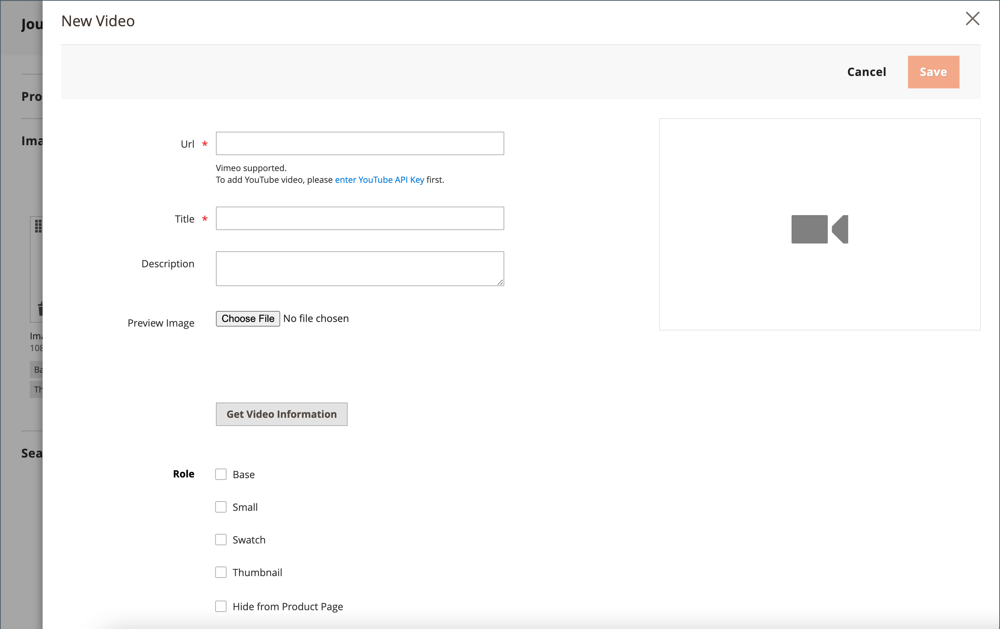

# 添加产品视频

要添加产品视频，您必须首先从Google帐户获取API密钥，并在商店的配置中输入该密钥。 然后，您可以从产品链接到视频。

## 步骤1：获取YouTube API密钥

1. 登录到您的Google帐户并访问 [Google开发人员控制台][1].

1. 在顶部的搜索字段中，输入 `YouTube Data API v3` ，然后单击搜索图标。

1. 显示API页面时，确保该页面处于启用状态。

1. 在左侧面板中，选择 **[!UICONTROL Credentials]**.

1. 根据您是否具有凭据，执行以下操作之一：

   - 如果您已经拥有所需的凭据，请将密钥复制到 _API密钥_ 表格。

   - 如果您还没有此API的凭据，请单击 **[!UICONTROL Create Credentials]**  ，然后按照提示创建所需的凭据。 下 _获取您的凭据_，复制API密钥并单击 **[!UICONTROL Done]**.

1. 将API密钥复制到剪贴板。

1. 单击右侧的“编辑”图标并设置限制，以确保API密钥被限制为使用正确的反向链接。

1. 等待片刻，以生成密钥，然后将密钥复制到剪贴板。

   在下一步中，您会将密钥粘贴到应用商店的配置中。

## 步骤2：在Commerce中配置密钥

1. 在 _管理员_ 侧栏，转到 **[!UICONTROL Stores]** > _[!UICONTROL Settings]_>**[!UICONTROL Configuration]**.

1. 在左侧面板中，展开 **[!UICONTROL Catalog]** 并选择 **[!UICONTROL Catalog]** 下方。

1. 展开  该 _[!UICONTROL Product Video]_分区并粘贴您的&#x200B;**[!UICONTROL YouTube API key]**.

   {width="600" zoomable="yes"}

1. 完成后，单击 **[!UICONTROL Save Config]**.

1. 出现提示时，刷新缓存。

## 步骤3：视频链接

1. 在编辑模式下打开产品。

1. 滚动到并展开 _[!UICONTROL Images and Videos]_部分。

   {width="600" zoomable="yes"}

1. 单击 **[!UICONTROL Add Video]**.

   如果尚未配置YouTube API密钥，请单击 **[!UICONTROL OK]** 以继续。 您无法链接到YouTube视频，但可以完成此过程。

1. 对象 **[!UICONTROL Url]**，输入YouTube或Vimeo视频的URL。

   {width="600" zoomable="yes"}

1. 单击字段外部并等待API密钥或视频的反馈。

   如果一切都已签出，YouTube将提供视频的基本信息

1. 输入 **[!UICONTROL Title]** 和 **[!UICONTROL Description]** 视频的。

1. 要上传 **[!UICONTROL Preview Image]**，浏览到图像并选择文件。

   >[!NOTE]
   >
   >上传后，显示的预览图像由外部视频服务提供商自动生成。 您无法从Adobe Commerce管理员中编辑图像。

1. 如果您希望使用视频元数据，请单击 **[!UICONTROL Get Video Information]**.

1. 要确定如何在商店中使用视频，请选中每个视频的复选框 **[!UICONTROL Role]** 适用：

   - `Base Image`
   - `Small Image`
   - `Swatch Image`
   - `Thumbnail`
   - `Hide from Product Page`

1. 完成后，单击 **[!UICONTROL Save]**.

   >[!NOTE]
   >
   >如果 _[!UICONTROL Autostart base video]_配置选项设置为 `Yes` 但是，视频不会自动开始播放，这可能是由于浏览器强制实施且无法由Adobe Commerce控制的自动播放策略所导致的。 每个受支持的浏览器都有自己的自动播放策略，这些策略会随着时间的推移而改变，并且您的视频将来可能不会自动播放。 作为建议的最佳实践，您不应依赖自动播放来实现业务关键功能，而应使用每个受支持的浏览器在您的存储中测试视频自动播放行为。

## 维护API访问

据Google开发人员介绍 [条款和条件]中，YouTube可能会为已处于非活动状态超过90天的帐户禁用API访问。 此事件可能会导致您的视频无法显示。 要使API访问保持最新，请使用cron作业定期ping通API：

```code
30 10 1 * * curl -i -G -e https://yourdomain.com/ -d "part=snippet&maxResults=1&q=test&key=YOUTUBEAPIKEY" https://www.googleapis.com/youtube/v3/search >/dev/null 2>&1
```

## 字段引用

| 字段 | 描述 |
|--- |--- |
| [!UICONTROL URL] | 相关视频的URL。 |
| [!UICONTROL Title] | 视频标题。 |
| [!UICONTROL Description] | 视频描述。 |
| [!UICONTROL Preview Image] | 已上传的图像，用于商店中的视频预览。 |
| [!UICONTROL Get Video Information] | 检索存储在主机服务器上的视频元数据。 您可以使用原始数据，也可以根据需要对其进行更新。 |
| [!UICONTROL Role] | 确定如何在您的商店中使用预览图像。 您可以选择任意选项组合： `Base Image`， `Small Image`， `Thumbnail`， `Swatch Image`， `Hide from Product Page` |

{style="table-layout:auto"}

[1]: https://console.developers.google.com/
[条款和条件]: https://developers.google.com/youtube/terms/developer-policies#d.-accessing-youtube-api-services
