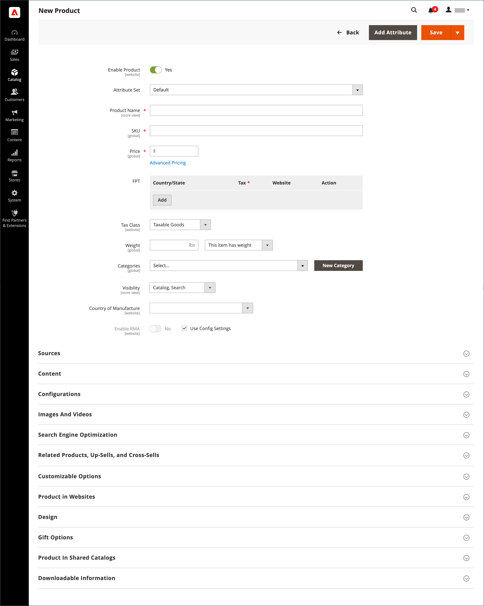
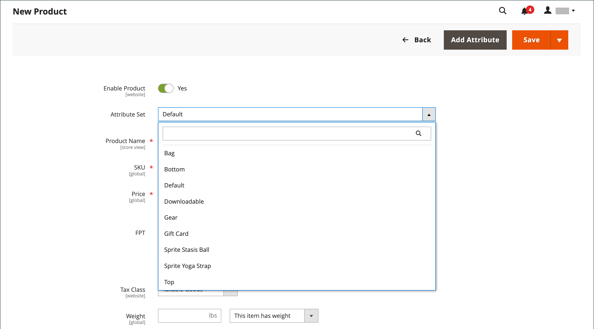

# 产品工作区

所有产品类型的产品工作区基本上相同，尽管字段选择会根据使用的属性集而发生更改。 产品属性位于表单顶部，其后是产品信息的可展开部分。 首次保存新产品时，_[!UICONTROL Store View]_&#x200B;选择器将显示在表单的左上角。

{width="700" zoomable="yes"}

## [!UICONTROL Enable Product]设置

产品的在线状态由表单顶部的开关指示。 若要更改联机状态，请将&#x200B;**[!UICONTROL Enable Product]**&#x200B;开关设置为`Yes`或`No`。

| 控件 | 描述 |
|-------- | ----------- |
|  | 指示产品处于联机状态。 |
|  | 指示产品处于脱机状态。 |

{style="table-layout:auto"}

## 属性集

[属性集](attribute-sets.md)的名称显示在左上角，它决定了产品记录中显示的字段。 要选择其他属性集，请单击默认属性集名称旁边的向下箭头。

{width="600" zoomable="yes"}

## 展开/折叠

要展开或折叠部分，请单击展开或折叠图标。

## [!UICONTROL Save]菜单

_[!UICONTROL Save]_&#x200B;菜单包含多个选项，可让您保存并继续、保存并创建产品、保存并复制产品，或者保存并关闭。

{width="600" zoomable="yes"}

| 命令 | 描述 |
|--- |--- |
| [!UICONTROL Save] | 保存当前产品并继续工作。 |
| [!UICONTROL Save & New] | 保存并关闭当前产品，然后基于相同的产品类型和模板开始新产品。 |
| [!UICONTROL Save & Duplicate] | 保存并关闭当前产品，然后打开新的重复副本。 |
| [!UICONTROL Save & Close] | 保存当前产品并返回&#x200B;_[!UICONTROL Products]_&#x200B;工作区。 |

{style="table-layout:auto"}

## 默认字段值

为了在创建产品时节省时间，多个产品字段的默认值会引用另一个字段的值。 您可以接受默认值或输入其他值。 以下字段已自动生成默认值：

| 字段 | 默认 |
|----- |------- |
| [!UICONTROL SKU] | 基于产品名称。 |
| [!UICONTROL Meta Title] | 基于产品名称。 |
| [!UICONTROL Meta Keywords] | 基于产品名称。 |
| [!UICONTROL Meta Description] | 基于产品名称和描述。 |

{style="table-layout:auto"}

表示另一个字段值的占位符用双大括号括起来。 产品[属性集](attribute-sets.md)中包含的任何属性代码都可以用作占位符。

{width="600" zoomable="yes"}

有关这些设置的详细列表，请参阅&#x200B;_配置引用_&#x200B;中的[产品字段自动生成](../configuration-reference/catalog/catalog.md#product-fields-auto-generation)。

### 编辑占位符值

1. 在&#x200B;_管理员_&#x200B;侧边栏上，转到&#x200B;**[!UICONTROL Stores]** > _[!UICONTROL Settings]_>**[!UICONTROL Configuration]**。

1. 在左侧面板中，展开&#x200B;**[!UICONTROL Catalog]**&#x200B;并在下面选择&#x200B;**[!UICONTROL Catalog]**。

1. 展开&#x200B;**[!UICONTROL Product Fields Auto-Generation]**&#x200B;部分的，并对占位符值进行任何所需的更改。

   例如，如果您希望为每个产品包含一个特定的关键字，或者希望在每个元描述中包含一个短语，请直接在相应的字段中输入该值。

   >[!NOTE]
   >
   >如果要保留现有的占位符值，请保留包含每个标记的双大括号。

1. 完成后，单击&#x200B;**[!UICONTROL Save Config]**。

### 常用占位符

- `{{color}}`
- `{{country_of_manufacture}}`
- `{{description}}`
- `{{gender}}`
- `{{material}}`
- `{{name}}`
- `{{short_description}}`
- `{{size}}`
- `{{sku}}`
