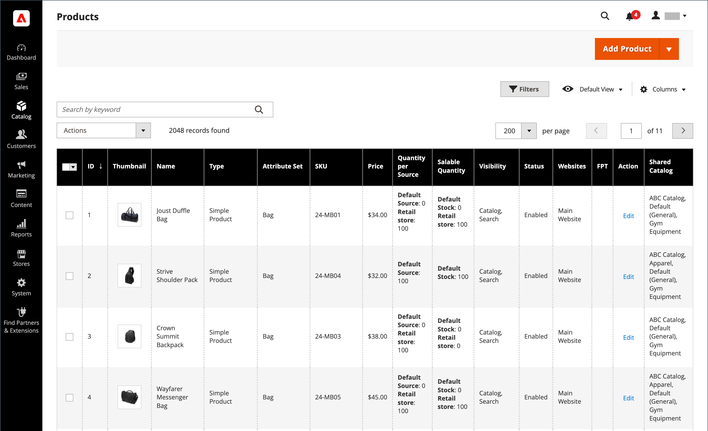

# 产品列表

目录中的所有产品都可从管理员的&#x200B;_[!UICONTROL Products]_页面访问，您可以在该页面中创建产品和编辑现有产品。 对于多站点安装，每个网站都可以从同一目录提供不同的产品选择以供销售。

_[!UICONTROL Products]_列表包括目录中的所有产品，指示这些产品所在的网站，以及这些产品当前是否允许销售。 在启用了[共享目录](../b2b/catalog-shared.md)的Adobe Commerce B2B安装中，网格包含一列，该列指示哪些产品在共享目录中具有替代折扣定价。

您可以逐页浏览列表页面，或搜索特定产品。 使用标准[控件](../getting-started/admin-grid-controls.md)对列表进行排序和筛选，并将[操作](../getting-started/admin-actions-control.md)应用于所选产品。

{width="700" zoomable="yes"}

## 限制产品显示

要提高大型目录的性能，建议您限制网格中显示的产品数。 您可以限制以下项显示的产品网格：

- 产品页面
- 添加相关/追加销售/交叉销售产品
- 将产品添加到捆绑产品
- 将产品添加到组产品
- 创建订单（管理员）

默认情况下，产品显示限制的此配置设置处于禁用状态。 启用此选项后，您可以将网格中的产品数量限制为特定值。 如果启用，并且网格显示的匹配产品数大于记录限制，则返回有限制的记录集合。 当达到限制时，找到的记录总数、选定的记录数以及分页元素数不会显示在网格标题中。

>[!NOTE]
>
>如果不希望限制产品网格，请更准确地使用筛选器来生成项目数少于&#x200B;_[!UICONTROL Records Limit]_字段中指定数量的集合。

**_要配置产品显示限制：_**

1. 在&#x200B;_管理员_&#x200B;侧边栏上，转到&#x200B;**[!UICONTROL Stores]** > _[!UICONTROL Settings]_>**[!UICONTROL Configuration]**。

1. 展开&#x200B;**[!UICONTROL Advanced]**&#x200B;并选择&#x200B;**[!UICONTROL Admin]**。

1. 展开&#x200B;**[!UICONTROL Admin Grids]**&#x200B;部分中的并执行以下操作：

   - 将&#x200B;**[!UICONTROL Limit Number of Products in Grid]**&#x200B;设置为`Yes`。

   - （可选）在&#x200B;**[!UICONTROL Records Limit]**&#x200B;字段中输入一个值，以将网格中的产品数量限制为特定值。 默认最小值为`20000`。

   {width="600" zoomable="yes"}

1. 完成后，单击&#x200B;**[!UICONTROL Save Config]**。

## 页面控件

| 控件 | 描述 |
|--- |--- |
| [!UICONTROL Add Product] | 启动流程以创建新的简单产品。 要选择特定的产品类型，请单击向下箭头。 选项： [[!UICONTROL Simple Product]](product-create-simple.md) / [[!UICONTROL Configurable Product]](product-create-configurable.md) / [[!UICONTROL Grouped Product]](product-create-grouped.md) / [[!UICONTROL Virtual Product]](product-create-virtual.md) / [[!UICONTROL Bundle Product]](product-create-bundle.md) / [[!UICONTROL Downloadable Product]](product-create-downloadable.md) / [[!UICONTROL Gift Card]](product-gift-card-create.md) |
| [!UICONTROL Actions] | 列出可应用于列表中选定产品的所有操作。 要对产品或产品组应用操作，请选中每个产品第一列中的复选框。 选项： `Delete` / `Change Status` / `Update Attributes` / `Assign Inventory Source` / `Unassign Inventory Source` / `Transfer Inventory To Source` |
| [!UICONTROL Filters] | 根据当前筛选器启动目录搜索。 |
| [!UICONTROL Default View] | 指示当前网格列布局。 如果存在已保存的网格列视图，则可以选择其他视图。 |
| [!UICONTROL Columns] | 列出可应用于列表中选定产品的所有操作。 要对产品或产品组应用操作，请选中每个产品第一列中的复选框。 |
| [!UICONTROL Search by keyword] | 左上角的搜索框用于按关键字查找产品。 |
| [!UICONTROL Edit] | 在编辑模式下打开产品。 通过单击行上的任意位置，可以实现相同的目标。 |

{style="table-layout:auto"}

## 默认列

| 列 | 描述 |
|--- |--- |
| （复选框） | 选择要遵循某项操作的多个记录。 每个选定记录的第一列中的复选框都将被标记。 选项：  **[!UICONTROL Select All]**— 选择找到的所有与当前筛选器设置匹配的记录。 **[!UICONTROL Select All on This Page]** — 仅选择在当前页面上找到的与筛选器设置匹配的记录。 |
| [!UICONTROL ID] | 首次保存新产品时分配的唯一序列号。 |
| [!UICONTROL Thumbnail] | 显示主产品图像的缩略图。 |
| [!UICONTROL Name] | 产品名称。 |
| [!UICONTROL Type] | 产品类型。 |
| [!UICONTROL Attribute Set] | 用作产品模板的属性集的名称。 |
| [!UICONTROL SKU] | 分配给产品的唯一库存单位。 |
| [!UICONTROL Price] | 产品的单价。 |
| [!UICONTROL Quantity] | 有库存的数量。 |
| [!UICONTROL Salable Quantity] | 此产品的所有可用单位的总和。 |
| [!UICONTROL Visibility] | 指示产品在目录中的可见位置。 选项： `Not Visible Individually` / `Catalog` / `Search` / `Catalog, Search` |
| [!UICONTROL Status] | 指示产品的状态。 选项： `Enabled`和`Disabled` |
| [!UICONTROL Websites] | 指示产品可用的网站。 |
| [!UICONTROL Remote Media URL] | 如果使用[适用于Commerce的AEM Assets集成](../content-design/aem-assets.md)管理产品媒体资源，则此字段显示用于在AEM Assets数字资产管理存储（保留资源的集中存储库）中查看Commerce资源的URL。 仅当启用了AEM Assets集成时，才会显示此字段。 |
| [!UICONTROL Action] | 在编辑模式下打开产品。 |
| [!UICONTROL Shared Catalog] | (仅适用于[Adobe Commerce B2B](./b2b/../introduction.md))指示包含产品的自定义定价的共享目录。 |

{style="table-layout:auto"}

## 其他列

| 列 | 描述 |
|--- |--- |
| [!UICONTROL Short Description] | 产品的简短描述。 |
| [!UICONTROL Special Price From Date] | 特殊价格促销的第一个日期。 |
| [!UICONTROL Special Price To Date] | 特殊价格促销的最后日期。 |
| [!UICONTROL Cost] | 物料的实际成本。 |
| [!UICONTROL Manufacturer] | 产品的制造商。 |
| [!UICONTROL Meta Keywords] | 产品的元关键字。 |
| [!UICONTROL Color] | 产品颜色。 |
| [!UICONTROL Set Product as New from Date] | 将产品设置为新促销活动的第一个日期。 |
| [!UICONTROL Set Product as New to Date] | 将产品设置为新促销的最后日期。 |
| [!UICONTROL Active From / To] | 产品的开始日期和结束日期。 |
| [!UICONTROL Layout] | 产品布局。 |
| [!UICONTROL Minimum Advertised Price] | 产品的最低广告价格。 |
| [!UICONTROL Allow Gift Message] | 给购买礼品卡的客户的礼品消息。 |
| [!UICONTROL Special Price] | 产品的特殊价格。 |
| [!UICONTROL Weight] | 产品重量。 |
| [!UICONTROL Meta Title] | 产品的元标题。 |
| [!UICONTROL Meta Description] | 产品元数据描述。 |
| [!UICONTROL Country of Manufacture] | 生产国家/地区。 |
| [!UICONTROL New Theme] | 已将自定义主题应用于产品。 |
| [!UICONTROL URL Key] | 产品的URL密钥。 |
| [!UICONTROL Tax Class] | 产品税分类。 |
| [!UICONTROL Allow Gift Message] | 显示产品的礼品消息选项的可用性。 |

{style="table-layout:auto"}
