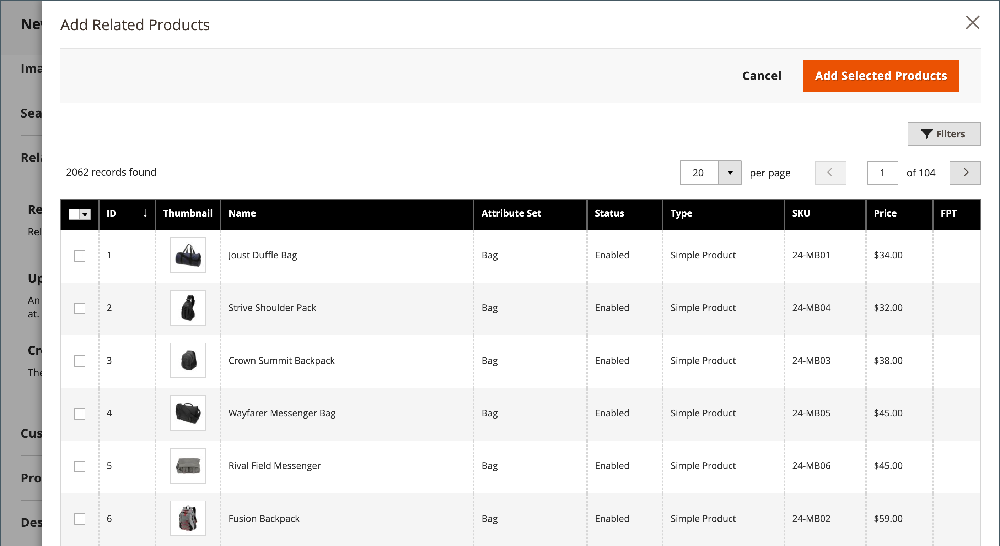
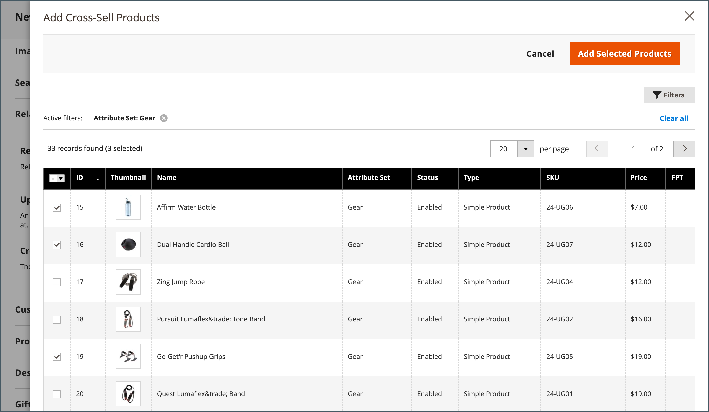

# 产品设置 —  [!UICONTROL Related Products, Up-Sells, and Cross-Sells]

使用 _[!UICONTROL Related Products, Up-Sells, and Cross-Sells]_部分，用于设置简单的促销块，这些块提供客户可能感兴趣的一系列其他产品。 有关更多信息，请参阅 [产品关系](../merchandising-promotions/product-relationships.md).

{width="600" zoomable="yes"}

每个块由属于特定选项的产品列表组成。

| 字段 | 描述 |
|--- |--- |
| [!UICONTROL ID] | 分配给产品实体的唯一数字标识符。 |
| [!UICONTROL Thumbnail] | 产品缩略图图像。 |
| [!UICONTROL Name] | 产品的名称。 |
| [!UICONTROL Status] | 指示产品状态。 选项： `Enabled` / `Disabled`. 禁用的产品不会显示在前端的块中。 |
| [!UICONTROL Attribute Set] | 用作产品模板的属性集的名称。 |
| [!UICONTROL SKU] | 分配给产品的唯一库存单位。 |
| [!UICONTROL Price] | 产品的单价。 |
| [!UICONTROL Action] | 选项： `Remove`. 从块中删除产品。 |

{style="table-layout:auto"}

>[!TIP]
>
> (仅限Adobe Commerce) **由Adobe Sensei提供支持的产品Recommendations** 通过使用人工智能和机器学习算法对汇总的访客数据进行深入分析，简化了定义产品关系的过程。 此数据与Adobe Commerce目录结合使用后，可为购物者提供引人入胜、相关且个性化的体验。
> 
>有关使用此Adobe开发的扩展作为手动配置的产品推荐和追加销售的替代方案的更多信息，请参阅 _[产品Recommendations指南](https://experienceleague.adobe.com/docs/commerce-merchant-services/product-recommendations/guide-overview.html)_.

## 相关产品

除了客户正在查看的项目外，还应该购买相关产品。 客户只需单击复选框即可将商品放入购物车。 放置 _相关产品_ 块根据定义的主题和页面布局而有所不同。 在以下示例中， _相关产品_ 块显示在底部 _产品查看_ 页面。 采用两列式布局， _相关产品_ 块经常出现在右侧边栏中。

{width="600" zoomable="yes"}

要设置相关产品，请执行以下操作：

1. 在编辑模式下打开产品。

1. 向下滚动并展开  该 **[!UICONTROL Related Products, Up-Sells, and Cross-Sells]** 部分。

1. 单击 **[!UICONTROL Add Related Products]**.

1. 使用 [筛选器控件](../getting-started/admin-grid-controls.md) 以查找所需的产品。

1. 在列表中，选中任何要作为相关产品使用的产品的复选框。

   {width="600" zoomable="yes"}

1. 完成后，单击 **[!UICONTROL Add Selected Products]**.

## 追加销售

追加销售产品是客户可能更喜欢的产品，而不是当前考虑的产品。 作为向上销售提供的商品可能质量更高、更受欢迎，或者利润率更高。 追加销售产品会显示在产品页面的标题下，例如 _您可能还会对以下产品感兴趣_.

{width="600" zoomable="yes"}

要选择追加销售产品，请执行以下操作：

1. 在编辑模式下打开产品。

1. 向下滚动并展开  该 **[!UICONTROL Related Products, Up-Sells, and Cross-Sells]** 部分。

1. 单击 **[!UICONTROL Add Up-Sell Products]**.

1. 使用 [筛选器控件](../getting-started/admin-grid-controls.md) 以查找所需的产品。

1. 在列表中，选中任何要作为追加销售产品使用的产品的复选框。

   {width="600" zoomable="yes"}

1. 完成后，单击 **[!UICONTROL Add Selected Products]**.

>[!NOTE]
>
>父捆绑产品始终自动显示为其所有子产品的追加销售产品。

## 交叉销售

交叉销售商品与位于结账行中收银机旁边的冲动购买类似。 在客户开始结帐之前，以交叉销售形式提供的产品会显示在购物车页面上。

>[!NOTE]
>
>要按商店视图显示或隐藏交叉销售物料，请参阅 [结帐>购物车](../configuration-reference/sales/checkout.md) 已调用选项 _[!UICONTROL Show Cross-sell Items]_在购物车中。 您可能需要在特定销售期间隐藏交叉销售，或在商店视图中隐藏A/B测试。

{width="600" zoomable="yes"}

**_要选择交叉销售产品，请执行以下操作：_**

1. 在编辑模式下打开产品。

1. 向下滚动并展开  该 **[!UICONTROL Related Products, Up-Sells, and Cross-Sells]** 部分。

1. 单击 **[!UICONTROL Add Cross-Sell Products]**.

1. 使用 [筛选器控件](../getting-started/admin-grid-controls.md) 以查找所需的产品。

1. 在列表中，选中作为交叉销售产品功能的任何产品的复选框。

   {width="600" zoomable="yes"}

1. 完成后，单击 **[!UICONTROL Add Selected Products]**.
