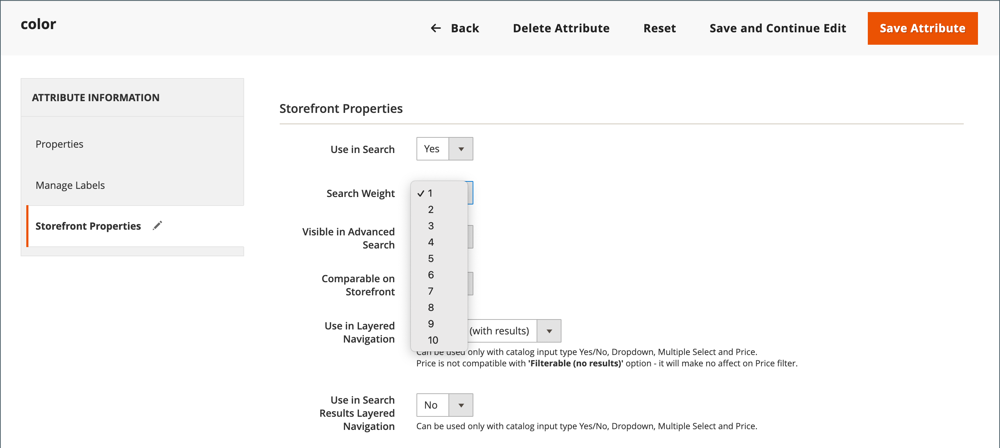

# 搜索结果

>[!NOTE]
>
>本页介绍的标准搜索功能可能与 [实时搜索](https://experienceleague.adobe.com/docs/commerce-merchant-services/live-search/overview.html).

此 _搜索结果_ 列表包括与“快速搜索”框或“高级搜索”表单中输入的搜索条件匹配的所有产品。 目录中的每个产品列表基本上具有相同的控件。 唯一的区别是，一个是搜索查询的结果，另一个区别是 [导航](navigation.md).

结果可以格式化为网格或列表，并按属性选择进行排序。 如果页面上的产品超出其容纳范围，则会显示分页控件。 使用这些控件可从一个页面移动到下一个页面。 每页的记录数由目录前端配置决定。 有关更多信息，请参阅 [产品列表](navigation-product-listings.md).

替换为 **Elasticsearch**：

- 对于后缀的搜索，没有现成的支持。 例如，如果关键字只包含SKU的端部，则按SKU搜索可能不会返回预期结果。
- 开箱即用地支持按前缀搜索（部分关键词搜索） `name` 和 `sku` 仅限产品属性。 其他所有产品属性均按整个关键字进行搜索，且完全匹配。
- 搜索结果 `name` 和 `sku` 产品属性基于相关性，而不是精确匹配。 最相关的匹配，例如完全匹配 _产品名称_ 或 _SKU_，首先列出。 要搜索完全匹配项，客户可以在搜索查询中使用双引号。 例如， `WSH12-32-Red` 搜索查询可能返回多个产品，按相关性排序。 但是 `"WSH12-32-Red"` 搜索查询仅返回一个产品，具有 **_完全匹配_** 匹配 `sku`.

{width="700" zoomable="yes"}

>[!IMPORTANT]
>
>由于Elasticsearch7将于2023年8月宣布终止支持，建议所有Adobe Commerce客户迁移到OpenSearch 2.x搜索引擎。 有关在产品升级期间迁移搜索引擎的信息，请参阅 [迁移到OpenSearch](https://experienceleague.adobe.com/docs/commerce-operations/upgrade-guide/prepare/opensearch-migration.html) 在 _升级指南_.

## 用于扩展搜索结果的关键字映射

此技术使用属性在两个产品之间创建基于关键字的关联，以便搜索任一产品都会返回两个产品的结果。 您可以使用关键词映射来促销搜索结果中的产品，否则不会显示产品。

{width="700" zoomable="yes"}

以下示例使用基于SKU的关键字映射。 在搜索框中输入任一SKU后，两个产品都会显示在结果中。 映射以下可配置产品的SKU，而不是产品变体的SKU：

- 蒙大拿风衣(MJ03)
- 查兹袋鼠连帽衫(MH01)

### 步骤1：创建属性

1. 在 _[!UICONTROL Products]_列表，打开 `Montana Wind Jacket` (MJ03)编辑模式。
1. 在右上角，单击 **[!UICONTROL Add Attribute]**.
1. 在 _选择属性_ 页面，单击 **[!UICONTROL Create New Attribute]**.
1. 按如下方式填写属性属性：

   **[!UICONTROL Attribute Properties]**

   - [!UICONTROL Attribute Label]  - `Search Keywords`
   - [!UICONTROL Catalog Input Type for Store Owner] - `Text Field`

   **[!UICONTROL Advanced Attribute Properties]**

   - [!UICONTROL Add to Column Options] - `Yes` （默认）
   - [!UICONTROL Use in Filter Options] - `Yes` （默认）

   **[!UICONTROL Storefront Properties]**

   - [!UICONTROL Use in Search] - `Yes`
   - [!UICONTROL Visible on Catalog Pages in the Storefront] - `No`
   - [!UICONTROL Used in Product Listings] - `No`

1. 完成后，单击 **[!UICONTROL Save Attribute]**.

   该属性将添加到产品的属性集中。

### 步骤2：映射第一个产品

1. 在产品设置页面上，向下滚动并展开 _[!UICONTROL Attributes]_部分。
1. 在 **[!UICONTROL Search Keywords]** 字段，输入SKU `MH01` 将映射到此产品的属性。

   您可以在Search Keywords字段中输入多个以空格分隔的SKU。 在此示例中，只输入一个。

   {width="600" zoomable="yes"}

1. 完成后，单击 **[!UICONTROL Save]**.
1. 转到 **[!UICONTROL System]** > _[!UICONTROL Tools]_>**[!UICONTROL Cache Management]**并刷新&#x200B;**[!UICONTROL Page Cache]**.

### 步骤3：映射第二个产品

1. 在 _[!UICONTROL Products]_列表，打开 `Chaz Kangaroo Hoodie` (MH01)处于编辑模式。
1. 向下滚动并展开 **[!UICONTROL Attributes]** 部分。
1. 在 **[!UICONTROL Search Keywords]** 字段中，输入其他产品的SKU， `MJ03`.
1. 单击 **[!UICONTROL Save]**.
1. 转到 **[!UICONTROL System]** > _[!UICONTROL Tools]_>**[!UICONTROL Cache Management]**并刷新&#x200B;**[!UICONTROL Page Cache]**.

### 步骤4：在店面中测试

1. 前往店面并进入 `MJ03` 在 _快速搜索_ 盒子。
1. 验证搜索结果列表中是否返回了这两个产品。

## 加权搜索

可以为为目录搜索启用的产品属性分配权重，以便在搜索结果中赋予它们较高的值。 较重属性的返回先于较轻属性的返回。 例如，如果系统中有两个属性， _颜色_ 搜索权重为3且 _描述_ 搜索权重为1。 搜索单词 _红色_ 返回颜色属性值为的产品列表 `red` 返回搜索结果顶部的产品，其中包含的描述包含单词 _红色_ 位于搜索结果底部。 在此示例中， `color` 属性的已定义权重大于 `description` 属性。

**_设置属性的搜索权重属性：_**

1. 在 _管理员_ 侧栏，转到 **[!UICONTROL Stores]** > _[!UICONTROL Attributes]_>**[!UICONTROL Product]**.

1. 在列表中查找属性并在编辑模式下打开。

1. 在左侧面板中，选择 **[!UICONTROL Storefront Properties]** 并执行以下操作：

   - 要在搜索查询中包含属性，请设置 **[!UICONTROL Use in Search]** 到 `Yes`.

   - 要建立属性的搜索值，请设置 **[!UICONTROL Search Weight]** 到1到10之间的数字，其中 `10` 具有最高优先级。 如果未输入值，则所有属性默认使用搜索权重 `1`.

   {width="600" zoomable="yes"}

1. 完成后，单击 **[!UICONTROL Save Attribute]**.
