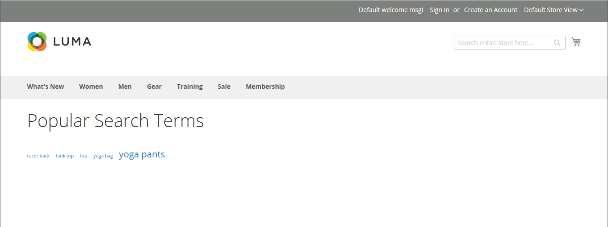

# 管理搜索词

搜索词的[登陆页面](../content-design/pages.md)可以是内容页面、类别页面、产品详细信息页面，甚至可以是其他网站上的页面。

使用搜索词捕获常见的拼写错误并将它们重定向到相应的页面。 例如，如果您销售锻铁式露台家具，您知道许多人会误将术语拼写为&#x200B;_rod iron_，甚至&#x200B;_rot iron_。 您可以输入每个拼写错误的单词作为搜索词，并使它们成为&#x200B;_锻铁_&#x200B;的同义词。 尽管这个词拼写有误，搜索仍会被导向到需要锻铁的页面。

您还可以通过检查客户在您的商店中查找产品时所使用的搜索词来了解他们要查找的内容。 如果有足够多的人在寻找目录中没有的产品，则表明存在销售机会。 同时，您可以将它们重定向到目录中的其他产品，而不是让这些产品空手而归。

## 添加搜索词

当您了解用户使用新词在您的商店中进行搜索时，可以将这些词添加到您的搜索词列表，以将用户定向到您目录中最匹配的产品。

{width="700" zoomable="yes"}

| 列 | 描述 |
|--- |--- |
| [!UICONTROL Search Query] | 用于执行搜索的查询。 |
| [!UICONTROL Store] | 应用搜索查询的存储。 |
| [!UICONTROL Results] | 查询找到的结果数。 |
| [!UICONTROL Uses] | 使用次数。 |
| [!UICONTROL Redirect URL] | 执行搜索后用户被重定向到的目标页面的URL。 |
| [!UICONTROL Suggested Terms] | 确定查询结果是否显示建议的术语。 |
| [!UICONTROL Actions] | 在编辑模式下打开产品。 |

{style="table-layout:auto"}

>[!NOTE]
>
>每次购物者使用此搜索查询执行搜索时，结果数都会更新。 如果更改或删除了任何产品，则不会更新它。

### 添加搜索词

1. 在&#x200B;_管理员_&#x200B;侧边栏上，转到&#x200B;**[!UICONTROL Marketing]** > _[!UICONTROL SEO & Search]_>**[!UICONTROL Search Terms]**。

1. 单击&#x200B;**[!UICONTROL Add New Search Term]**。

   {width="600" zoomable="yes"}

1. 在&#x200B;**[!UICONTROL Search Query]**&#x200B;框中的&#x200B;_[!UICONTROL General Information]_下，输入要作为新搜索词添加的词或短语。

1. 如果您的商店以多种语言提供，请选择适用的&#x200B;**[!UICONTROL Store]**&#x200B;视图。

1. 要将搜索结果重定向到您商店中的其他页面或其他网站，请在&#x200B;**[!UICONTROL Redirect URL]**&#x200B;字段中输入目标页面的完整URL。

1. 如果希望每当搜索未返回任何结果时此术语可用作建议，请将&#x200B;**[!UICONTROL Display in Suggested Terms]**&#x200B;设置为`Yes`。

1. 完成后，单击&#x200B;**[!UICONTROL Save Search]**。

## 编辑搜索词

1. 在&#x200B;_[!UICONTROL Search Terms]_网格中，单击任何记录的行以在编辑模式下打开搜索项。

1. 进行必要的更改。

1. 完成后，单击&#x200B;**[!UICONTROL Save Search]**。

## 删除搜索词

有两种删除搜索词的方法 — 从网格中删除和在“编辑”页面上删除。

_[!UICONTROL Search Terms]_网格中的&#x200B;**方法1：**

1. 在列表中，选中要删除的术语的复选框。

1. 在列表的左上角，将&#x200B;**[!UICONTROL Actions]**&#x200B;设置为`Delete`。

1. 完成后，单击&#x200B;**[!UICONTROL Submit]**。

_[!UICONTROL Edit a Search Term]_页面上的&#x200B;**方法2：**

1. 在&#x200B;_管理员_&#x200B;侧边栏上，转到&#x200B;**[!UICONTROL Marketing]** > _[!UICONTROL SEO & Search]_>**[!UICONTROL Search Terms]**。

1. 查找要删除的搜索词并在编辑模式下将其打开。

1. 单击&#x200B;**[!UICONTROL Delete Search]**。

1. 要确认操作，请单击&#x200B;**[!UICONTROL OK]**。

## 常用搜索词

商店页脚中的&#x200B;_搜索词_&#x200B;链接显示商店访客使用的搜索词，按人气排序。 搜索词以&#x200B;_标记云_&#x200B;格式显示，其中文本的大小表示搜索词的人气。

默认情况下，常用搜索词已启用作为搜索引擎优化工具，但不会直接连接到目录搜索过程。 由于搜索词页面是由搜索引擎编制索引的，因此该页面上的任何搜索词都可以帮助提高搜索引擎排名以及商店的可见性。 常用搜索词页面的URL为： `mystore.com/search/term/popular/`

{width="600" zoomable="yes"}

**_要配置常用搜索词：_**

1. 在&#x200B;_管理员_&#x200B;侧边栏上，转到&#x200B;**[!UICONTROL Stores]** > _[!UICONTROL Settings]_>**[!UICONTROL Configuration]**。

1. 在左侧面板中，展开&#x200B;**[!UICONTROL Catalog]**&#x200B;并在下面选择&#x200B;**[!UICONTROL Catalog]**。

1. 展开&#x200B;**[!UICONTROL Search Engine Optimization]**&#x200B;部分的。

   {width="600" zoomable="yes"}

   有关这些选项的详细列表，请参阅&#x200B;_配置引用_&#x200B;中的[搜索引擎优化](../configuration-reference/catalog/catalog.md#search-engine-optimization)。

1. 根据需要设置&#x200B;**[!UICONTROL Popular Search Terms]**。

   如果需要，请清除&#x200B;**[!UICONTROL Use system value]**&#x200B;复选框以更改此设置。

1. 完成后，单击&#x200B;**[!UICONTROL Save Config]**。

>[!NOTE]
>
>您可以进一步配置常用[目录搜索](search-configuration.md)的缓存。

## 搜索同义词

提高[目录搜索](search-configuration.md)的有效性的一种方法是包含人们可能用于描述同一项目的不同术语。 您不希望仅因为某人正在查找&#x200B;_沙发_&#x200B;并且您的产品被列为&#x200B;_沙发_&#x200B;而丢失销售。 通过输入&#x200B;_sofa_、_davenport_&#x200B;和&#x200B;_loveeat_&#x200B;作为&#x200B;_couch_&#x200B;的同义词，您可以捕获更广泛的搜索词，并将它们定向到同一登陆页面。

Adobe Commerce支持两种不同的同义词管理解决方案：

- Live Search [同义词](https://experienceleague.adobe.com/docs/commerce-merchant-services/live-search/live-search-admin/synonyms/synonyms.html)功能可用于已安装Live Search的Adobe Commerce安装。
- 所有Adobe Commerce安装均可现成使用标准搜索同义词功能（如本页所述）。

>[!NOTE]
>
>标准搜索同义词功能开箱即用支持`name`和`sku`产品属性&#x200B;**_仅_**。

>[!IMPORTANT]
>
>搜索同义词功能仅使用全文匹配搜索方法。

{width="700" zoomable="yes"}

### 创建同义词组

1. 在&#x200B;_管理员_&#x200B;侧边栏上，转到&#x200B;**[!UICONTROL Marketing]** > _[!UICONTROL SEO & Search]_>**[!UICONTROL Search Synonyms]**。

   出现&#x200B;_[!UICONTROL Search Synonyms]_网格。 如果这是您第一次使用搜索同义词，则网格为空。

   {width="700" zoomable="yes"}

1. 单击&#x200B;**[!UICONTROL New Synonym Group]**。

   {width="700" zoomable="yes"}

1. 将&#x200B;**[!UICONTROL Scope]**&#x200B;设置为应用同义词的存储视图。

1. 输入组中的每个同义词，用逗号分隔。 选择人们可能用作搜索标准的单词。 例如：

   - `sweatshirt, sweat shirt, hoodie, fleece`
   - `cell phone, mobile phone, smart phone`
   - `couch, sofa, davenport`
   - `wrought iron, rot iron, rod iron`

1. 要将这些同义词合并到具有相同范围的其他同义词组中，请选中&#x200B;**[!UICONTROL Merge existing synonyms]**&#x200B;复选框。

1. 完成后，单击&#x200B;**[!UICONTROL Save Synonym Group]**。

### 编辑同义词组

1. 在&#x200B;_[!UICONTROL Search Synonyms]_网格中，单击任何记录的行以在编辑模式下打开同义词组。

1. 进行必要的更改。

1. 完成后，单击&#x200B;**[!UICONTROL Save Synonym Group]**。

### 删除同义词组

删除同义词组的方法有两种：从网格中删除和在编辑页面上。

搜索同义词网格中的&#x200B;**方法1：**

1. 在&#x200B;_[!UICONTROL Search Synonyms]_网格中，选中要删除的组的复选框。

1. 在列表的左上角，将&#x200B;**[!UICONTROL Actions]**&#x200B;设置为`Delete`。

1. 完成后，单击&#x200B;**[!UICONTROL Submit]**。

在“编辑同义词组”页面上&#x200B;**方法2：**

1. 在“搜索同义词”网格中，单击任意记录的行以在编辑模式下打开同义词组。

1. 单击&#x200B;**[!UICONTROL Delete Synonym Group]**。

1. 出现提示时，确认移除该组。

## 搜索词报表

搜索词报表显示每个搜索词的结果数以及使用该搜索词的次数（点击次数）。 可按术语、存储、结果和点击筛选报告数据，并导出以供进一步分析。

### 查看报告

1. 在&#x200B;_管理员_&#x200B;侧边栏上，转到&#x200B;**[!UICONTROL Reports]** > _[!UICONTROL Marketing]_>**[!UICONTROL Search Terms]**。

1. 根据需要使用控件筛选报表。

   {width="700" zoomable="yes"}

## 导出报告

1. 对于&#x200B;**[!UICONTROL Export to]**，请选择导出格式：

   - `CSV` — 包含纯文本数据的逗号分隔值文件
   - `Excel XML` — 基于XML的电子表格数据格式

1. 单击&#x200B;**[!UICONTROL Export]**。

   生成的文件会自动保存到指定的文件夹以供下载。

### 报表列

| 列 | 描述 |
|--- |--- |
| [!UICONTROL ID] | 为搜索词条目生成的唯一数字ID |
| [!UICONTROL Search Query] | 用于执行搜索的查询 |
| [!UICONTROL Store] | 应用搜索查询的存储 |
| [!UICONTROL Results] | 结果数 |
| [!UICONTROL Hits] | 使用次数 |

{style="table-layout:auto"}
