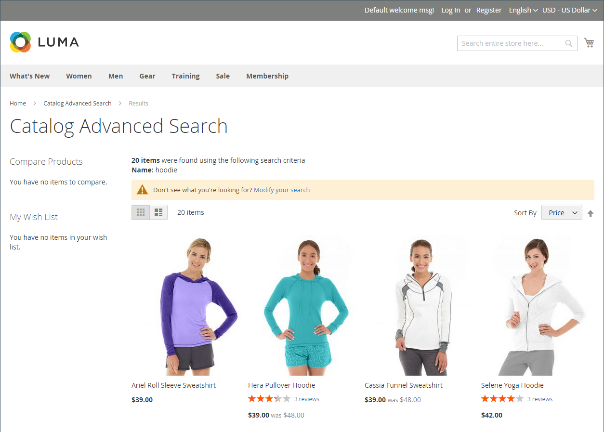

# 目录搜索概述

>[!TIP]
>
>[[!DNL Live Search]](https://experienceleague.adobe.com/docs/commerce/live-search/overview.html)提供了快速、超级相关且直观的搜索体验，可供Adobe Commerce免费使用。 本节介绍可能与[!DNL Live Search]不同的标准搜索功能。

研究表明，使用搜索的用户比仅依赖导航的客户更有可能购物。 事实上，根据一些研究，使用搜索功能的人购买产品的可能性几乎是两倍。

以下各节介绍了基本的目录搜索功能。 有关如何配置和自定义本机目录搜索功能的信息，请参阅：

- [配置目录搜索](search-configuration.md)
- [搜索结果](search-results.md)
- [管理搜索词](search-terms.md)

>[!NOTE]
>
>Commerce中的本机搜索功能提供完全匹配的搜索结果。 而[!DNL Live Search]（可在Adobe Commerce中安装和启用的可选模块）的实施方式不同，结果不限于确切的搜索字符串。 例如，您有10个编号为&#x200B;_Omega_&#x200B;的产品：搜索`Omega 1`将导致&#x200B;_Omega 1_&#x200B;与本机搜索功能有一个匹配。 但是，由Live Search提供支持的同一搜索字符串将匹配多个项目&#x200B;_Omega 1_&#x200B;和&#x200B;_Omega 10_。

## 快速搜索

>[!NOTE]
>
>安装[[!DNL Live Search]](https://experienceleague.adobe.com/en/docs/commerce/live-search/overview)并启用[[!DNL Storefront Popover]](https://experienceleague.adobe.com/en/docs/commerce/live-search/live-search-storefront/storefront-popover)构件时，搜索框会在弹出窗口中返回“键入时搜索”结果。

商店标题中的搜索框可帮助访客在目录中查找产品。 搜索文本可以是完整或部分产品名称，也可以是描述产品的任何其他单词或短语。 管理员可管理用户用于查找产品的搜索词。

1. 对于&#x200B;**[!UICONTROL Search]**，客户输入其要查找内容的前几个字母。

   以下显示目录中的任何匹配项，其中包含找到的结果数。

1. 客户按Enter键或单击匹配产品列表中的结果。

   {width="700" zoomable="yes"}

## 高级搜索

>[!NOTE]
>
>此处介绍的高级表单搜索功能不适用于[[!DNL Live Search]](https://experienceleague.adobe.com/docs/commerce/live-search/overview.html)。

通过高级搜索，购物者可以根据在表单中输入值搜索目录。 由于表单包含多个字段，因此单次搜索可以包含多个参数。 结果将列出目录中符合条件的所有产品。 高级搜索的链接位于商店的页脚中。

{width="700" zoomable="yes"}

表单中的每个字段对应于产品目录中的属性。 要添加字段，请将属性的前端属性设置为`Include in Advanced Search`。 作为最佳实践，应仅包含客户最有可能用于查找产品的字段，因为数量过多会减慢搜索速度。

1. 在商店的页脚中，客户单击&#x200B;**[!UICONTROL Advanced Search]**。

1. 在&#x200B;_高级搜索_&#x200B;窗体中，将完整或部分值添加到所需数量的字段中。

1. 单击&#x200B;**[!UICONTROL Search]**&#x200B;以显示结果。

   {width="700" zoomable="yes"}

1. 如果他们在搜索结果中未看到要查找的内容，则客户单击&#x200B;**[!UICONTROL Modify your search]**&#x200B;并尝试其他条件组合。
