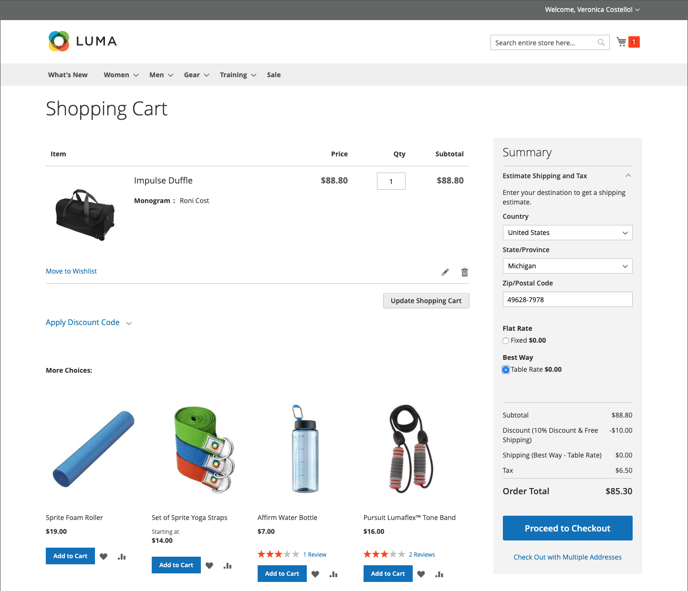
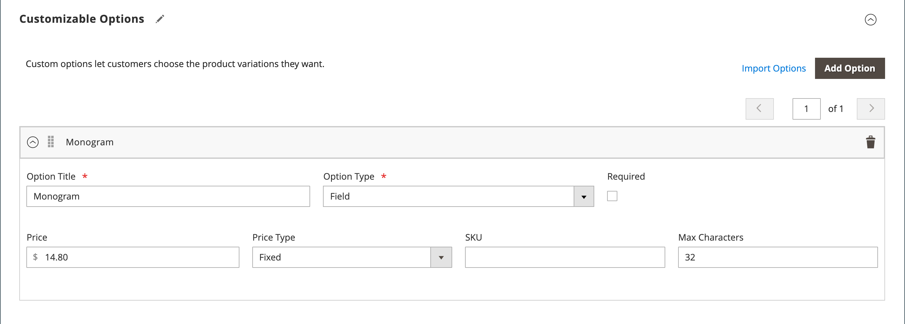

# 产品设置 — [!UICONTROL Customizable Options]

向产品添加可自定义选项是一种提供选项选项的简单方法，这些选项包含文本、选择和日期输入类型。 如果您的库存需求非常简单，可定制选项就是一个很好的解决方案。 但是，因为它们基于单个SKU的变体，所以不能用于管理库存或作为价格规则条件的基础。 如果您有多个具有相同选项的产品，则可以设置一个产品并将选项导入其他产品。

当客户购买带有可自定义选项的产品时，每个选定选项的描述都会显示在产品描述下方，并且任何关联的加价（或标记）都会自动应用于项目的价格。

带有可自定义选项的{width="700" zoomable="yes"}

如果购买触发了购物车价格规则，则初始计算将首先应用于产品价格，然后应用于行项目价格，并对适用的可自定义选项进行任何调整。 在下面的示例中，客户以74.00美元的价格购买了一个饺子包，另外还购买了一个可定制的单字母选项。 产品基本价格加价为14.80美元，调整后的价格为88.80美元。在这种情况下，购买饺子包会触发基于产品SKU的购物车价格规则，并对购买应用折扣，外加免运费。 尽管可自定义选项未触发购物车价格规则，但它会将折扣应用于购物车内容，其中包括可自定义选项的标记。

带有可自定义选项和价格规则的{width="700" zoomable="yes"}

>[!NOTE]
>
>目录价格规则折扣不适用于固定价格可自定义选项。

## 创建可自定义的选项

1. 在编辑模式下打开产品。

1. 向下滚动并展开&#x200B;_[!UICONTROL Customizable Options]_部分的。

1. 单击&#x200B;**[!UICONTROL Add Option]**。

   {width="600" zoomable="yes"}

1. 完成新的选项设置：

   - 为&#x200B;**[!UICONTROL Option Title]**&#x200B;输入选项的名称。

   - 为数据条目类型设置&#x200B;**[!UICONTROL Option Type]**。

   - 如果购买产品不需要该选项，请取消选中&#x200B;**[!UICONTROL Required]**&#x200B;复选框。

1. 根据数据输入类型填写字段：

   - 对于&#x200B;**[!UICONTROL Title]**，请输入此选项的名称。

   - （可选）对于&#x200B;**[!UICONTROL Price]**，输入适用于此选项的基本产品价格的任何加价或减价。

   - 将&#x200B;**[!UICONTROL Price Type]**&#x200B;设置为以下项之一：

      - `Fixed` — 变量的价格与基础产品的价格不同，因为固定货币金额不同，如$1。
      - `Percentage` — 变体的价格与基础产品的价格之间相差一个百分比，如10%。

   - （可选）为选项输入&#x200B;**[!UICONTROL SKU]**。 选项SKU是添加到产品SKU的后缀。

   - 如果&#x200B;_[!UICONTROL Option Type]_是`File`，请设置文件的参数。 对于&#x200B;**[!UICONTROL Compatible File Extensions]**，请以逗号分隔值（如`png, jpg, gif`）的形式输入有效的扩展名。 对于&#x200B;**[!UICONTROL Maximum Image Size]**，输入最大图像大小（以像素为单位）。 如果是文本条目，请输入&#x200B;**[!UICONTROL Maximum Characters]**的最大值。

   {width="600" zoomable="yes"}

1. （可选）如果要添加其他可自定义的选项，请单击&#x200B;**[!UICONTROL Add Option]**。

   - 像之前一样完成设置。

   - 要更改选项的顺序，请单击&#x200B;_[!UICONTROL Order]_图标并将选项拖到列表中的新位置。

   对每个要添加的选项重复此步骤。

1. 完成后，单击&#x200B;**[!UICONTROL Save]**。

## 导入可自定义的选项

1. 在&#x200B;_可自定义选项_&#x200B;部分中，单击&#x200B;**[!UICONTROL Import Options]**。

1. 所有带有可自定义选项的产品都会显示在网格中。

1. 在列表中，选中包含要导入的选项的产品复选框。

1. 单击&#x200B;**[!UICONTROL Import]**。

1. 完成后，您可以继续添加更多自定义选项或单击&#x200B;**[!UICONTROL Save and Close]**。

## 输入类型

| 类型 | 描述 |
|---------------------|---------------|
| [!UICONTROL Text] | 客户可在其中输入所需信息的输入行或文本框。 选项： **[!UICONTROL Field]**— 单行输入文本字段。 **[!UICONTROL Area]** — 多行输入字段。 此类型不支持HTML等高级格式。 使用最大字符数限制可输入的文本长度，并确保在管理员中输入的文本有正确的表示形式。 |
| [!UICONTROL File] | 允许客户上传文件。 |
| [!UICONTROL Select] | 允许客户根据使用的输入类型选择单个选项或多个选项。 选项： **[!UICONTROL Drop-down]**— 仅允许一个选择的选项下拉列表。 **[!UICONTROL Radio Buttons]** — 一组仅允许一个选择的选项。 **[!UICONTROL Checkbox]**— 复选框是是/否选项的变体。 如果产品有多个复选框，则可以进行多个选择。 **[!UICONTROL Multiple Select]** — 接受多个选择的选项下拉列表框。 要选择多个选项，请按住Ctrl (PC)或Command (Mac)键并单击每个选项。 |
| [!UICONTROL Date] | 允许客户输入日期或时间，或从日历中选择值。 选项：  **[!UICONTROL Date]**— 日期值的输入字段。 可以直接在字段中键入日期或从列表或日历中选择日期。 输入方法和格式由[日期和时间选项](attributes-input-types.md#date-and-time-options)配置决定。 **[!UICONTROL Date & Time]** — 日期和时间值的输入字段。 **[!UICONTROL Time]**— 时间值的输入字段。 |

{style="table-layout:auto"}
