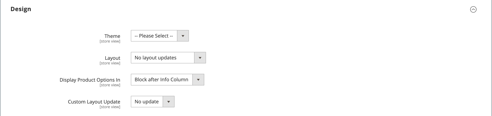

# 产品设置 — [!UICONTROL Design]

_[!UICONTROL Design]_设置允许将不同的主题应用于产品页面，更改列布局，确定产品选项出现的位置，并输入自定义XML代码。

{width="600" zoomable="yes"}

>[!NOTE]
>
>将同一产品分配给多个类别时，每个类别的设计设置不同，建议在[搜索引擎优化配置选项](../configuration-reference/catalog/catalog.md#search-engine-optimization)中设置&#x200B;**[!UICONTROL Use Categories Path for Product URLs]** = `Yes`。 要访问此设置，请转到&#x200B;**[!UICONTROL Stores]** > _[!UICONTROL Settings]_>**[!UICONTROL Configuration]**，展开&#x200B;**[!UICONTROL Catalog]**并在左侧面板中选择&#x200B;**[!UICONTROL Catalog]**，然后展开页面上的&#x200B;**[!UICONTROL Search Engine Optimization]**部分。

| 字段 | [作用域](../getting-started/websites-stores-views.md#scope-settings) | 描述 |
|---|---|----|
| [!UICONTROL Theme] | 商店视图 | （仅限Adobe Commerce）允许您对产品应用其他主题。 选项： （所有可用主题） |
| [!UICONTROL Layout] | 商店视图 | 允许您对产品页面应用不同的[布局](../content-design/page-layout.md)。 选项：  **[!UICONTROL No layout updates]**— 默认情况下，产品页面不提供布局更新。 **[!UICONTROL Empty]** — 允许您定义自己的布局，如4列页面。 （需要了解XML。）  **[!UICONTROL 1 column]**— 将一列布局应用于产品页。 **[!UICONTROL 2 columns with left bar]** — 将带有左侧栏的两列布局应用于产品页面。 **[!UICONTROL 2 columns with right bar]**— 将带有右侧栏的两列布局应用于产品页面。 **[!UICONTROL 3 columns]** — 将三列布局应用于产品页面。 **[!UICONTROL Page -- Full Width]**- （需要[[!DNL Page Builder]](../page-builder/introduction.md)）将CMS页面的全宽布局应用于产品页面。 **[!UICONTROL Category -- Full Width]** - （需要[!DNL Page Builder]）将类别页面的全宽布局应用于产品页面。 **[!UICONTROL Product -- Full Width]**- （需要[!UICONTROL Page Builder]）将产品页面的全宽布局应用于产品页面。 |
| [!UICONTROL Display Product Options In] | 商店视图 | 确定产品选项在产品页面上的显示位置。 选项： `Product Info Column` / `Block after Info Column` |
| [!UICONTROL Custom Layout Update] | 商店视图 | 用于访问更新产品页面上的自定义布局的选项。 |

{style="table-layout:auto"}
