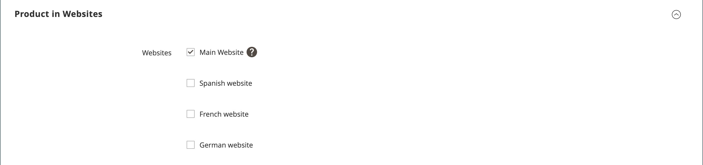

# 产品设置 — [!UICONTROL Product in Websites]

_[!UICONTROL Product in Websites]_部分根据[商店层次结构](../stores-purchase/stores.md)标识每个可用产品的网站。

{width="550"}

**_要将产品复制到其他网站：_**

1. 在编辑模式下打开产品。

1. 向下滚动并展开&#x200B;_[!UICONTROL Product in Websites]_部分的。

   网站中的{width="600" zoomable="yes"}

1. 选中要放置复制产品的网站的复选框。

   对于单个网站安装，默认情况下会选中website复选框。

1. 选择要制作现有产品副本的&#x200B;**[!UICONTROL Store View]**。

1. 单击&#x200B;**[!UICONTROL Save]**&#x200B;并执行以下操作：

   - 当您返回到产品记录时，将&#x200B;**[!UICONTROL Store View]**&#x200B;选择器设置为产品复制到的商店视图。 提示确认范围切换时，单击&#x200B;**[!UICONTROL OK]**。

   - 输入此商店视图的产品&#x200B;**[!UICONTROL Price]**。

   由于基本货币的范围设置为`website`，因此可以在每个网站中以不同的价格销售产品。

1. 完成后，单击&#x200B;**[!UICONTROL Save]**。
