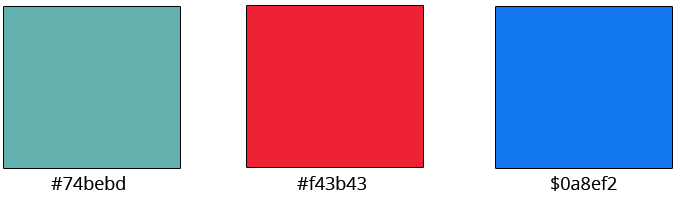
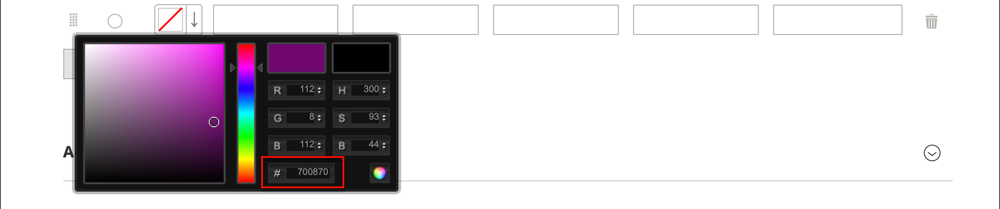

# 产品样本

客户对颜色的选择期望很高，产品描述准确地表示每种可用的颜色、图案或纹理至关重要。 例如，以下示例中的裤子不可使用红色、绿色和蓝色。 它们只能以红色、绿色和蓝色的特定色调提供，这些颜色可能是此产品所特有的。

产品页面上的{width="700" zoomable="yes"}

对于[可配置产品](product-create-configurable.md)，可通过可视色板、文本色板或输入控件指示颜色。 色板可用于产品页面、产品列表和[分层导航](navigation-layered.md)。 在产品页面上，当选择样本时，将同步样本以显示相应的产品图像。 当客户选择样本时，相应的值将显示在输入字段中，并且样本被概述为当前选择。

>[!NOTE]
>
>通过将Admin中[!UICONTROL Attribute Edit]页面上的&#x200B;_[!UICONTROL Update Product Preview Image]_&#x200B;选项值设置为`No`，可以将样本属性配置为在选择样本时不显示相应的简单产品图像。

## 基于文本的样本

如果图像不可用于色板，则属性值将显示为文本。 基于文本的色板与具有文本标签的按钮类似，其行为与具有图像的色板相同。 当使用基于文本的样本显示可用大小时，任何不可用的大小都会被划掉。

{width="700" zoomable="yes"}

## 分层导航中的样本

如果color属性的&#x200B;_[!UICONTROL Use in Layered Navigation]_&#x200B;属性设置为`Yes`，则样本也可用于分层导航。 以下示例显示了分层导航中基于文本的图像样本和彩色图像样本。

在分层导航中显示的{width="700" zoomable="yes"}

## 创建产品的色板

样本可以定义为`color`属性的组件，或者为特定产品在本地设置并上传为[产品映像](product-image.md#upload-an-image)。

在前面的示例中，“Sylvia Capri”裤子可用于`red`、`green`和`blue`的特定值。 由于色板是从产品图像中提取的，因此每种色板都是颜色的真实表示形式。 `color`属性用于管理所有产品颜色和样本的信息。

### 第1步：创建样本

使用以下任一方法为您的产品创建色板。

#### 方法1：添加色板

1. 要捕获产品的真实颜色，请在照片编辑器中打开该图像，然后使用滴管工具来识别确切的颜色并记下等效的十六进制值。

   {width="400"}

1. 在&#x200B;_管理员_&#x200B;侧边栏上，转到&#x200B;**[!UICONTROL Stores]** > _[!UICONTROL Attributes]_>**[!UICONTROL Product]**。

1. 在网格中，在编辑模式下打开&#x200B;_color_&#x200B;属性。

1. 验证&#x200B;**[!UICONTROL Catalog Input Type for Store Owner]**&#x200B;是否设置为`Visual Swatch`。

1. 如果希望在产品显示页面上选择样本时不显示相应的简单产品图像，请将&#x200B;**[!UICONTROL Update Product Preview Image]**&#x200B;设置为`No`。

1. 在&#x200B;_[!UICONTROL Manage Swatch (Values of Your Attribute)]_&#x200B;下，单击&#x200B;**[!UICONTROL Add Swatch]**&#x200B;并执行以下操作：

   {width="600" zoomable="yes"}

   - 在&#x200B;_样本_&#x200B;列中，单击新样本并从菜单中选择&#x200B;**[!UICONTROL Choose a color]**。

     {width="500" zoomable="yes"}

   - 在拾色器中，将光标置于&#x200B;**#**&#x200B;字段中，删除当前值，然后输入新颜色的十六进制值（6个字符）。

     {width="500" zoomable="yes"}

   - 要保存色板，请单击拾色器右下角的&#x200B;_色轮_ （  ）图标。

   - 在&#x200B;_管理员_&#x200B;列中，输入标签以向商店管理员描述颜色。

     如果适用，您还可以为支持的每种语言输入颜色的翻译。 在以下示例中，SKU包含在&#x200B;_管理员_&#x200B;标签中以供参考，因为这些颜色仅用于特定产品。 您可以在标签中包含空格或下划线，但不能包括连字符。

   - 在&#x200B;_为默认_&#x200B;列中，选择要作为默认选项的样本。

   - 要更改颜色样本的顺序，请单击&#x200B;_[!UICONTROL Order]_图标并将该项拖到列表中的新位置。

     {width="400"}

1. 完成后，单击&#x200B;**[!UICONTROL Save Attribute]**&#x200B;并在出现提示时刷新缓存。

1. 在编辑模式下打开每个产品，并使用正确的样本更新&#x200B;**Color**&#x200B;属性。

   要同时更新多个产品，请执行以下步骤。

#### 方法2：上传样本图像

1. 要捕获样本的图像，请在照片编辑器中打开产品图像，并保存图像上描述颜色、图案或纹理的方形区域。

   如果需要，您可以对产品的每个变体重复此操作。

   色板的大小和尺寸由主题决定。 通常，将图像保存为正方形有助于保留图案的长宽比。

   {width="400"}

1. 在&#x200B;_管理员_&#x200B;侧边栏上，转到&#x200B;**[!UICONTROL Stores]** > _[!UICONTROL Attributes]_>**[!UICONTROL Product]**。

1. 在网格中，以编辑模式打开&#x200B;**[!UICONTROL color]**&#x200B;属性。

1. 验证&#x200B;**[!UICONTROL Catalog Input Type for Store Owner]**&#x200B;是否设置为`Visual Swatch`。

1. 如果希望在产品显示页面上选择样本时不显示相应的简单产品图像，请将&#x200B;**[!UICONTROL Update Product Preview Image]**&#x200B;设置为`No`。

1. 在&#x200B;_[!UICONTROL Manage Swatch]_（属性的值）下，单击&#x200B;**[!UICONTROL Add Swatch]**&#x200B;并执行以下操作：

   - 在&#x200B;_[!UICONTROL Swatch]_&#x200B;列中，单击新样本以显示菜单，然后选择&#x200B;**[!UICONTROL Upload a file]**。

   - 导航到您准备的样本文件，然后选择要上传的文件。

   - 对每个样本图像重复这些步骤。

   - 输入管理员和店面的标签。

     在此示例中，SKU包含在管理员标签中以供参考，因为这些颜色仅用于特定产品。 您可以在标签中包含空格或下划线，但不能包含连字符。

     {width="500" zoomable="yes"}

1. 完成后，单击&#x200B;**[!UICONTROL Save Attribute]**&#x200B;并在出现提示时刷新缓存。

1. 在编辑模式下打开每个产品，并使用正确的样本更新&#x200B;**[!UICONTROL Color]**&#x200B;属性。

   要同时更新多个产品，请执行以下步骤。

### 第2步：更新产品

1. 在&#x200B;_管理员_&#x200B;侧边栏上，转到&#x200B;**[!UICONTROL Catalog]** > **[!UICONTROL Products]**。

1. 使用&#x200B;**[!UICONTROL Filter]**&#x200B;按名称或SKU显示列表并仅包括适用的产品。

1. 在网格中，选中样本应用于的每个产品的复选框。

1. 将&#x200B;**[!UICONTROL Actions]**&#x200B;设置为`Update Attributes`。

   在此示例中，选择裤子的所有蓝色配置。

   {width="600" zoomable="yes"}

1. 向下滚动到&#x200B;**[!UICONTROL Color]**&#x200B;属性并选择&#x200B;**[!UICONTROL Change]**&#x200B;复选框。

   {width="400"}

1. 选择适用于所选产品的色板，然后单击&#x200B;**[!UICONTROL Save]**。

1. 出现提示时，刷新缓存。

   {width="200"}中

## 向简单产品添加色板

1. 在&#x200B;_管理员_&#x200B;侧边栏上，转到&#x200B;**[!UICONTROL Catalog]** > **[!UICONTROL Products]**。

1. 在编辑模式下打开产品，检查产品状态（应启用）。

1. 单击&#x200B;**[!UICONTROL Create Configurations]**&#x200B;按钮（在`Configurations`选项卡下）。

1. 在弹出窗口中，选择“颜色”属性和&#x200B;**[!UICONTROL Next]**。

1. 从要包含在此产品中的属性中选择颜色色板。

1. 在进度条中，单击&#x200B;**[!UICONTROL Next]**。

1. [配置图像、价格和数量](product-create-configurable.md#step-3-configure-the-images-price-and-quantity)。

   在此步骤中，设置每个配置的图像、定价和数量。 每个选项提供的选项都相同，您只能选择一个。 您可以将相同的设置应用于所有SKU，将唯一的设置应用于每个SKU，或者暂时跳过这些设置。

1. 完成图像、价格和数量的配置后，单击右上角的&#x200B;**[!UICONTROL Next]**。

   当前产品变体显示在配置部分的底部。 如果您对配置满意，请单击&#x200B;**[!UICONTROL Generate Products]**。
