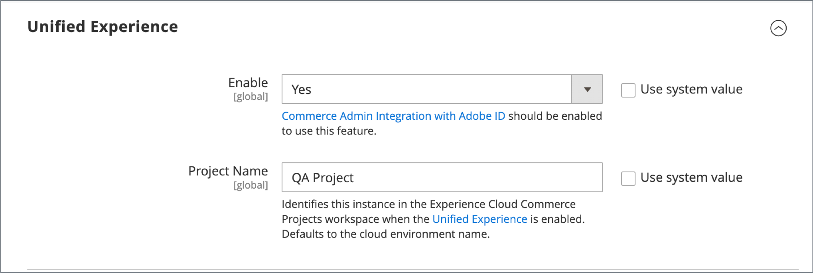
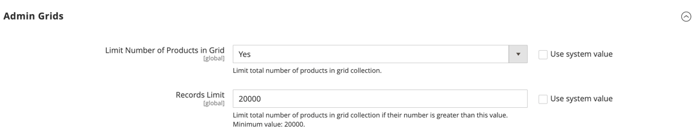

# 高级>管理员

{{config}}

## [!UICONTROL Admin User Emails]

<!-- zoom -->

有关更改这些设置的详细信息，请参阅[忘记密码并重置电子邮件](../../systems/permissions-users-all.md#forgotten-password-and-reset-emails)。

| 字段 | [作用域](../../getting-started/websites-stores-views.md#scope-settings) | 描述 |
|---------------------------------------------|------------------------------------------------------------------------|----------------------------------------------------------------------------------------------------------------------------------------------------------------------------------------------------------------|
| [!UICONTROL Forgot Password Email Template] | 全局 | 标识电子邮件模板，该模板用于管理员用户忘记密码时发送的消息。 默认模板： `Forgot Admin Password` |
| [!UICONTROL Forgot and Reset Email Sender] | 全局 | 标识显示为&#x200B;_忘记密码_&#x200B;电子邮件发件人的商店联系人。 默认发件人： `General Contact` 其他发件人选项： `Sales Representative`、`Customer Support`、`Custom Email` |
| [!UICONTROL User Notification Template] | 全局 | 确定用作管理员通知默认值的电子邮件模板。 默认模板： `User Notification` |

{style="table-layout:auto"}

## [!UICONTROL Startup Page]

<!-- zoom -->

有关更改这些设置的详细信息，请参阅[入门指南](../../getting-started/admin-dashboard.md#change-the-startup-page)中的&#x200B;_更改启动页_。

| 字段 | [作用域](../../getting-started/websites-stores-views.md#scope-settings) | 描述 |
|---------------------------|------------------------------------------------------------------------|------------------------------------------------------------------|
| [!UICONTROL Startup Page] | 全局 | 确定登录后显示的管理员登录页面。 |

{style="table-layout:auto"}

### [!UICONTROL Startup Page]选项

| 面积 |                                                                                                                                                                                                                                                                                                                                                                           | 选项 |
|---------------------------------------------------------|---------------------------------------------------------------------------------------------------------------------------------------------------------------------------------------------------------------------------------------------------------------------------------------------------------------------------------------------------------------------------|---------------------------------------------------------------------------------------------------------------------------------------------------------------------------------------------------------------------------------------------------------------------------------------------------------------------------------------------------------------------------------------------------------------------------------------------------------------------------------------------------------------------------------------------------------------------------------------------|
| [`Dashboard`](../../getting-started/admin-dashboard.md) |                                                                                                                                                                                                                                                                                                                                                                           |                                                                                                                                                                                                                                                                                                                                                                                                                                                                                                                                                                                             |
| `Sales` | `Operations` | [`Quotes`](../../b2b/quotes.md)   [`Orders`](../../stores-purchase/orders.md) [`Invoices`](../../stores-purchase/invoices.md) [`Shipments`](../../stores-purchase/shipments.md) [`Credit Memos`](../../stores-purchase/credit-memos.md) [`Billing Agreements`](../../stores-purchase/paypal-billing-agreements.md) [`Returns`](../../stores-purchase/returns.md)   [`Transactions`](../../stores-purchase/transactions.md) `Braintree Virtual Terminal` |
| `Catalog` | [`Inventory`](../../inventory-management/introduction.md) | [`Products`](../../catalog/products-list.md) [`Categories`](../../catalog/categories.md) [`Shared Catalog`](../../b2b/catalog-shared-create.md)  |
| `Customers` | [`All Customers`](../../customers/customers-all.md) [`Now Online`](../../customers/now-online.md) [`Customer Groups`](../../customers/customer-groups.md) [`Segments`](../../customers/customer-segments.md)   [`Companies`](../../b2b/account-companies.md) |                                                                                                                                                                                                                                                                                                                                                                                                                                                                                                                                                                                             |
| `Marketing` | `Promotions` | [`Catalog Price Rule`](../../merchandising-promotions/price-rules-catalog.md)  [`Cart Price Rules`](../../merchandising-promotions/price-rules-cart.md))  [`Related Products Rules`](../../merchandising-promotions/product-related-rules.md)   [`Gift Card Accounts`](../../stores-purchase/product-gift-card-accounts.md)  |
|                                                         | [`Private Sales`](../../merchandising-promotions/events-private-sales.md)  | [`Events`](../../merchandising-promotions/event-configure.md)  [`Invitations`](../../merchandising-promotions/invitations.md) |
|                                                         | `Communications` | [`Email Templates`](../../systems/email-templates.md)  [`Newsletter Template`](../../merchandising-promotions/newsletter-template.md)  [`Newsletter Queue`](../../merchandising-promotions/newsletter-queue.md)  [`Newsletter Subscribers`](../../merchandising-promotions/newsletter-subscribers.md)  [`Email Reminders`](../../merchandising-promotions/email-reminder-rules.md)  |
|                                                         | `SEO & Search` | [`Search Terms`](../../catalog/search-terms.md)  [`Search Synonyms`](../../catalog/search-terms.md#search-synonyms)  [`URL Rewrites`](../../merchandising-promotions/url-rewrite.md)  [`Site Map`](../../merchandising-promotions/sitemap-xml.md) |
|                                                         | [`User Content`](../../catalog/settings-advanced-product-reviews.md) | [`All Reviews`](../../catalog/settings-advanced-product-reviews.md)  [`Pending Reviews`](../../merchandising-promotions/product-reviews-moderate.md)   |
| `Content` | `Elements` | [`Pages`](../../content-design/pages.md) [`Hierarchy`](../../content-design/page-hierarchy.md)  [`Blocks`](../../content-design/blocks.md) [`Dynamic Blocks`](../../content-design/dynamic-blocks.md)  [`Widgets`](../../content-design/widgets.md) [`Media Gallery`](../../content-design/media-storage.md) |
|                                                         | `Design` | [`Configuration`](../../content-design/configuration.md) [`Themes`](../../content-design/themes.md) [`Schedule`](../../content-design/schedule.md) |
|                                                         | `Content Staging`   | [仪表板](../../content-design/content-staging.md) |
| `Reports` | [`Marketing`](../../getting-started/marketing-reports.md) | `Products in Cart` `Search Terms` `Abandoned Carts` `Newsletter Problem Reports` |
|                                                         | [`Reviews`](../../getting-started/review-reports.md) | `By Customer`  `By Products`  |
|                                                         | [`Sales`](../../getting-started/sales-reports.md) | `Orders` `Tax` `Invoiced` `Shipping` `Refunds` `Coupons` `PayPal Settlement` `Braintree Settlement` |
|                                                         | `System Insights` | [`Site-Wide Analysis Tool`](https://experienceleague.adobe.com/docs/commerce-operations/tools/site-wide-analysis-tool/access.html)  |
|                                                         | [`Customers`](../../getting-started/customer-reports.md) | `Order Total` `Order Count` `New` `Wish Lists` `Segments`  |
|                                                         | [`Products`](../../getting-started/product-reports.md) | `Views` `Bestsellers` `Low Stock` `Ordered` `Downloads` |
|                                                         | [`Private Sales`](../../getting-started/private-sales-reports.md)  | `Invitations` `Invited Customers` `Conversions` |
|                                                         | `Statistics` | [`Refresh Statistics`](../../getting-started/sales-reports.md#refresh-statistics) |
|                                                         | [`Business Intelligence`](../../getting-started/business-intelligence.md) | `Advanced Reporting` `BI Essentials`  |
|                                                         | `Customer Engagement` | `Dashboard` `Importer Status` `Automation Enrollment` `Campaign Sends` `SMS Sends` `Cron Tasks` `Log Viewer` `Abandoned Carts` |
| `Stores` | `Settings` | [`All Stores`](../../stores-purchase/stores.md) [`Configuration`](../../configuration-reference/guide-overview.md) [`Terms and Conditions`](../../stores-purchase/terms-and-conditions.md) [`Order Status`](../../stores-purchase/order-status.md) |
|                                                         | [`Inventory`](../../inventory-management/introduction.md) | [`Sources`](../../inventory-management/sources-stocks.md#sources) [`Stocks`](../../inventory-management/sources-stocks.md#stocks) |
|                                                         | [`Taxes`](../../stores-purchase/taxes.md) | [`Tax Rules`](../../stores-purchase/tax-rules.md) [`Tax Zones and Rates`](../../stores-purchase/tax-zones-rates.md) |
|                                                         | [`Currency`](../../stores-purchase/currency.md) | [`Currency Rates`](../../stores-purchase/currency-configuration.md) [`Currency Symbols`](../../stores-purchase/currency-configuration.md#step-5-customize-currency-symbols-optional) |
|                                                         | `Attributes` | [`Customer`](../../systems/data-attributes-customer.md) [`Customer Address`](../../systems/data-attributes-customer.md#customer-addresses) [`Product`](../../systems/data-attributes-product.md) [`Attribute Set`](../../catalog/attribute-sets.md) [`Returns`](../../stores-purchase/attributes-returns.md) [`Ratings`](../../merchandising-promotions/product-reviews.md#create-custom-ratings) |
|                                                         | `Other Settings` | [`Reward Exchange Rates`](../../merchandising-promotions/reward-exchange-rates.md) [`Gift Wrapping`](../../stores-purchase/cart-configuration.md#gift-wrap) [`Gift Registry`](../../merchandising-promotions/gift-registry-create.md) |
| `System` | [`Data Transfer`](../../systems/data-transfer.md) | [`Import`](../../systems/data-import.md) [`Export`](../../systems/data-export.md) [`Import/Export Tax Rates`](../../systems/data-transfer-tax-rates.md) [`Import History`](../../systems/data-import.md#import-history) [`Scheduled Import/Export`](../../systems/data-scheduled-import-export.md) |
|                                                         | `Extensions` | [`Integrations`](../../systems/integrations.md) |
|                                                         | `Tools` | [`Cache Management`](../../systems/cache-management.md) [`Index Management`](../../systems/index-management.md) |
|                                                         | `Support` | [`System Report`](../../systems/support.md#system-reports) |
|                                                         | `Permissions` | [`All Users`](../../systems/permissions-users-all.md) [`Locked Users`](../../systems/permissions-users-all.md#locked-users) [`User Roles`](../../systems/permissions-user-roles.md) |
|                                                         | `Action Log`  | [`Report`](../../systems/action-log.md) [`Archive`](../../systems/action-log-archive.md) [`Bulk Actions`](../../systems/action-log-bulk-actions.md) |
|                                                         | `Other Settings` | [`Notifications`](../../systems/notifications.md) [`Custom Variables`](../../systems/variables-custom.md) [`Manage Encryption Key`](../../systems/encryption-key.md) |
| `Find Partners & Extensions` |                                                                                                                                                                                                                                                                                                                                                                           |                                                                                                                                                                                                                                                                                                                                                                                                                                                                                                                                                                                             |

{style="table-layout:auto"}

<!-- Feature still in development 
## [!UICONTROL Unified Experience]

The [!UICONTROL Unified Experience] option is available in Adobe Commerce deployments that have the Commerce Admin Unified Experience extension loaded. This extension enables integration with Experience Cloud to streamline cross-application workflows between Commerce and other Experience Cloud solutions. See [Adobe Experience Cloud Integration for Commerce Admin](../../getting-started/admin-unified-experience-integration-overview.md).

| Field        | [Scope](../../getting-started/websites-stores-views.md#scope-settings) | Description                                                                                                                                                                                                                                                                                                                                                                    |
|--------------|------------------------------------------------------------------------|--------------------------------------------------------------------------------------------------------------------------------------------------------------------------------------------------------------------------------------------------------------------------------------------------------------------------------------------------------------------------------|
| Enable       | Global                                                                 | Determines if the Commerce instance uses the Experience Cloud integration. Before enabling this feature, review the [requirements and configuration instructions](../../getting-started/admin-unified-experience-integration-overview.md). Options: Yes/No.                                                                                                                    |
| Project Name | Global                                                                 | Identifies the instance in the Experience Cloud Commerce Projects workspace when the Unified Experience is enabled. The name can contain only alphanumeric characters and spaces. Defaults to the [cloud environment name](https://experienceleague.adobe.com/docs/commerce-cloud-service/user-guide/architecture/pro-architecture.html#pro-environment-architecture). |

{style="table-layout:auto"}

-->

## [!UICONTROL Admin Base URL]

<!-- zoom -->

有关设置这些选项的更多信息，请参阅[存储和购买体验指南](../../stores-purchase/store-urls.md#configure-the-base-url)中的&#x200B;_配置基本URL_。

| 字段 | [作用域](../../getting-started/websites-stores-views.md#scope-settings) | 描述 |
|------------------------------------|------------------------------------------------------------------------|-----------------------------------------------------------------------------------------------------------------------------------------------------------------------------------------------------------------------------------|
| [!UICONTROL Use Custom Admin URL] | 全局 | 确定是否使用自定义URL来访问管理员。 选项： `Yes` / `No` |
| [!UICONTROL Custom Admin URL] | 全局 | 指定用于访问管理员的自定义URL。 默认情况下，管理员URL与基本URL相同。 **重要信息：**&#x200B;管理员URL必须位于同一Commerce安装中，并且与店面具有相同的文档根目录。 |
| [!UICONTROL Use Custom Admin Path] | 全局 | 确定是否使用自定义路径来访问管理员。 默认路径为`admin`。 选项： `Yes` / `No` |
| [!UICONTROL Custom Admin Path] | 全局 | 将默认管理员路径名称更改为一些难以猜测的内容。 以小写字符输入自定义路径名称。 例如： `aardvark` |

{style="table-layout:auto"}

## [!UICONTROL Security]

<!-- zoom -->

有关设置这些选项的更多信息，请参阅[管理员系统指南](../../systems/security-admin.md)中的&#x200B;_配置管理员安全_。

| 字段 | [作用域](../../getting-started/websites-stores-views.md#scope-settings) | 描述 |
|--------------------------------------------------------|------------------------------------------------------------------------|--------------------------------------------------------------------------------------------------------------------------------------------------------------------------------------------------------------------------------------------------------------------------------------------------------------------------------------------------------------------------------------------------------------------------------------------------------------------------------------------------------------------------------------------------------------------------------------------------------|
| [!UICONTROL Admin Account Sharing] | 商店视图 | 确定管理员用户是否可以从不同设备同时登录到同一帐户。 选项：  **`Yes`**— 允许来自同一管理员帐户的多个活动会话。 **`No`** — 每个管理员帐户只允许一个活动会话。 |
| [!UICONTROL Password Reset Protection Type] | 商店视图 | 确定用于管理密码重置请求的方法。 选项：  **`By IP and Email`**— 在收到来自通知的响应发送到与管理员帐户关联的电子邮件地址后，可以联机重置密码。 **`By IP`** — 密码可以在线重置，而无需其他确认。  **`By Email`**— 只有通过电子邮件响应发送到与管理员帐户关联的电子邮件地址的通知才能重置密码。 **`None`** — 密码只能由存储管理员重置。 |
| [!UICONTROL Recovery Link Expiration Period (hours)] | 全局 | 确定密码恢复链接保持有效的小时数。 |
| [!UICONTROL Max Number of Password Reset Requests] | 商店视图 | 确定每小时可以提交的最大密码请求数。 |
| [!UICONTROL Min Time Between Password Reset Requests] | 商店视图 | 确定密码重置请求之间的最小分钟数。 |
| [!UICONTROL Add Secret Key to URLs] | 全局 | 启用后，会将密钥附加到管理员URL中，作为防止利用漏洞的预防措施。 选项： `Yes` / `No` |
| [!UICONTROL Login Is Case Sensitive] | 全局 | 确定用户输入的登录凭据是否必须与存储凭据的大小写相匹配。 选项： `Yes` / `No` |
| [!UICONTROL Admin Session Lifetime (seconds)] | 全局 | 确定管理员会话的长度（以秒为单位）。 |
| [!UICONTROL Maximum Login Failures to Lockout Account] | 全局 | 确定在锁定其帐户之前，管理员用户可以尝试登录的次数。 如果字段为空，则不会设置最小值。 默认值： `6` |
| [!UICONTROL Lockout Time (minutes)] | 全局 | 确定管理员帐户被锁定后用户再次尝试登录的分钟数。 默认值： `30` |
| [!UICONTROL Password Lifetime (days)] | 全局 | 确定管理员密码过期前的天数。 如果字段为空，则不会设置生命周期。 默认值： `90` |
| [!UICONTROL Password Change] | 全局 | 确定是否要求管理员用户更改密码。 选项：  **`Forced`**— 要求管理员用户在设置帐户后更改密码。 **`Recommended`** — 建议管理员用户在设置帐户后更改密码。 |

{style="table-layout:auto"}

## [!UICONTROL Dashboard]

<!-- zoom -->

有关设置这些选项的更多信息，请参阅[入门指南](../../getting-started/admin-dashboard.md)中的&#x200B;_管理员仪表板_。

| 字段 | [作用域](../../getting-started/websites-stores-views.md#scope-settings) | 描述 |
|----------------------------|------------------------------------------------------------------------|-------------------------------------------------------------------------------------------------------|
| [!UICONTROL Enable Charts] | 全局 | 确定功能板是否包含从当前销售数据生成的图表。 选项： `Yes` / `No` |

{style="table-layout:auto"}

## [!UICONTROL Admin Grids]

<!-- zoom -->

有关设置这些选项的更多信息，请参阅[目录管理指南](../../catalog/products-list.md#limit-product-display)中的&#x200B;_限制产品显示_。

>[!NOTE]
>
>要提高大型目录的性能，建议您限制网格中显示的产品数。

| 字段 | [作用域](../../getting-started/websites-stores-views.md#scope-settings) | 描述 |
|-----------------------------------------------|------------------------------------------------------------------------|-------------------------------------------------------------------------------------------------------------------------------------|
| [!UICONTROL Limit Number of Products in Grid] | 全局 | 确定网格显示的产品数是否限制为&#x200B;_[!UICONTROL Records Limit]_&#x200B;值。 选项： `Yes` / `No` |
| [!UICONTROL Records Limit] | 全局 | 设置产品网格中产品的数量限制。 默认最小值为`20000`。 |

## [!UICONTROL CAPTCHA]

<!-- zoom -->

有关设置这些选项的更多信息，请参阅[管理系统指南](../../systems/security-captcha.md)中的&#x200B;_验证码_。

| 字段 | [作用域](../../getting-started/websites-stores-views.md#scope-settings) | 描述 |
|-------------------------------------------------------|------------------------------------------------------------------------|-------------------------------------------------------------------------------------------------------------------------------------------------------------------------------------------------------------------------------------------------------------------------------------------------------------------------------------------------------------------------------------------------------------------------------------------------------------------------------------------------------------------------------------------------------------------------------------------------------------------------------------------------------------------------------------------------------------------------------------------------------------------------------------------------|
| [!UICONTROL Enable CAPTCHA in Admin] | 全局 | 为管理员登录启用验证码。 选项： `Yes` / `No` |
| [!UICONTROL Font] | 全局 | 确定用于显示验证码的字体。 要添加您自己的字体，请将该字体文件放入与Commerce实例相同的目录中，并将声明添加到config.xml文件`app/code/Magento/Captcha/etc`中的默认字体：` LinLibertine` |
| [!UICONTROL Forms] | 全局 | 确定使用CAPTCHA的表单。 选项： `Admin Login` / `Admin Forgot Password` |
| [!UICONTROL Displaying Mode] | 全局 | 确定验证码的出现时间。 选项：  **`Always`**— 登录始终需要CAPTCHA。 **`After number of attempts to login`** — 显示[!UICONTROL Number of Unsuccessful Attempts to Login]字段。 输入允许的登录尝试次数。 值为0（零）与将“显示模式”设置为“始终”类似。 此选项不包括“忘记密码”和“创建用户”表单。 如果启用并设置显示CAPTCHA，则它始终包含在表单中。 **注意**：若要跟踪失败的登录尝试次数，则每次尝试使用一个电子邮件地址和一个IP地址登录都会被计入。 允许从同一IP地址登录的最大次数是1,000。 此限制仅在启用CAPTCHA时适用。 |
| [!UICONTROL Number of Unsuccessful Attempts to Login] | 全局 | 确定帐户锁定前用户可尝试登录的次数。 为了跟踪失败的登录尝试次数，系统从单个IP地址跟踪来自一个电子邮件地址的尝试。 允许来自相同IP地址的最大尝试次数为1,000。 此限制仅在启用CAPTCHA的情况下适用。 |
| [!UICONTROL CAPTCHA Timeout (minutes)] | 全局 | 确定当前CAPTCHA的生命周期。 验证码过期后，用户必须重新加载页面。 |
| [!UICONTROL Number of Symbols] | 全局 | 确定验证码中使用的符号数。 允许的最大值为`8`。 您还可以指定范围，例如`5-8`。 |
| [!UICONTROL Symbols Used in CAPTCHA] | 全局 | 确定验证码中使用的符号。 只允许使用字母（a-z和A-Z）和数字(0-9)。 在字段中建议的默认符号集不包括相似符号，如i、l或1。 在CAPTCHA中显示这些符号会降低用户正确识别CAPTCHA的可能性。 |
| [!UICONTROL Case Sensitive] | 全局 | 确定验证码中使用的字符是否区分大小写。 选项： `Yes` / `No` |

{style="table-layout:auto"}

## [!UICONTROL Admin Actions Logging]

{{ee-feature}}

<!-- zoom -->

有关设置这些选项的更多信息，请参阅[管理系统指南](../../systems/action-log-archive.md)中的&#x200B;_操作日志存档_。

| 字段 | [作用域](../../getting-started/websites-stores-views.md#scope-settings) | 描述 |
|-----------------------------|------------------------------------------------------------------------|-----------------------------------------------------------------------------------------------------------------------------------------------------------------------------------------------------------------------------------------------------------------------------------------------------------------------------------------------------------------------------------------------------------------------------------------------------------------------------------------------------------------------------------------------------------------------------------------------------------------------------------------------------------------------------------------------------------------------------------------------------------------------------------------------------------------------------------------------------------------------------------------------------------------------------------------------------------------------------------------------------------------------------------------------------------------------------------------------------------------------------------------------------------------------------------------------------------------------------------------------------------------------------------------------------------------------------------------------------------------------------------------------------------------------------------------------------------------------------------------------------------------------------------------------------------------------------------------------------------------------------------------------------------------------------------------------------------------------------------------------------------------------------------------------|
| [!UICONTROL Enable Actions] | 全局 | 为每个选定的操作启用操作日志记录：  `Admin My Account`  `Admin Permission Roles`  `Admin Permission Users`  `Admin Sign In`  `CMS Blocks`  `CMS Hierarchy`  `CMS Pages`  `Cache Management`  `Cart Price Rules`  `Catalog Attributes`  `Catalog Categories`  `Catalog Events`  `Catalog Price Rules`  `Catalog Product Tax Classes`  `Catalog Product Templates`  `Catalog Products`  `Catalog Ratings`  `Catalog Reviews`  `Catalog Search`  `Checkout Terms and Conditions`  `Companies`  `Company Credit`  `Custom Variables`  `Customer Groups`  `Customer Invitations`  `Customer Tax Classes`  `Customers`  `Design Configuration`  `Gift Card Accounts`  `Gift Registry Entity`  `Gift Registry Type`  `Index Management`  `Login as a Customer`   `Manage Currency Rates`  `Manage Customer Address Attributes`  `Manage Customer Attributes`  `Manage Design`  `Manage Dynamic Blocks`  `Manage Segments`  `Manage Store Views`  `Manage Stores`  `Manage Websites`  `Negotiable Quotes`  `Newsletter Queue`  `Newsletter Subscribers`  `Newsletter Templates`  `PayPal Settlement Reports`  `Reports`   `Reward Points Rates`  `Rule-Based Product Relations`  `Sales Archive`  `Sales Credit Memos`  `Sales Invoices`  `Sales Order Status`  `Sales Orders`  `Sales Shipments`  `Shared Catalog`  `Shopping Cart Management`  `Store Credit`  `System Backups`  `System Configuration`  `Tax Rates`  `Tax Rules`  `Transactional Emails`  `URL Rewrites`  `Widget`  `XML Sitemap` |

{style="table-layout:auto"}

## [!UICONTROL Admin Usage]

<!-- zoom -->

有关设置这些选项的更多信息，请参阅[入门指南](../../getting-started/admin.md#usage-data-collection)中的&#x200B;_使用情况数据收集_。

| 字段 | 范围 | 描述 |
|------------------------------------------|--------|--------------------------------------------------------------------------------------------------------------------------------------------------------------------------------------------------------------------------------------------------------------------------------------------------------------------------------------------------------------------------------------------------------------------------------------------------------------------------------------------------------------------------------------------------------------------------------------------------------------|
| [!UICONTROL Enable Admin Usage Tracking] | 全局 | 授予Adobe收集管理员使用情况数据的权限，以改善使用&#x200B;_管理员_&#x200B;以及相关产品和服务的体验。 允许数据收集还支持&#x200B;_产品内指南_，该指南旨在为&#x200B;_管理员_&#x200B;提供交互式内容，例如帮助、工具提示、演练指南、入门信息、功能公告等。 使用数据中未识别各个管理员。 选项： **`Yes`**— 允许数据收集并启用&#x200B;_产品内指南_。 **`No`** — 不允许数据收集或启用&#x200B;_产品内指南_。 |

{style="table-layout:auto"}
