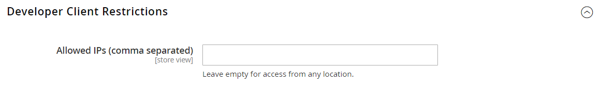
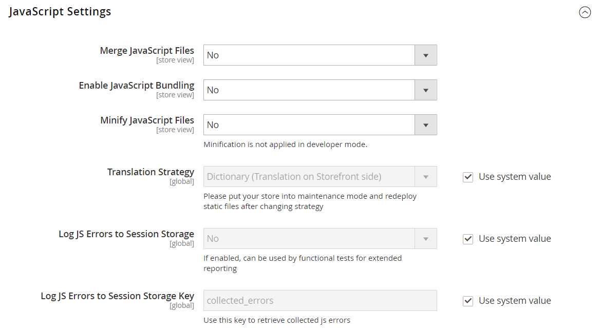

# [!UICONTROL Advanced] > [!UICONTROL Developer]

{{config}}

>[!NOTE]
>
>这些配置设置仅在[开发人员模式](../../systems/developer-tools.md#operation-modes)下可用。

## [!UICONTROL Frontend Development Workflow]

<!-- zoom -->

有关更改这些设置的详细信息，请参阅&#x200B;_Admin Systems指南_&#x200B;中的[前端开发工作流](../../systems/developer-tools.md#frontend-development-workflow)。

| 字段 | [作用域](../../getting-started/websites-stores-views.md#scope-settings) | 描述 |
|--- |--- |--- |
| [!UICONTROL Workflow Type] | 全局 | 确定在开发期间是在客户端还是服务器端进行较少的编译。 选项：  **`Client side less compilation`**— 使用本机less.js库在浏览器中进行编译。 **`Server side less compilation`** — 使用Less PHP库在服务器上进行编译。 这是默认的生产模式。 |

{style="table-layout:auto"}

## [!UICONTROL Developer Client Restrictions]

<!-- zoom -->

有关更改此设置的详细信息，请参阅&#x200B;_管理员系统指南_&#x200B;中的[客户端限制](../../systems/developer-tools.md#client-restrictions)。

| 字段 | [作用域](../../getting-started/websites-stores-views.md#scope-settings) | 描述 |
|--- |--- |--- |
| [!UICONTROL Allow IPs (comma separated)] | 商店视图 | 创建一个IP地址允许列表，该地址可以在实时网站上使用开发人员工具，而不会干扰商店中的客户。 使用开发人员工具（如&#x200B;_内联翻译_）时对该网站所做的任何更改仅在的IP地址中可见。 |

{style="table-layout:auto"}

## [!UICONTROL Template Settings]

<!-- zoom -->

有关更改这些设置的详细信息，请参阅&#x200B;_管理系统指南_&#x200B;中的[优化资源文件](../../systems/developer-tools.md#optimizing-resource-files)。

| 字段 | [作用域](../../getting-started/websites-stores-views.md#scope-settings) | 描述 |
|--- |--- |--- |
| [!UICONTROL Allow Symlinks] | 商店视图 | 启用[符号链接](https://en.wikipedia.org/wiki/Symbolic_link)可能会使您的网站面临安全风险，不建议在生产存储中使用。 |
| [!UICONTROL Minify Html] | 商店视图 | 确定用于商店模板的HTML是否已最小化。 选项： `Yes` / `No` |

{style="table-layout:auto"}

## [!UICONTROL Debug]

<!-- zoom -->

有关更改这些设置的详细信息，请参阅&#x200B;_管理系统指南_&#x200B;中的[模板路径提示](../../systems/developer-tools.md#template-path-hints)。

| 字段 | [作用域](../../getting-started/websites-stores-views.md#scope-settings) | 描述 |
|--- |--- |--- |
| [!UICONTROL Enable Template Path Hints for Storefront] | 商店视图 | 向storefront添加表示法，指示页面上使用的每个模板的路径。 选项： `Yes` / `No` |
| [!UICONTROL Enable Template Path Hints for Admin] | 全局 | 向管理员添加表示法，以指示页面上使用的每个模板的路径。 选项： `Yes` / `No` |
| [!UICONTROL Add Block Class Type to Hints] | 商店视图 | 在模板路径提示中包含块的名称。 选项： `Yes` / `No` |

{style="table-layout:auto"}

## [!UICONTROL Translate Inline]

<!-- zoom -->

有关更改这些设置的详细信息，请参阅&#x200B;_管理系统指南_&#x200B;中的[翻译内联](../../systems/developer-tools.md#translate-inline)。

| 字段 | [作用域](../../getting-started/websites-stores-views.md#scope-settings) | 描述 |
|--- |--- |--- |
| [!UICONTROL Enable for Storefront] | 商店视图 | 为店面激活内联转换器。 可以为每个商店视图编辑界面文本。 要在不干扰实时应用商店的情况下使用内联转换器，请将您的IP地址添加到开发人员客户端限制允许列表。 |
| [!UICONTROL Enable for Admin] | 全局 | 为管理员激活内联翻译器。 与店面不同，管理员无法翻译成多种语言。 但是，可以更改界面中的字段标签和其他文本。 |

{style="table-layout:auto"}

## [!UICONTROL JavaScript Settings]

<!-- zoom -->

有关更改这些设置的详细信息，请参阅&#x200B;_管理系统指南_&#x200B;中的[优化资源文件](../../systems/developer-tools.md#optimizing-resource-files)。

| 字段 | [作用域](../../getting-started/websites-stores-views.md#scope-settings) | 描述 |
|--- |--- |--- |
| [!UICONTROL Merge JavaScript Files] | 商店视图 | 将多个JavaScript文件合并到单个文件中以缩短页面加载时间。 |
| [!UICONTROL Enable JavaScript Bundling] | 商店视图 | 确定是否可以将多个JavaScript文件捆绑到一个文件中。 选项： `Yes` / `No` |
| [!UICONTROL Minify JavaScript Files] | 商店视图 | 删除不必要的字符、空格和缩进以减小代码大小。 |
| [!UICONTROL Move JS code to the bottom of the page] | 全局 | 如果启用，会将JS代码移至页面底部。 选项： `Yes` / `No` |
| [!UICONTROL Translation Strategy] | 全局 | 确定系统使用的翻译方法。 选项：  **`Dictionary`**— 店面翻译。 **`Embedded`** — 管理员端的翻译。 |
| [!UICONTROL Log JS Errors to Session Storage] | 全局 | 如果启用，则可由功能测试用于报告。 选项： `Yes` / `No` |
| [!UICONTROL Log JS Errors to Session Storage Key] | 全局 | 标识用于检索收集的js错误的键。 |

{style="table-layout:auto"}

## [!UICONTROL CSS Settings]

<!-- zoom -->

有关更改这些设置的详细信息，请参阅&#x200B;_管理系统指南_&#x200B;中的[优化资源文件](../../systems/developer-tools.md#optimizing-resource-files)。

| 字段 | [作用域](../../getting-started/websites-stores-views.md#scope-settings) | 描述 |
|--- |--- |--- |
| [!UICONTROL Merge CSS Files] | 商店视图 | 将多个CSS文件合并到单个文件以缩短页面加载时间。 选项： `Yes` / `No` |
| [!UICONTROL Minify CSS Files] | 商店视图 | 删除不必要的字符、空格和缩进以减小代码大小。 选项： `Yes` / `No` |
| [!UICONTROL Use CSS critical path] | 全局 | _CSS关键路径_&#x200B;在`<head>`中提供缩小的关键CSS内联，并延迟异步加载的所有非关键样式。 选项： `Yes` / `No` |

{style="table-layout:auto"}

## [!UICONTROL Image Processing Settings]

<!-- zoom -->

| 字段 | [作用域](../../getting-started/websites-stores-views.md#scope-settings) | 描述 |
|--- |--- |--- |
| [!UICONTROL Image Adapter] | 全局 | 指定用于渲染图像的适配器。 更改适配器设置后，刷新目录图像缓存。 选项： `PHP GD2` / `ImageMagick`   **_Note:_**&#x200B;只有ImageMagik适配器支持ICO文件类型。 |

{style="table-layout:auto"}

## [!UICONTROL Caching Settings]

<!-- zoom -->

| 字段 | [作用域](../../getting-started/websites-stores-views.md#scope-settings) | 描述 |
|--- |--- |--- |
| [!UICONTROL Cache User Defined Attributes] | 全局 | 启用后，将缓存用户定义属性和系统实体属性值(EAV)属性。 此选项可能会提高性能，但也需要额外的缓存空间。 选项： `Yes` / `No` |

{style="table-layout:auto"}

## [!UICONTROL Static Files Settings]

<!-- zoom -->

| 字段 | [作用域](../../getting-started/websites-stores-views.md#scope-settings) | 描述 |
|--- |--- |--- |
| [!UICONTROL Sign Static Files] | 全局 | 启用后，会向静态文件的URL添加数字签名，以便浏览器能够检测到较新版本的文件何时可用。 如果文件的签名与浏览器缓存中存储的签名不同，则使用较新版本的文件。 可签名的静态文件包括JavaScript、CSS、图像和字体。 选项： `Yes` / `No` |

{style="table-layout:auto"}

## [!UICONTROL Grid Settings]

<!-- zoom -->

| 字段 | [作用域](../../getting-started/websites-stores-views.md#scope-settings) | 描述 |
|--- |--- |--- |
| [!UICONTROL Asynchronous Indexing|Global] | 确定将订单处理系统实体（如订单、发票、发运和贷项通知单）添加到网格并重新编制索引的时间。 异步索引可用于避免在保存操作期间锁定数据，并减少处理时间。 选项：  **`Disable`**— （默认）与订单相关的实体会多次添加到网格中。 当它们被保存时。 **`Enable`** — 仅在计划的cron作业期间将与订单相关的实体添加到网格。 Cron应配置为每分钟运行一次。 |

{style="table-layout:auto"}
