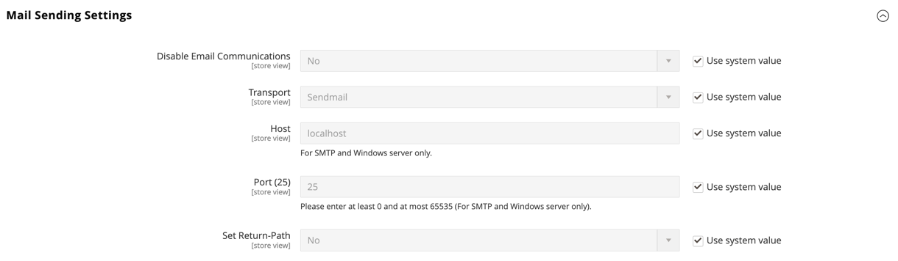

# [!UICONTROL Advanced] > [!UICONTROL System]

{{config}}

## [!UICONTROL Cron (Scheduled Tasks)]

<!-- zoom -->

有关更改这些配置设置的详细信息，请参阅 [Cron（计划任务）](../../systems/cron.md).

### [!UICONTROL index]

<!-- zoom -->

| 字段 | [范围](../../getting-started/websites-stores-views.md#scope-settings) | 描述 |
|--- |--- |--- |
| [!UICONTROL Generate Schedules Every] | 全局 | 确定计划的生成频率（以分钟为单位）。 |
| [!UICONTROL Schedule Ahead for] | 全局 | 确定提前生成计划的分钟数。 |
| [!UICONTROL Missed if Not Run Within] | 全局 | 确定尚未执行的cron作业被标记为已错过之前经过的分钟数。 |
| [!UICONTROL History Cleanup Every] | 全局 | 确定清理cron历史记录之前经过的分钟数。 |
| [!UICONTROL Success History Lifetime] | 全局 | 确定成功完成的cron作业的记录保留在数据库中的分钟数。 |
| [!UICONTROL Failure History Lifetime] | 全局 | 确定在数据库中保留失败的cron作业记录的分钟数。 |
| [!UICONTROL Use Separate Process] | 全局 | 确定cron作业是否作为单独的进程并行执行。 选项： `Yes` / `No` |

{style="table-layout:auto"}

### [!UICONTROL default]

<!-- zoom -->

| 字段 | [范围](../../getting-started/websites-stores-views.md#scope-settings) | 描述 |
|--- |--- |--- |
| [!UICONTROL Generate Schedules Every] | 全局 | 确定计划的生成频率（以分钟为单位）。 |
| [!UICONTROL Schedule Ahead for] | 全局 | 确定提前生成计划的分钟数。 |
| [!UICONTROL Missed if Not Run Within] | 全局 | 确定尚未执行的cron作业被标记为已错过之前经过的分钟数。 |
| [!UICONTROL History Cleanup Every] | 全局 | 确定清理cron历史记录之前经过的分钟数。 |
| [!UICONTROL Success History Lifetime] | 全局 | 确定成功完成的cron作业的记录保留在数据库中的分钟数。 |
| [!UICONTROL Failure History Lifetime] | 全局 | 确定在数据库中保留失败的cron作业记录的分钟数。 |
| [!UICONTROL Use Separate Process] | 全局 | 确定cron作业是否作为单独的进程并行执行。 选项： `Yes` / `No` |

{style="table-layout:auto"}

## [!UICONTROL MySQL Message Queue Cleanup]

{{ee-feature}}

<!-- zoom -->

| 字段 | [范围](../../getting-started/websites-stores-views.md#scope-settings) | 描述 |
|--- |--- |--- |
| [!UICONTROL Successful Messages Lifetime] | 全局 | 确定成功消息的生命周期（分钟）。 输入零以跳过清理。 默认： `10080` （7天） |
| [!UICONTROL New Messages Lifetime] | 全局 | 确定新消息的生命周期（分钟）。 输入零以跳过清理。 默认： `10080` （7天） |
| [!UICONTROL Failed Messages Lifetime] | 全局 | 确定失败消息的生命周期（以分钟为单位）。 输入零以跳过清理。 默认： `10080` （7天） |
| [!UICONTROL Retry Messages in Progress After] | 全局 | 确定在重试之前，系统等待消息进行的时长。 默认： `1440` （24小时） |

{style="table-layout:auto"}

## [!UICONTROL Mail Sending Settings]

<!-- zoom -->

有关更改这些设置的详细信息，请参阅 [配置电子邮件通信](../../systems/email-communications.md) 在 _管理系统指南_.

>[!IMPORTANT]
>
>**安全声明** 我们建议所有商家立即设置其邮件发送配置，以防最近发现的潜在远程代码执行漏洞。 在解决此问题之前，强烈建议您避免使用 [!DNL Sendmail] 用于电子邮件通信。 在 [!UICONTROL Mail Sending Settings]，请确保 [!UICONTROL Set Return Path] 设置为 `No`.

| 字段 | [范围](../../getting-started/websites-stores-views.md#scope-settings) | 描述 |
|--- |--- |--- |
| [!UICONTROL Disable Email Communications] | 商店视图 | 确定是否为商店激活电子邮件通信。 选项： `Yes` / `No` |
| [!UICONTROL Transport] | 商店视图 | 确定来自商店的电子邮件通信的传输类型。 选项： `Sendmail` / `SMTP` |
| [!UICONTROL Host] | 商店视图 | （仅适用于SMTP和Windows服务器）确定用于引用主机的名称。 默认值： `localhost` |
| [!UICONTROL Port (25)] | 商店视图 | （仅适用于SMTP和Windows服务器）标识用于电子邮件通信的端口。 默认值： `25` |
| [!UICONTROL Set Return-Path] | 商店视图 | 确定路由地址是否用于返回的电子邮件。 选项： `No` / `Yes` / `Specified` |

{style="table-layout:auto"}

### SMTP选项

在传输类型中选择SMTP时，可以使用其他选项来配置SMTP服务器连接。

<!-- zoom -->

| 字段 | [范围](../../getting-started/websites-stores-views.md#scope-settings) | 描述 |
|--- |--- |--- |
| [!UICONTROL Username] | 商店视图 | SMTP服务器的登录用户名。 |
| [!UICONTROL Password] | 商店视图 | SMTP服务器登录密码。 |
| [!UICONTROL Auth] | 商店视图 | 确定SMTP服务器连接的身份验证类型。 选项： `NONE` / `PLAIN` / `LOGIN` |
| [!UICONTROL SSL] | 商店视图 | 确定主机安全证书的验证类型。 选项： `SSL` / `TLS` |

{style="table-layout:auto"}

## [!UICONTROL Currency]

<!-- zoom -->

有关更改此设置的详细信息，请参阅 [货币配置](../../stores-purchase/currency-configuration.md) 在 _存储和购买体验指南_.

| 字段 | [范围](../../getting-started/websites-stores-views.md#scope-settings) | 描述 |
|--- |--- |--- |
| [!UICONTROL Installed Currencies] | 全局 | 指示当前可用于Commerce安装的货币。 选项包括所有可用货币，并且已选择安装的货币。 |

{style="table-layout:auto"}

## [!UICONTROL Security]

<!-- zoom -->

有关更改这些设置的详细信息，请参阅 [会话管理](../../systems/security-session-management.md) 在 _管理系统指南_.

| 字段 | [范围](../../getting-started/websites-stores-views.md#scope-settings) | 描述 |
|--- |--- |--- |
| [!UICONTROL Max Session Size in Admin] | 全局 | 限制以字节为单位的最大会话大小。 使用 `0` 以禁用。 |
| [!UICONTROL Max Session Size in Storefront] | 全局 | 限制以字节为单位的最大会话大小。 使用 `0` 以禁用。 |

{style="table-layout:auto"}

## [!UICONTROL Notifications]

<!-- zoom -->

有关更改这些设置的详细信息，请参阅 [系统通知](../../systems/notifications.md) 在 _管理系统指南_.

| 字段 | [范围](../../getting-started/websites-stores-views.md#scope-settings) | 描述 |
|--- |--- |--- |
| [!UICONTROL Use HTTPS to Get Feed] | 全局 | 确定管理员通知是否通过安全渠道传递。 选项： `Yes` / `No` |
| 更新频率 | 全局 | 确定管理员消息更新的频率。 选项： `1 Hour` / `2 Hours` / `6 Hours` / `12 Hours` / `24 Hours` |
| [!UICONTROL Last Update] | 全局 | 指示上次更新消息的日期和时间。 |

{style="table-layout:auto"}

## [!UICONTROL Backup Settings]

<!-- zoom -->

{{$include /help/_includes/backups-note.md}}

有关更改这些设置的详细信息，请参阅 [系统备份](../../systems/backups.md) 在 _管理系统指南_.

| 字段 | [范围](../../getting-started/websites-stores-views.md#scope-settings) | 描述 |
|--- |--- |--- |
| [!UICONTROL Enable Backup] | 全局 | 确定Commerce实例是否允许备份。 选项： `Yes` / `No` |
| [!UICONTROL Enable Scheduled Backup] | 全局 | (显示时间 _[!UICONTROL Enable Backup]_设置为 `Yes`.) 确定是否定期自动备份Commerce实例。 选项： `Yes` / `No` |
| [!UICONTROL Scheduled Backup Type] | 全局 | (显示时间 _[!UICONTROL Enable Scheduled Backup]_设置为 `Yes`.) 确定备份中包含的Commerce实例的元素。 选项： `Database` / `Database and Media` / `System` / `System (excluding Media)` |
| [!UICONTROL Start Time] | 全局 | (显示时间 [!UICONTROL Enable Scheduled Backup] 设置为 `Yes`.) 指定计划备份开始的时间（小时、分钟和秒）。 |
| [!UICONTROL Frequency] | 全局 | (显示时间 [!UICONTROL Enable Scheduled Backup] 设置为 `Yes`.) 确定定时备份的频率。 选项： `Daily` / `Weekly` / `Monthly` |
| [!UICONTROL Maintenance Mode] | 全局 | (显示时间 [!UICONTROL Enable Scheduled Backup] 设置为 `Yes`.) 确定在定时备份期间是否将存储置于维护模式。 选项： `Yes` / `No` |

{style="table-layout:auto"}

## [!UICONTROL Admin Actions Log Archiving]

{{ee-feature}}

<!-- zoom -->

有关更改这些设置的详细信息，请参阅 [操作日志存档](../../systems/action-log-archive.md) 在 _管理系统指南_.

| 字段 | [范围](../../getting-started/websites-stores-views.md#scope-settings) | 描述 |
|--- |--- |--- |
| [!UICONTROL Log Entry Lifetime, Days] | 商店视图 | 确定管理操作在管理操作存档中保留的天数。 默认： `60` |
| [!UICONTROL Log Archiving Frequency] | 商店视图 | 确定存档管理员操作日志的频率。 选项： `Daily` / `Weekly` / `Monthly` |

{style="table-layout:auto"}

## [!UICONTROL Full Page Cache]

<!-- zoom -->

有关更改这些设置的详细信息，请参阅 [全页缓存](../../systems/cache-management.md#full-page-caching) 在 _管理系统指南_.

<!-- zoom -->

| 字段 | [范围](../../getting-started/websites-stores-views.md#scope-settings) | 描述 |
|--- |--- |--- |
| [!UICONTROL Caching Application] | 全局 | 确定用于管理全页缓存的应用程序。 选项：  **`Built-in Application`**— 不建议在生产环境中使用。 **`Varnish Caching`**  — 建议用于生产环境。 |
| [!UICONTROL TTL for public content] | 全局 | 确定公共内容缓存的生命周期（以秒为单位）。 默认值： `120` |
| [!UICONTROL Handles param size] | 全局 | 指定最大数量 [布局句柄](https://developer.adobe.com/commerce/frontend-core/guide/layouts/#layout-handles) 处理 [`{BASE-URL}/page_cache/block/esi`](https://experienceleague.adobe.com/docs/commerce-operations/configuration-guide/cache/use-varnish-esi.html) HTTP端点。 限制大小可以提高安全性和性能。 默认值： `100` |
| **[!UICONTROL Varnish Configuration]** |  |  |
| [!UICONTROL Access list] | 全局 | 指定可以清除清漆配置以生成配置文件的IP地址。 用逗号分隔多个条目。 默认值： `localhost` |
| [!UICONTROL Backend host] | 全局 | 指定生成配置文件的后端主机。 默认值： `localhost` |
| [!UICONTROL Backend port] | 全局 | 指定用于生成配置文件的后端端口。 默认值： `8080` |
| [!UICONTROL Grace period] | 全局 | 确定在后端无响应时，Varnish提供过时内容的时长。 默认值： `300` |
| **[!UICONTROL Export Configuration]** |  |  |
| [!UICONTROL Export VCL for Varnish 4] | 全局 | 导出 `varnish.vcl` 版本4的文件。 |
| [!UICONTROL Export VCL for Varnish 5] | 全局 | 导出 `varnish.vcl` 版本5的文件。 |
| [!UICONTROL Export VCL for Varnish 6] | 全局 | 导出 `varnish.vcl` 版本6的文件。 |

{style="table-layout:auto"}

## [!UICONTROL Storage Configuration for Media]

<!-- zoom -->

有关更改这些设置的详细信息，请参阅 [使用媒体数据库](../../content-design/media-storage-database.md) 在 _内容和设计指南_.

| 字段 | [范围](../../getting-started/websites-stores-views.md#scope-settings) | 描述 |
|--- |--- |--- |
| [!UICONTROL Media Storage] | 全局 | 确定用于存储媒体文件的方法。 默认设置： `File System` |
| [!UICONTROL Environment Update Time] | 全局 | 确定媒体文件环境更新的频率（秒）。 默认值： `3600` |

{style="table-layout:auto"}

<!-- zoom -->

>[!IMPORTANT]
>
>自Adobe Commerce和Magento Open Source2.4.3起，数据库媒体存储方法已被弃用。

| 字段 | [范围](../../getting-started/websites-stores-views.md#scope-settings) | 描述 |
|--- |--- |--- |
| [!UICONTROL Media Storage] | 全局 | 将数据库指定为用于存储媒体文件的方法。 |
| [!UICONTROL Select Media Database] | 全局 | 标识用于媒体存储的数据库的名称。 默认设置： `default_setup` |
| [!UICONTROL Synchronize] |  | 将所有介质的传输同步到指定的数据库位置。 |
| 环境更新时间 | 全局 | 确定媒体文件环境更新的频率（秒）。 默认值： `3600` |

{style="table-layout:auto"}

## [!UICONTROL Bulk Actions]

{{ee-feature}}

<!-- zoom -->

有关更改这些设置的详细信息，请参阅 [批量操作](../../systems/action-log-bulk-actions.md) 在 _管理系统指南_.

| 字段 | [范围](../../getting-started/websites-stores-views.md#scope-settings) | 描述 |
|--- |--- |--- |
| [!UICONTROL Days Saved in Log] | 全局 | 确定批量操作在中保留的天数 _批量操作日志_ 存档。 默认： `60` |

{style="table-layout:auto"}

## [!UICONTROL Scheduled Import/Export File History Cleaning]

{{ee-feature}}

<!-- zoom -->

有关更改这些设置的详细信息，请参阅 [计划的导入和导出](../../systems/data-scheduled-import-export.md) 在 _管理系统指南_.

| 字段 | [范围](../../getting-started/websites-stores-views.md#scope-settings) | 描述 |
|--- |--- |--- |
| [!UICONTROL Save File, Days] | 全局 | 确定导入/导出历史记录文件的保存天数。 |
| [!UICONTROL Enable Scheduled File History Cleaning] | 全局 | 启用导入/导出文件的计划文件清理。 选项： `Yes` / `No` |
| [!UICONTROL Clean Now] |  | 覆盖计划的清理，并立即清除导入/导出历史记录文件。 |
| [!UICONTROL Start Time] | 全局 | 指定导入/导出历史记录文件清理的小时、分钟和秒。 |
| [!UICONTROL Frequency] | 全局 | 确定清除导入/导出历史记录文件的频率。 选项： `Daily` / `Weekly` / `Monthly` |
| [!UICONTROL Error Email Recipient] | 全局 | 在清理导入/导出文件历史记录期间发生错误时接收通知的人员的电子邮件地址。 用逗号分隔多个地址。 |
| [!UICONTROL Error Email Sender] | 全局 | 标识显示为通知发送者的商店联系人。 默认发件人： `General Contact` |
| [!UICONTROL Error Email Template] | 全局 | 标识用于导入/导出文件清理错误通知的电子邮件模板。 默认模板： `File History Clean Failed` |

{style="table-layout:auto"}

## [!UICONTROL Image Upload Configuration]

<!-- zoom -->

<!-- [Image Upload Configuration](https://docs.magento.com/user-guide/system/action-log-bulk-actions.html) -->

| 字段 | [范围](../../getting-started/websites-stores-views.md#scope-settings) | 描述 |
|--- |--- |--- |
| [!UICONTROL Quality] | 全局 | 确定调整后图像的JPG质量。 较低的质量会减小文件大小。 使用80-90%来帮助以高质量减小文件大小。 默认： `80` |
| [!UICONTROL Enable Frontend Resize] | 全局 | 启用此设置将允许Commerce调整您为上传的大型、超大图像的大小 _产品详细信息_ 页面。 Commerce在上传文件之前使用JavaScript调整图像文件的大小。 在调整图像大小时，它将保持精确的比例以符合“最大宽度”或“最大高度”的要求，并且不会超过“最大宽度”或“最大高度”的最大尺寸。 默认： `Yes` |
| [!UICONTROL Maximum Width] | 全局 | 确定图像的最大像素宽度。 调整图像大小时，它不会超过此宽度。 默认： `1920` |
| [!UICONTROL Maximum Height] | 全局 | 确定图像的最大像素高度。 调整图像大小时，它不会超过此高度。 默认： `1200` |

{style="table-layout:auto"}

## [!UICONTROL Media Gallery]

<!-- zoom -->

| 字段 | [范围](../../getting-started/websites-stores-views.md#scope-settings) | 描述 |
|--- |--- |--- |
| [!UICONTROL Enable Old Media Gallery] | 全局 | 启用或禁用旧媒体集。 |

{style="table-layout:auto"}

## [!UICONTROL Media Gallery Image Optimization]

<!-- zoom -->

| 字段 | [范围](../../getting-started/websites-stores-views.md#scope-settings) | 描述 |
|--- |--- |--- |
| [!UICONTROL Enable Image Optimization] | 全局 | 确定是否调整图像大小以减小插入到内容中的图像的文件大小。 原始图像会保留在媒体集中。 |
| [!UICONTROL Maximum Width] | 全局 | 从媒体库插入到内容中的图像的最大宽度（以像素为单位）。 |
| [!UICONTROL Maximum Height] | 全局 | 从媒体库插入到内容中的图像的最大高度（以像素为单位）。 |

{style="table-layout:auto"}

## [!UICONTROL Adobe Stock Integration]

<!-- zoom -->

有关配置这些设置的详细信息，请参阅 [Adobe Stock集成](../../content-design/adobe-stock.md) 在 _内容和设计指南_.

| 字段 | [范围](../../getting-started/websites-stores-views.md#scope-settings) | 描述 |
|--- |--- |--- |
| [!UICONTROL Enabled Adobe Stock] | 全局 | 启用或禁用Adobe Stock集成。 |
| [!UICONTROL API Key (Client ID)] | 全局 | 需要API密钥才能将您的存储连接到Adobe Stock服务。 |
| [!UICONTROL Client Secret] | 全局 | 您的Adobe Stock集成需要客户端密钥。 |
| [!UICONTROL Test Connection] |  | 运行测试以验证API密钥是否可用于Adobe Stock服务。 |

{style="table-layout:auto"}
