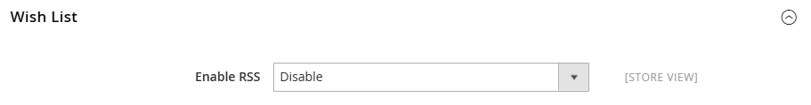

# [!UICONTROL Catalog] > [!UICONTROL RSS Feeds]

{{config}}

## [!UICONTROL Rss Config]

<!-- zoom -->

<!-- [Rss Config](https://docs.magento.com/user-guide/marketing/rss-feed.html) -->

| 字段 | [范围](../../getting-started/websites-stores-views.md#scope-settings) | 描述 |
|--- |--- |--- |
| [!UICONTROL Enable RSS] | 商店视图 | 允许客户从应用商店接收RSS源。 |

{style="table-layout:auto"}

## [!UICONTROL Wish List]

<!-- zoom -->

<!-- [Wish List](https://docs.magento.com/user-guide/marketing/wishlists.html) -->

| 字段 | [范围](../../getting-started/websites-stores-views.md#scope-settings) | 描述 |
|--- |--- |--- |
| [!UICONTROL Enable RSS] | 商店视图 | 启用后，一个RSS馈送链接将显示在愿望列表页面的顶部。 愿望清单共享页面包括一个复选框，客户可以选择该复选框以链接到共享愿望清单中的信息源。 |

{style="table-layout:auto"}

## [!UICONTROL Catalog]

<!-- zoom -->

<!-- [Catalog](https://docs.magento.com/user-guide/catalog/catalog-menu.html) -->

| 字段 | [范围](../../getting-started/websites-stores-views.md#scope-settings) | 描述 |
|--- |--- |--- |
| [!UICONTROL New Products] | 商店视图 | 启用后，会发布添加到商店目录的新产品的通知。 |
| [!UICONTROL Special Products] | 商店视图 | 启用后，会发布任何具有特殊定价产品的通知。 |
| [!UICONTROL Coupons/Discounts] | 商店视图 | 启用后，会发布任何优惠券或折扣的通知。 |
| [!UICONTROL Top Level Category] | 商店视图 | 发布对目录顶级类别结构所做任何更改的通知，这反映在主菜单中。 |

{style="table-layout:auto"}

## [!UICONTROL Order]

<!-- zoom -->

<!-- [Order](https://docs.magento.com/user-guide/sales/order-status-notification.html) -->

| 字段 | [范围](../../getting-started/websites-stores-views.md#scope-settings) | 描述 |
|--- |--- |--- |
| [!UICONTROL Customer Order Status Notification] | 商店视图 | 使客户能够通过RSS馈送跟踪其订单状态。 启用后，订单上会显示RSS馈送链接 |

{style="table-layout:auto"}
