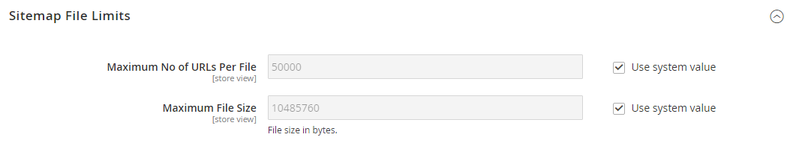

# [!UICONTROL Catalog] > [!UICONTROL XML Sitemap]

{{config}}

## [!UICONTROL Categories Options]

<!-- zoom -->

<!-- [Categories Options](https://experienceleague.adobe.com/en/docs/commerce-admin/marketing/seo/sitemap-xml) -->

| 字段 | [作用域](../../getting-started/websites-stores-views.md#scope-settings) | 描述 |
|--- |--- |--- |
| [!UICONTROL Frequency] | 商店视图 | 确定Sitemap类别的更新频率。 选项： `Always` / `Hourly` / `Daily` / `Weekly` / `Monthly` / `Yearly` / `Never` |
| [!UICONTROL Priority] | 商店视图 | 介于`0.0`和`1.0`之间的值，该值确定类别站点地图更新相对于其他内容的优先级。 零(`0.0`)具有最低优先级。 |

{style="table-layout:auto"}

## [!UICONTROL Products Options]

<!-- zoom -->

<!-- [Products Options](https://experienceleague.adobe.com/en/docs/commerce-admin/marketing/seo/sitemap-xml) -->

| 字段 | [作用域](../../getting-started/websites-stores-views.md#scope-settings) | 描述 |
|--- |--- |--- |
| [!UICONTROL Frequency] | 商店视图 | 确定Sitemap产品的更新频率。 选项： `Always` / `Hourly` / `Daily` / `Weekly` / `Monthly` / `Yearly` / `Never` |
| [!UICONTROL Priority] | 商店视图 | 介于`0.0`和`1.0`之间的值，该值确定产品站点地图更新相对于其他内容的优先级。 零(`0.0`)具有最低优先级。 |
| [!UICONTROL Add Images into Sitemap] | 商店视图 | 确定图像在站点地图中的包含范围。 选项： `None` / `Base Only` / `All` |

{style="table-layout:auto"}

## [!UICONTROL CMS Pages Options]

<!-- zoom -->

<!-- [CMS Pages Options](https://experienceleague.adobe.com/en/docs/commerce-admin/marketing/seo/sitemap-xml) -->

| 字段 | [作用域](../../getting-started/websites-stores-views.md#scope-settings) | 描述 |
|--- |--- |--- |
| [!UICONTROL Frequency] | 商店视图 | 确定Sitemap CMS页面的更新频率。 选项： `Always` / `Hourly` / `Daily` / `Weekly` / `Monthly` / `Yearly` / `Never` |
| [!UICONTROL Priority] | 商店视图 | 一个介于`0.0`和`1.0`之间的值，它确定CMS页面Sitemap更新相对于其他内容的优先级。 零(`0.0`)具有最低优先级。 |

{style="table-layout:auto"}

## [!UICONTROL Store Url Options]

| 字段 | [作用域](../../getting-started/websites-stores-views.md#scope-settings) | 描述 |
|--- |--- |--- |
| [!UICONTROL Frequency] | 商店视图 | 确定存储URL的更新频率。 选项： `Always` / `Hourly` / `Daily` / `Weekly` / `Monthly` / `Yearly` / `Never` |
| [!UICONTROL Priority] | 商店视图 | 介于`0.0`和`1.0`之间的值，该值确定存储URL更新相对于其他内容的优先级。 零(`0.0`)具有最低优先级。 |

{style="table-layout:auto"}

## [!UICONTROL Generation Settings]

<!-- zoom -->

<!-- [Generation Settings](https://experienceleague.adobe.com/en/docs/commerce-admin/marketing/seo/sitemap-xml) -->

| 字段 | [作用域](../../getting-started/websites-stores-views.md#scope-settings) | 描述 |
|--- |--- |--- |
| [!UICONTROL Enabled] | 商店视图 | 确定XML Sitemap是否可用于存储。 选项： `Yes` / `No` |
| [!UICONTROL Generation Method] | 商店视图 | 确定XML Sitemap的生成方式。 `Standard`使用传统的同步生成过程并处理内存中的所有数据，而`Batch`使用异步内存优化批处理模式以获得更大的灵活性和可扩展性。 从2.4.9版本开始，提供了此选项。 选项： `Standard` / `Batch` |
| [!UICONTROL Start Time] | 商店视图 | 指定站点地图在一天中的小时、分钟和秒进行更新。 |
| [!UICONTROL Frequency] | 商店视图 | 确定站点地图的更新频率。 选项： `Daily` / `Weekly` / `Monthly` |
| [!UICONTROL Error Email Recipient] | 商店视图 | 在站点地图更新过程中发生错误时接收通知的人员的电子邮件地址。 对于多个地址，请使用逗号分隔每个地址。 |
| [!UICONTROL Error Email Sender] | 网站 | 标识显示为错误通知发送者的商店联系人。 选项： `General Contact` / `Sales Representative` / `Customer Support` / `Custom Email 1` / `Custom Email 2` |
| [!UICONTROL Error Email Template] | 网站 | 标识用于错误通知的电子邮件模板。 默认模板： `Sitemap generate Warnings` |

{style="table-layout:auto"}

## [!UICONTROL Sitemap File Limits]

<!-- zoom -->

<!-- [Sitemap File Limits](https://experienceleague.adobe.com/en/docs/commerce-admin/marketing/seo/sitemap-xml) -->

| 字段 | [作用域](../../getting-started/websites-stores-views.md#scope-settings) | 描述 |
|--- |--- |--- |
| [!UICONTROL Maximum No of URLs Per File] | 商店视图 | 确定单个站点地图中可以包含的最大URL数。 |
| [!UICONTROL Maximum File Size] | 商店视图 | 确定生成的站点地图的最大大小（字节）。 |

{style="table-layout:auto"}

## [!UICONTROL Search Engine Submission Settings]

<!-- zoom -->

<!-- [Search Engine Submission Settings](https://experienceleague.adobe.com/en/docs/commerce-admin/marketing/seo/sitemap-xml) -->

| 字段 | [作用域](../../getting-started/websites-stores-views.md#scope-settings) | 描述 |
|--- |--- |--- |
| [!UICONTROL Enable Submission to Robots.txt] | 商店视图 | 允许为robots.txt文件提交指令。 选项： `Yes` / `No` |

{style="table-layout:auto"}
