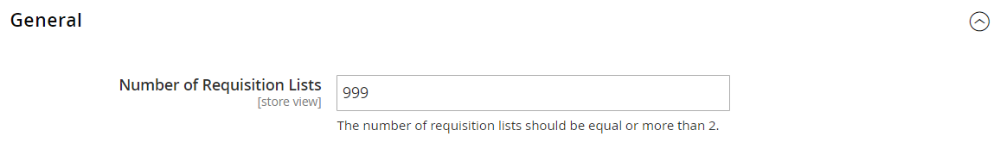

# [!UICONTROL Customers] > [!UICONTROL Requisition Lists]

{{b2b-feature}}

{{config}}

>[!TIP]
>
>通过安装和启用Adobe Commerce B2B，您可以利用公司的特定功能个性化购买体验。 Adobe Commerce B2B是一个集成式解决方案，同时支持B2B和B2C模型。 有关B2B功能的详细信息，请参阅&#x200B;[_Adobe Commerce B2B用户指南_](https://experienceleague.adobe.com/docs/commerce-admin/b2b/introduction.html)。

>[!NOTE]
>
>对B2B功能的这些配置选项的访问权限由[角色资源](../../systems/permissions-user-roles.md#role-resources)控制。 必须为分配给管理员用户的用户角色设置这些角色资源。

## [!UICONTROL General]

<!-- zoom -->

<!-- [General](https://experienceleague.adobe.com/en/docs/commerce-admin/b2b/requisition-lists/configure-requisition-lists) -->

| 字段 | [作用域](../../getting-started/websites-stores-views.md#scope-settings) | 描述 |
|--- |--- |--- |
| [!UICONTROL Number of Requisition Lists] | 商店视图 | 确定每个客户帐户可以维护的申请列表的最大数量。 最小值为`2`，最大值为`999`。 |

{style="table-layout:auto"}
