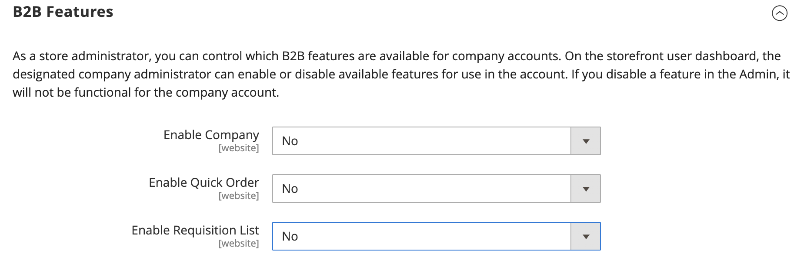

# [!UICONTROL General] > [!UICONTROL B2B Features]

{{b2b-feature}}

{{config}}

>[!TIP]
>
>通过安装和启用Adobe Commerce的B2B，您可以利用公司特定的功能提供个性化的购买体验。 Adobe Commerce的B2B是一个集成式解决方案，同时支持B2B和B2C模型。 有关B2B功能的详细信息，请参见 [_《 B2B for Adobe Commerce用户指南》_](https://experienceleague.adobe.com/docs/commerce-admin/b2b/introduction.html).

## [!UICONTROL B2B Features]

<!-- zoom -->

| 字段 | [范围](../../getting-started/websites-stores-views.md#scope-settings) | 描述 |
|----------------------------------------------------------------------------------|------------------------------------------------------------------------|----------------------------------------------------------------------------------------------------------------------------------------------------------------------------------------------|
| [[!UICONTROL Enable Company]](../../b2b/account-companies.md) | 网站 | 启用后，允许客户从其帐户仪表板管理其公司分配，默认情况下还启用“共享目录”和“B2B报价”功能。 选项： `Yes` / `No` |
| [[!UICONTROL Enable Quick Order]](../../b2b/quick-order.md) | 网站 | 启用后，允许客户和来宾根据SKU或产品名称快速下订单。 选项： `Yes` / `No` |
| [[!UICONTROL Enable Requisition List]](../../b2b/configure-requisition-lists.md) | 网站 | 启用后，允许客户从其帐户信息板创建和管理申请列表。 |

{：style=&quot;table-layout：auto&quot;}

<!-- zoom -->

启用“公司”功能后，“共享目录”和B2B Quote将可使用其他字段。

| 字段 | [范围](../../getting-started/websites-stores-views.md#scope-settings) | 描述 |
|--------------------------------------------------------------------|------------------------------------------------------------------------|-----------------------------------------------------------------------------------------------------------------------------------------------------------------------------------------------------------------------------------------------------------------------------------------------------------------|
| [[!UICONTROL Enable Shared Catalog]](../../b2b/catalog-shared.md) | 网站 | 启用后，即可使用自定义定价创建特选目录，这些目录可在全球范围内使用，或仅限特定公司使用。 选项： `Yes` / `No` |
| [!UICONTROL Enable Shared Catalog direct products price assigning] | 网站 | 当 _[!UICONTROL Enable Shared Catalog]_字段设置为 `Yes`中，此选项可用。 启用后，只有分配给共享目录的产品才会存储在价格指数中。 店面中不会显示未分配给共享目录的产品。 选项： `Yes` / `No` |
| [[!UICONTROL Enable B2B Quote]](../../b2b/configure-quotes.md) | 网站 | 启用后，允许公司购买者从购物车提交询价。 选项： `Yes` / `No` |

{：style=&quot;table-layout：auto&quot;}

### [!UICONTROL Default B2B Payment Methods]

<!-- zoom -->

|[!UICONTROL Applicable Payment Methods]|全局|确定B2B购买者可用的支付方式选择。 选项： `All Payment Methods` / `Specific Payment Methods`| |[!UICONTROL Payment Methods]|全局|指定B2B购买者可用的每种付款方式。|

{：style=&quot;table-layout：auto&quot;}

### [!UICONTROL Default B2B Shipping Methods]

<!-- zoom -->

|[!UICONTROL Applicable Shipping Methods]|全局|确定默认情况下可供B2B购买者使用的配送方式选择。 选项： `All Shipping Methods` / `Specific Shipping Methods`| |[!UICONTROL Shipping Methods]|全局|指定B2B购买者默认可用的每种配送方式。  **_注意：_**您还可以限制特定的 [公司帐户](../../b2b/account-companies.md).|

{：style=&quot;table-layout：auto&quot;}

## [!UICONTROL Order Approval Configuration]

| 字段 | [范围](../../getting-started/websites-stores-views.md#scope-settings) | 描述 |
|--------------------------------------------------------------------------------|------------------------------------------------------------------------|---------------------------------------------------------------------------------|
| [[!UICONTROL Enable Purchase Orders]](../../stores-purchase/purchase-order.md) | 网站 | 启用后，允许公司创建采购订单。 选项： `Yes` / `No` |

<!-- zoom -->

{：style=&quot;table-layout：auto&quot;}
