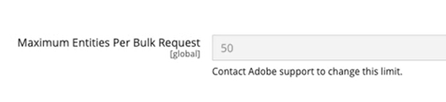

# [!UICONTROL General] > [!UICONTROL Bulk API]

{{config}}

## [!UICONTROL General]

<!-- zoom -->

| 字段 | [作用域](../../getting-started/websites-stores-views.md#scope-settings) | 描述 |
|--- |--- |--- |
| [!UICONTROL Maximum Entities Per Bulk Request] | 全局 | 显示单个批量请求中可处理的最大实体数。 建议将[批量API](https://developer.adobe.com/commerce/webapi/rest/use-rest/bulk-endpoints/){target="_blank"}合并为单个请求，以减少请求数并提高性能。 客户可以通过联系[Adobe Commerce支持](https://experienceleague.adobe.com/zh-hans/support?support-tab=home#support)来请求增加[!UICONTROL Maximum Entities Per Bulk Request]。 Adobe将审查您的用例，并确定增加批量请求大小是否合适。 |

{style="table-layout:auto"}
