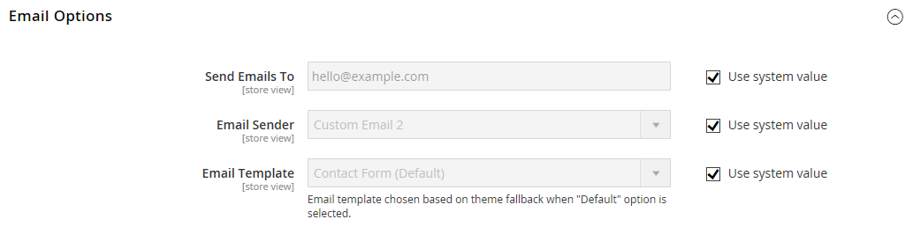

# [!UICONTROL General] > [!UICONTROL Contacts]

{{config}}

## [!UICONTROL Contact Us]

<!-- zoom -->

<!-- [Contact Us](https://experienceleague.adobe.com/en/docs/commerce-admin/start/setup/store-details#contact-us-form) -->

| 字段 | [作用域](../../getting-started/websites-stores-views.md#scope-settings) | 描述 |
|--- |--- |--- |
| [!UICONTROL Enable Contact Us] | 商店视图 | 启用&#x200B;[_联系我们_](../../getting-started/store-details.md#contact-us-form)&#x200B;页面并在页脚中放置链接。 |

{style="table-layout:auto"}

## [!UICONTROL Email Options]

<!-- zoom -->

<!-- [Email Options](https://experienceleague.adobe.com/en/docs/commerce-admin/start/setup/store-details#contact-us-form) -->

| 字段 | [作用域](../../getting-started/websites-stores-views.md#scope-settings) | 描述 |
|--- |--- |--- |
| [!UICONTROL Send Emails To] | 商店视图 | 标识接收来自&#x200B;_联系我们_&#x200B;页面的所有响应的电子邮件地址 |
| [!UICONTROL Email Sender] | 商店视图 | 标识用于从&#x200B;_联系我们_&#x200B;页面回复电子邮件查询的商店联系人。 默认发件人： `Custom Email 2` |
| [!UICONTROL Email Template] | 商店视图 | 指定要用作来自&#x200B;_联系我们_&#x200B;页面的所有电子邮件查询回复的基础的模板。 默认模板： `Contact Form` |

{style="table-layout:auto"}
