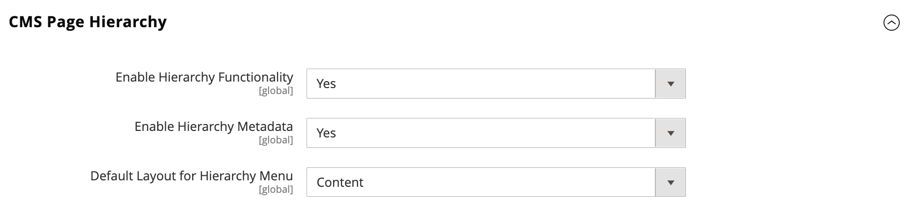

# [!UICONTROL General] > [!UICONTROL Content Management]

{{config}}

## [!UICONTROL WYSIWYG Options]

### [!UICONTROL TinyMCE 6]

<!-- zoom -->

<!-- [WYSIWYG Options](https://experienceleague.adobe.com/en/docs/commerce-admin/content-design/wysiwyg/editor) -->

| 字段 | [作用域](../../getting-started/websites-stores-views.md#scope-settings) | 描述 |
|--- |--- |---------------------------------------------------------------------------------------------------------------------------------------------------------------------------------------------------------------------------------------------------------------------------------------------------------------------------------------------------------------------------------------------------------------------------------------------------------------------------------------------------------------------------------------------------------------------------------------------------------------------------------------------------------------------------------------------------------------------------------------------------|
| [!UICONTROL Enable WYSIWYG Editor] | 商店视图 | 确定是否为存储启用了编辑器。 选项：默认启用/默认禁用/完全禁用 |
| [!UICONTROL WYSIWYG Editor] | 网站 | 确定用于WYSIWYG编辑器的TinyMCE编辑器的版本。 选项：  **`TinyMCE 6`**— （默认）使用TinyMCE版本6作为默认WYSIWYG编辑器。  _**&#x200B;注意：**_对Adobe Commerce和Magento Open Source 2.4.5中的TinyMCE 5.10库的更新解决了允许在使用某些类型的URL更新图像或链接时执行任意JavaScript的漏洞。 TinyMCE 3在2.4.0版本中被弃用，在2.4.3版本中被删除。 TinyMCE 4在2.4.4版本中被删除。 |
| [!UICONTROL Use Static URLs for Media Content in WYSIWYG] | 全局 | 确定[静态URL](../../content-design/catalog-urls-dynamic-media.md)是否用于从WYSIWYG编辑器引用的媒体内容。 设置适用于所有可用WYSIWYG编辑器的位置，包括产品、类别、页面和块。 选项：  **`Yes`**— 对使用WYSIWYG编辑器插入的媒体内容使用静态URL。 静态URL是绝对的，如果存储区的[基本URL](../../stores-purchase/store-urls.md)发生更改，则会中断。 **`No`** （默认） — 根据`{{media url="..."}}`指令，对通过WYSIWYG编辑器插入的媒体内容使用动态URL。 动态URL是相对的，如果商店的基本URL发生更改，则不会中断。 |

{style="table-layout:auto"}

>[!NOTE]
>
>TinyMCE已被Hugerte取代，成为Magento 2.4.6及更高版本中的默认WYSIWYG编辑器。

### [!UICONTROL HugeRTE]

<!-- zoom -->

<!-- [WYSIWYG Options](https://experienceleague.adobe.com/en/docs/commerce-admin/content-design/wysiwyg/editor) -->

| 字段 | [作用域](../../getting-started/websites-stores-views.md#scope-settings) | 描述 |
|--- |--- |---------------------------------------------------------------------------------------------------------------------------------------------------------------------------------------------------------------------------------------------------------------------------------------------------------------------------------------------------------------------------------------------------------------------------------------------------------------------------------------------------------------------------------------------------------------------------------------------------------------------------------------------------------------------------------------------------------------------------------------------------|
| [!UICONTROL Enable WYSIWYG Editor] | 商店视图 | 确定是否为存储启用了编辑器。 选项：默认启用/默认禁用/完全禁用 |
| [!UICONTROL WYSIWYG Editor] | 网站 | 确定用于WYSIWYG编辑器的Hugerte编辑器的版本。 |
| [!UICONTROL Use Static URLs for Media Content in WYSIWYG] | 全局 | 确定[静态URL](../../content-design/catalog-urls-dynamic-media.md)是否用于从WYSIWYG编辑器引用的媒体内容。 设置适用于所有可用WYSIWYG编辑器的位置，包括产品、类别、页面和块。 选项：  **`Yes`**— 对使用WYSIWYG编辑器插入的媒体内容使用静态URL。 静态URL是绝对的，如果存储区的[基本URL](../../stores-purchase/store-urls.md)发生更改，则会中断。 **`No`** （默认） — 根据`{{media url="..."}}`指令，对通过WYSIWYG编辑器插入的媒体内容使用动态URL。 动态URL是相对的，如果商店的基本URL发生更改，则不会中断。 |

{style="table-layout:auto"}

## [!UICONTROL CMS Page Hierarchy]

{{ee-feature}}

<!-- zoom -->

<!--[CMS Page Hierarchy](https://experienceleague.adobe.com/en/docs/commerce-admin/content-design/elements/pages/page-hierarchy) -->

| 字段 | [作用域](../../getting-started/websites-stores-views.md#scope-settings) | 描述 |
|--- |--- |--- |
| [!UICONTROL Enable Hierarchy Functionality] | 全局 | 为您的内容页面激活使用页面层次结构。 选项： `Yes` / `No` |
| [!UICONTROL Enable Hierarchy Metadata] | 全局 | 使您能够关联元数据与层级中的页面。 选项： `Yes` / `No` |
| [!UICONTROL Default Layout for Hierarchy Menu] | 全局 | 确定默认菜单样式。 选项： `Content` / `Left Column` / `Right Column` |

{style="table-layout:auto"}

## [!UICONTROL Advanced Content Tools]

<!-- zoom -->

<!-- [Advanced Content Tools](https://experienceleague.adobe.com/en/docs/commerce-admin/page-builder/walkthrough/3-catalog-content) -->

| 字段 | [作用域](../../getting-started/websites-stores-views.md#scope-settings) | 描述 |
|--- |--- |--- |
| [!UICONTROL Enable Page Builder] | 全局 | 确定[!DNL Page Builder]高级内容工具是否可用。 选项：  **`Yes`**- [!DNL Page Builder]工作区显示在页面、块、产品和类别的“内容”部分中。 **`No`** — 标准CMS编辑工具显示在页面、块、产品和类别的&#x200B;_[!UICONTROL Content]_部分中。 |
| [!UICONTROL Enable Page Builder Content Preview] | 全局 | 确定是否为产品和类别启用[!DNL Page Builder]内容预览。 选项： `Yes` / `No`  **_Note:_**&#x200B;默认情况下，此项设置为`Yes`，但关闭预览可能会阻止在产品或类别表单中加载预览导致的任何性能问题。 |
| [!UICONTROL Google Maps API Key] | 全局 | 来自您的Google帐户的[!DNL Google Maps] API密钥。 |
| [!UICONTROL Test Key] |  | 验证[!DNL Google Maps] API密钥。 |
| [!UICONTROL Google Maps Style] | 全局 | 在此处粘贴[!DNL Google Maps]样式JSON代码以更改映射内容类型的外观。 |
| [!UICONTROL Default Column Grid Size] | 全局 | 确定[!DNL Page Builder]网格中的默认列数。 |
| [!UICONTROL Maximum Column Grid Size] | 全局 | 确定[!DNL Page Builder]网格中的最大列数。 |

{style="table-layout:auto"}

>[!TIP]
>
>通过Page Builder，可以轻松使用自定义布局创建内容丰富的页面，以增强您的可视化storytelling并提高客户参与度和忠诚度。 这些功能旨在提高质量，并减少制作自定义页面的时间和费用。 有关这些功能以及如何使用这些功能为您的Adobe Commerce或Magento Open Source商店创建吸引人的内容的更多信息，请参阅&#x200B;[_Page Builder用户指南_](../../page-builder/guide-overview.md)。
