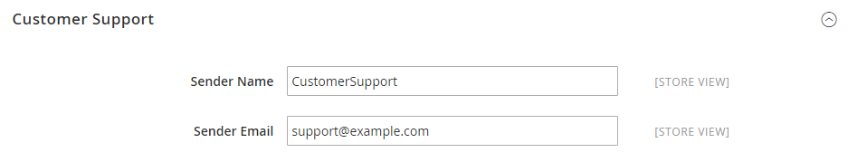
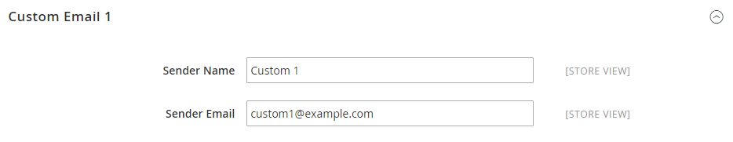

# [!UICONTROL General] > [!UICONTROL Store Email Addresses]

{{config}}

有关这些配置字段和选项的详细信息，请参阅[存储电子邮件地址](../../getting-started/store-details.md#store-email-addresses)。

## [!UICONTROL General]

仅[!BADGE SaaS]{type=Positive url="https://experienceleague.adobe.com/en/docs/commerce/user-guides/product-solutions" tooltip="仅适用于Adobe Commerce as a Cloud Service项目（Adobe管理的SaaS基础架构）。"}

<!-- zoom -->

| 字段 | [作用域](../../getting-started/websites-stores-views.md#scope-settings) | 描述 |
|--- |--- |--- |
| [!UICONTROL Storefront Base URL] | 商店视图 | 用于构造包含在对客户的电子邮件中的链接的基本URL。 URL必须以正斜杠结尾。 例如，`https://www.example.com/`。 |

{style="table-layout:auto"}

## [!UICONTROL General Contact]

<!-- zoom -->

| 字段 | [作用域](../../getting-started/websites-stores-views.md#scope-settings) | 描述 |
|--- |--- |--- |
| [!UICONTROL Sender Name] | 商店视图 | 显示为`General Contact`身份所发送电子邮件的发件人的名称。 |
| [!UICONTROL Sender Email] | 商店视图 | 与`General Contact`身份关联的电子邮件地址。 在Adobe Commerce as a Cloud Service上，创建支持工单以更改电子邮件地址。 |

{style="table-layout:auto"}

## [!UICONTROL Sales Representative]

<!-- zoom -->

| 字段 | [作用域](../../getting-started/websites-stores-views.md#scope-settings) | 描述 |
|--- |--- |--- |
| [!UICONTROL Sender Name] | 商店视图 | 显示为`Sales Representative`身份所发送电子邮件的发件人的名称。 |
| [!UICONTROL Sender Email] | 商店视图 | 与`Sales Representative`身份关联的电子邮件地址。  在Adobe Commerce as a Cloud Service上，创建支持工单以更改电子邮件地址。 |

{style="table-layout:auto"}

## [!UICONTROL Customer Support]

<!-- zoom -->

| 字段 | [作用域](../../getting-started/websites-stores-views.md#scope-settings) | 描述 |
|--- |--- |--- |
| [!UICONTROL Sender Name] | 商店视图 | 显示为`Customer Support`身份所发送电子邮件的发件人的名称。 |
| [!UICONTROL Sender Email] | 商店视图 | 与`Customer Support`身份关联的电子邮件地址。  在Adobe Commerce as a Cloud Service上，创建支持工单以更改电子邮件地址。 |

{style="table-layout:auto"}

## 自定义电子邮件1

<!-- zoom -->

| 字段 | [作用域](../../getting-started/websites-stores-views.md#scope-settings) | 描述 |
|--- |--- |--- |
| [!UICONTROL Sender Name] | 商店视图 | 显示为`Custom 1`身份所发送电子邮件的发件人的名称。 |
| [!UICONTROL Sender Email] | 商店视图 | 与`Custom 1`身份关联的电子邮件地址。  在Adobe Commerce as a Cloud Service上，创建支持工单以更改电子邮件地址。 |

{style="table-layout:auto"}

## 自定义电子邮件2

<!-- zoom -->

| 字段 | [作用域](../../getting-started/websites-stores-views.md#scope-settings) | 描述 |
|--- |--- |--- |
| [!UICONTROL Sender Name] | 商店视图 | 显示为`Custom 2`身份所发送电子邮件的发件人的名称。 |
| [!UICONTROL Sender Email] | 商店视图 | 与`Custom 2`身份关联的电子邮件地址。  在Adobe Commerce as a Cloud Service上，创建支持工单以更改电子邮件地址。 |

{style="table-layout:auto"}
