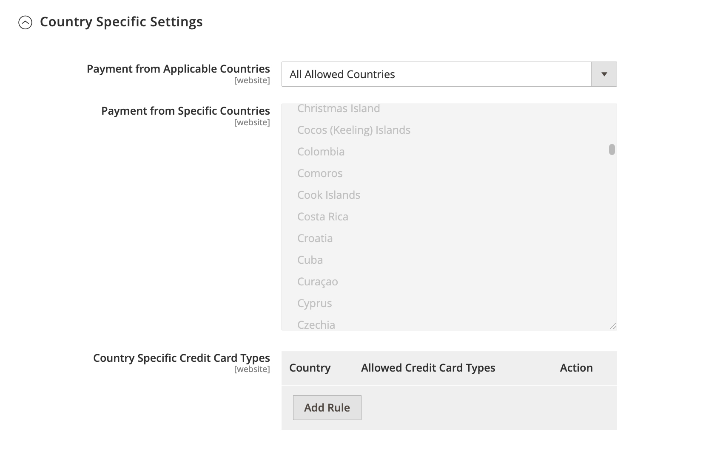

# [!UICONTROL Sales] > [!UICONTROL Payment Methods] > [!UICONTROL Braintree]

>[!IMPORTANT]
>
>**Commerce 2.4迁移：** 
>对于2.4.0之前的Adobe Commerce和Magento Open Source版本，建议商家从[Braintree](https://marketplace.magento.com/catalogsearch/result/?q=braintree)安装和配置官方的Commerce Marketplace支付集成扩展以替换核心集成。 从2.4.0开始，该扩展现已包含在核心版本中。
>  
>迁移到Commerce 2.4时，商家需要卸载Marketplace （`paypal/module-braintree`或`gene/module-braintree`）上分发的扩展，并更新任何代码自定义设置，以使用`PayPal_Braintree`命名空间而不是`Magento_Braintree`。 Commerce的捆绑扩展和Commerce Marketplace上分发的扩展中的配置设置会保留。 使用这些扩展版本进行的付款将正常捕获、失效或退款。
>  
>如果您要升级到Commerce 2.4.0，并且在之前的2.3.x版本中不使用推荐的Commerce Marketplace扩展，则多地址功能在2.4.0版本的Braintree中不起作用。 当购物者选择&#x200B;_传送到多个地址_&#x200B;时，Braintree付款方式未出现。 之前推荐用于2.3.x的Commerce Marketplace扩展存在此多地址问题。

{{config}}

>[!IMPORTANT]
>
>如果您需要有关卡上意外费用的帮助，请访问[取消订阅](https://helpx.adobe.com/manage-account/using/cancel-subscription.html)页面以获得帮助。

## [!UICONTROL Basic Braintree Settings]

<!-- zoom -->

| 字段 | [作用域](../../getting-started/websites-stores-views.md#scope-settings) | 描述 |
|--- |--- |--- |
| [!UICONTROL Title] | 商店视图 | 默认值： `Credit Card` (Braintree) |
| [!UICONTROL Environment] | 商店视图 | 选项： `Sandbox` / `Production` |
| [!UICONTROL Payment Action] | 商店视图 | 确定Braintree在处理付款时执行的操作。 选项：  **`Authorize`**— 客户信用卡上的资金已授权，但未从帐户转帐。 将在您的商店管理员中创建订单。 您可以稍后捕获销售并创建发票。 **`Intent Sale`**（以前版本中的`Authorize and Capture`） — 客户信用卡上的资金由Braintree授权并捕获，并在您的商店管理员中创建了订单和发票。 |
| [!UICONTROL Sandbox Merchant ID] | 商店视图 | 这是您整个沙盒网关帐户的唯一标识符。 也称为&#x200B;_公共ID_&#x200B;或&#x200B;_生产ID_，您的贸易商ID对于生产和沙盒网关是不同的。 当&#x200B;_[!UICONTROL Environment]_字段设置为`Sandbox`时，将显示此字段。 |
| [!UICONTROL Sandbox Public Key] | 商店视图 | 这是用户特定的公共标识符，用于限制对加密数据的访问。 与您的沙盒Braintree网关关联的每个用户都有自己的沙盒公钥。 当&#x200B;_[!UICONTROL Environment]_字段设置为`Sandbox`时，将显示此字段。 |
| [!UICONTROL Sandbox Private Key] | 商店视图 | 这是特定于用户的私有标识符，用于限制对加密数据的访问。 与您的沙盒Braintree网关关联的每个用户都有自己的沙盒私钥。 当&#x200B;_[!UICONTROL Environment]_字段设置为`Sandbox`时，将显示此字段。 |
| [!UICONTROL Merchant ID] | 商店视图 | 这是您整个网关帐户的唯一标识符，包括您的网关中可能存在的多个商家帐户。 也称为&#x200B;_公共ID_&#x200B;或&#x200B;_生产ID_，您的贸易商ID对于生产和沙盒网关是不同的。 当&#x200B;_[!UICONTROL Environment]_字段设置为`Production`时，将显示此字段。 |
| [!UICONTROL Public Key] | 商店视图 | 这是用户特定的公共标识符，用于限制对加密数据的访问。 与您的Braintree网关关联的每个用户都有自己的公钥。 当&#x200B;_[!UICONTROL Environment]_字段设置为`Production`时，将显示此字段。 |
| [!UICONTROL Private Key] | 商店视图 | 这是特定于用户的私有标识符，用于限制对加密数据的访问。 与您的Braintree网关关联的每个用户都有自己的私钥。 当&#x200B;_[!UICONTROL Environment]_字段设置为`Production`时，将显示此字段。 |
| [!UICONTROL Enable Card Payments] | 网站 | 确定Braintree信用卡支付方式是否适用于您的客户。 选项： `Yes` / `No` |
| [!UICONTROL Enable Vault for Card Payments] | 网站 | 启用后，将为客户付款信息提供安全存储，这样客户就不必在每次购买时都重新输入其信用卡信息。 选项： `Yes` / `No` |
| [!UICONTROL Enable Vault CVV Re-verification] | 网站 | 启用后，将对Braintree帐户中的CVV规则设置进行验证。 选项： `Yes` / `No` |

{style="table-layout:auto"}

## [!UICONTROL Advanced Braintree Settings]

{width="550" zoomable="yes"}

| 字段 | [作用域](../../getting-started/websites-stores-views.md#scope-settings) | 描述 |
|--- |--- |--- |
| [!UICONTROL Vault Title] | 网站 | 参考的描述性标题，用于标识存储客户卡信息的存储库。 |
| [!UICONTROL Merchant Account ID] | 网站 | 要与此网站中的Braintree交易关联的商家帐户ID。 如果留空，则会使用Braintree帐户中的默认商家帐户。 |
| [!UICONTROL Enable Checkout Express Payments] | 网站 | 在结账流程之初通过“快速付款”选项(包括PayPal、PayLater、Apple Pay和Google Pay)提供更快的结账体验。 选项： `Yes` / `No` |
| [!UICONTROL Skip Fraud Checks on Admin Orders] | 网站 | 仅当事务设置为`Yes`时，才阻止在通过管理员下单的订单上将该事务作为[!DNL Advanced Fraud Tools]检查的一部分发送以进行评估。 选项： `Yes` / `No` |
| [!UICONTROL Bypass Fraud Protection Threshold] | 网站 | 当达到或超过阈值时，绕过`Advanced Fraud Protection`检查。 将此字段留空将禁用此选项。 |
| [!UICONTROL Debug] | 网站 | 确定Braintree系统和您的商店之间的通信是否记录在日志文件中。 选项： `Yes` / `No` |
| [!UICONTROL CVV Verification] | 网站 | 确定是否要求客户提供信用卡背面的三位数安全代码。 选项： `Yes` / `No` |
| [!UICONTROL Send Card Line Items] | 网站 | 发送所有付款方法的购物车行项目。 选项： `Yes` / `No` |
| [!UICONTROL Credit Card Types] | 网站 | 指定您接受通过Braintree付款的每个信用卡。 按住`Ctrl`(或Mac上的`Command`)以选择卡片组合。 选项： `American Express` / `Visa` / `MasterCard` / `Discover` / `JCB` / `Diners` / `Maestro International` |
| [!UICONTROL Sort Order] | 网站 | 确定在结账过程中Braintree与其他支付方式一起列出的顺序。 |

## [!UICONTROL Braintree Webhooks Settings]

<!-- zoom -->

| 字段 | [作用域](../../getting-started/websites-stores-views.md#scope-settings) | 描述 |
|--- |--- |--- |
| [!UICONTROL Enable Webhook] | 网站 | 启用webhook功能以进行欺诈防护、ACH支付、本地支付方法和争议。 选项： `Yes` / `No` |
| [!UICONTROL Fraud Protection URL] | 网站 | 将此URL作为[!UICONTROL Webhook Destination URL]添加到您的Braintree帐户。 **此URL必须是安全的且可公开访问的。** |
| [!UICONTROL Fraud Protection Approve Order Status] | 网站 | 当Braintree批准防欺诈功能后，选定的订单状态将分配给Commerce订单。 此状态用于更新使用ACH支付方式以及在Braintree中将其移至`SETTLED`的订单的状态。 |
| [!UICONTROL Fraud Protection Reject Order Status] | 网站 | 当Braintree拒绝欺诈防护时，选定的订单状态将分配给Commerce订单。 此状态用于更新使用ACH付款方式且当`SETTLEMENT`在Braintree中为`DECLINED`时的订单状态。 |

{style="table-layout:auto"}

## [!UICONTROL Country Specific Settings]

<!-- zoom -->

| 字段 | [作用域](../../getting-started/websites-stores-views.md#scope-settings) | 描述 |
|--- |--- |--- |
| [!UICONTROL Payment from Applicable Countries] | 网站 | 确定您是否接受Braintree处理的来自所有国家/地区的付款，或仅接受特定国家/地区的付款。 选项： `All Allowed Countries` / `Specific Countries` |
| [!UICONTROL Payment from Specific Countries] | 网站 | 如果适用，请指明您接受Braintree处理付款的特定国家/地区。 |
| [!UICONTROL Country Specific Credit Card Types] | 网站 | 标识每个国家/地区针对Braintree处理的付款接受的信用卡。 将为每个国家/地区保存记录。 选项：  **`Country`**— 选择国家/地区。 **`Allowed Card Types`** — 选择从国家/地区接受通过Braintree付款的每个信用卡。  **`Add`**— 添加行以允许其他国家/地区的信用卡。 **`Action`** — 删除国家/地区允许的信用卡记录。 |

{style="table-layout:auto"}

## [!UICONTROL ACH through Braintree]

通过Braintree进行<!-- zoom -->

| 字段 | [作用域](../../getting-started/websites-stores-views.md#scope-settings) | 描述 |
|--- |--- |--- |
| [!UICONTROL Enabled ACH Direct Debit] | 网站 | 确定是否通过Braintree将[!DNL ACH Direct Debit]作为付款方式包括在内。 选项： `Yes` / `No` |
| [!UICONTROL Enable Vault for ACH Direct Debit] | 网站 | 客户可以保险存储/存储其一次性使用的ACH直接借记支付方式以供将来使用。 保存付款详细信息后，客户可以使用ACH直接借记支付方式，而无需重新输入数据或重新验证其付款信息。 选项： `Yes` / `No` |
| [!UICONTROL Sort Order] | 网站 | 确定在结帐期间将[!DNL ACH Direct Debit]与其他付款方法一起列出的顺序。 |

{style="table-layout:auto"}

## [!UICONTROL Apple Pay through Braintree]

<!-- zoom -->

| 字段 | [作用域](../../getting-started/websites-stores-views.md#scope-settings) | 描述 |
|--- |--- |--- |
| [!UICONTROL Enable ApplePay through Braintree] | 网站 | 确定是否通过Braintree将Apple Pay作为付款方式包含在内。 选项： `Yes` / `No`   域必须首先在Braintree帐户中[验证](https://developer.paypal.com/braintree/docs/guides/apple-pay/configuration/javascript/v3)。 |
| [!UICONTROL Enable Vault for ApplePay] | 网站 | 客户可以保险库/存储其Apple Pay支付方式以供将来使用。 保存付款详细信息后，客户可以使用Apple Pay，而无需重新输入数据或重新验证其付款信息。 选项： `Yes` / `No` |
| [!UICONTROL Payment Action] | 网站 | 确定Braintree在处理付款时执行的操作。 选项：  **`Authorize`**— 客户卡上的资金已授权，但未从客户帐户转帐。 将在您的商店管理员中创建订单。 您可以稍后捕获销售并创建发票。 **`Intent Sale`** — 客户卡上的资金由Braintree授权和捕获，并在您的商店管理员中创建订单和发票。 **_注意：_**&#x200B;在2.3.x及更早版本中，此值为`Authorize and Capture`。 |
| [!UICONTROL Merchant Name] | 商店视图 | 在ApplePay弹出窗口中向客户显示的标签。 |
| [!UICONTROL Sort Order] | 网站 | 确定在结账过程中Apple Pay与其他支付方式一起列出的顺序。 |

{style="table-layout:auto"}

## [!UICONTROL Local Payment Methods]

<!-- zoom -->

| 字段 | [作用域](../../getting-started/websites-stores-views.md#scope-settings) | 描述 |
|--- |--- |--- |
| [!UICONTROL Enabled Local Payment Methods] | 网站 | 确定是否通过Braintree将本地支付方法作为支付方法包含在内。 选项： `Yes` / `No` |
| [!UICONTROL Title] | 网站 | 在结账支付方式部分显示的标签。 默认值： `Local Payments` |
| [!UICONTROL Fallback Button Text] | 网站 | 输入要用于按钮的文本，该按钮显示在将客户带回网站的备用Braintree页面上。 默认值： `Complete Checkout` |
| [!UICONTROL Redirect on Fail] | 网站 | 指定当本地支付方式交易被取消、失败或遇到错误时，应重定向客户的URL。 它应该是结帐付款页面（例如，`https://www.domain.com/checkout#payment`）。 |
| [!UICONTROL Allowed Payment Method] | 网站 | 选择要启用的本地付款方式。 选项： `Bancontact` / `EPS` / `iDeal` / `MyBank` / `P24` / `SEPA/ELV Direct Debit` |
| [!UICONTROL Sort Order] | 网站 | 确定结帐期间本地支付方式与其他支付方式一起列出的顺序。 |

{style="table-layout:auto"}

>[!NOTE]
>
>捆绑的Braintree扩展不支持[Braintree开发人员文档](https://developer.paypal.com/braintree/docs/guides/local-payment-methods/overview)中列出的所有本地付款方法。 其他本地支付方法正在开发中，将在未来版本中提供支持。

## [!UICONTROL GooglePay through Braintree]

通过Braintree <!-- zoom -->

| 字段 | [作用域](../../getting-started/websites-stores-views.md#scope-settings) | 描述 |
|--- |--- |--- |
| [!UICONTROL Enabled GooglePay through Braintree] | 网站 | 确定是否通过Braintree将[!DNL Google Pay]付款作为付款方式包括在内。 选项： `Yes` / `No` |
| [!UICONTROL Enable Vault for GooglePay] | 网站 | 客户可以保管/存储其Google Pay付款方式以供将来使用。 保存付款详细信息后，客户可以使用Google Pay，而无需重新输入数据或重新验证其付款信息。 选项： `Yes` / `No` |
| [!UICONTROL Payment Action] | 网站 | 确定Braintree在处理付款时执行的操作。 选项：  **`Authorize`**— 客户卡上的资金已授权，但未从客户帐户转帐。 将在您的商店管理员中创建订单。 您可以稍后捕获销售并创建发票。 **`Intent Sale`** — 客户卡上的资金由Braintree授权和捕获，并在您的商店管理员中创建订单和发票。 **_注意：_**&#x200B;在2.3.x及更早版本中，此值为`Authorize and Capture`。 |
| [!UICONTROL Button Color] | 网站 | 确定[!DNL Google Pay]按钮的颜色。 选项： `White` / `Black` |
| [!UICONTROL Merchant ID] | 商店视图 | 必须在此处输入由Google提供的ID。 |
| [!UICONTROL Accepted Cards] | 网站 | 选择客户可以使用[!DNL Google Pay]下订单的卡片类型。 |
| [!UICONTROL Sort Order] | 网站 | 确定在结账过程中Google Pay与其他支付方式一起列出的顺序。 |

{style="table-layout:auto"}

## [!UICONTROL Venmo through Braintree]

通过Braintree进行<!-- zoom -->

| 字段 | [作用域](../../getting-started/websites-stores-views.md#scope-settings) | 描述 |
|--- |--- |--- |
| [!UICONTROL Enable Venmo through Braintree] | 网站 | 确定是否通过Braintree将[!DNL Venmo]作为付款方式包括在内。 选项： `Yes` / `No` |
| [!UICONTROL Enable Vault for Venmo] | 网站 | 客户可以保存/存储其Venmo支付方式以供将来使用。 一旦付款详细信息存入电子仓库，客户就可以使用Venmo付款方法，而无需重新输入数据或重新验证其付款信息。 选项： `Yes` / `No` |
| [!UICONTROL Payment Action] | 网站 | 确定Braintree在处理付款时执行的操作。 选项：  **`Authorize`**— 客户卡上的资金已授权，但未从客户帐户转帐。 将在您的商店管理员中创建订单。 您可以稍后捕获销售并创建发票。 **`Intent Sale`** — 客户卡上的资金由Braintree授权和捕获，并在您的商店管理员中创建订单和发票。 **_注意：_**&#x200B;在2.3.x及更早版本中，这是&#x200B;_Authorize and Capture_。 |
| [!UICONTROL Sort Order] | 网站 | 确定在结帐期间将Venmo与其他付款方法一起列出的顺序。 |

{style="table-layout:auto"}

## [!UICONTROL PayPal through Braintree]

通过Braintree配置1{width="550" zoomable="yes"}
{width="550" zoomable="yes"}进行PayPal

| 字段 | [作用域](../../getting-started/websites-stores-views.md#scope-settings) | 描述 |
|--- |--- |--- |
| [!UICONTROL Enable PayPal through Braintree] | 网站 | 确定是否通过Braintree将PayPal作为付款方式包含在内。 选项： `Yes` / `No` |
| [!UICONTROL Enable PayPal Credit through Braintree] | 网站 | 确定是否通过Braintree将PayPal点数作为付款方式包含在内。 选项： `Yes` / `No`。 当`Enable PayPal through Braintree`设置为`Yes`时，此字段可见 |
| [!UICONTROL Enable PayPal PayLater through Braintree] | 网站 | 确定是否通过Braintree将PayPal PayLater作为付款方式包含在内。 选项： `Yes` / `No`。 当`Enable PayPal through Braintree`设置为`Yes`时，此字段可见 |
| [!UICONTROL Title] | 商店视图 | 在结帐期间通过Braintree向客户标识PayPal的标签。 默认值： `PayPal` |
| [!UICONTROL Vault Enabled] | 网站 | 启用后，为客户支付信息提供安全存储，因此客户不必在每次购买时都重新输入其PayPal信息。 选项： `Yes` / `No` |
| [!UICONTROL Send Cart Line Items for PayPal] | 网站 | 将行项目（订单项目）与礼品卡、项目礼品包装、订单礼品包装、商店退款、配送和税作为行项目发送到PayPal。 选项： `Yes` / `No` |
| [!UICONTROL Sort Order] | 网站 | 一个数字，用于在结账期间确定PayPal通过Braintree与其他支付方式一起列出的顺序。 |
| [!UICONTROL Override Merchant Name] | 商店视图 | 可用于为每个商店视图标识商家的替代名称。 |
| [!UICONTROL Payment Action] | 网站 | 确定PayPal在处理付款时通过Braintree采取的操作。 选项：  **`Authorize`**— 客户卡上的资金已授权，但未从客户帐户转帐。 在您的商店管理员中创建了订单。 您可以稍后捕捉销售并创建发票。 **`Authorize and Capture`** - PayPal通过Braintree授权并获取客户卡上的资金，并在您的商店管理员中创建订单和发票。 |
| [!UICONTROL Payment from Applicable Countries] | 网站 | 确定是否接受由PayPal通过所有国家/地区或仅特定国家/地区的Braintree处理的付款。 选项： `All Allowed Countries` / `Specific Countries` |
| [!UICONTROL Payment from Specific Countries] | 网站 | 如果适用，将标识您接受Braintree处理付款的特定国家/地区。 |
| [!UICONTROL Require Customer's Billing Address] | 网站 | 确定是否要求客户的帐单地址来提交订单。 选项： `Yes` / `No` |
| [!UICONTROL Skip Order Review Step] | 网站 | 确定在完成付款之前是否要将客户重定向到审核页面。 选项： `Yes` / `No` |
| [!UICONTROL Debug] | 网站 | 确定PayPal通过Braintree系统和您的商店之间的通信是否记录在日志文件中。 选项： `Yes` / `No` |
| [!UICONTROL Display on Shopping Cart] | 网站 | 确定PayPal按钮是否出现在[迷你购物车](../../stores-purchase/cart-configuration.md#mini-cart)和[购物车](../../stores-purchase/cart.md)页面上。 选项： `Yes` / `No` |
| [!UICONTROL Send Package Tracking] | 网站 | 包跟踪信息将仅针对PayPal交易/订单发送到PayPal。 必须启用[!UICONTROL Send Cart Line Items for PayPal]配置字段才能使[!UICONTROL Package Tracking]功能正常工作。 选项： `Yes` / `No` |
| [!UICONTROL Use PayPal's "Notify Payer" functionality] | 网站 | 一旦将此选项设置为“是”，PayPal就会通知买方或付款人有关包跟踪更新的信息。 选项： `Yes` / `No` |

{style="table-layout:auto"}

>[!NOTE]
>
>可以启用&#x200B;**[!DNL PayPal Credit]**&#x200B;或&#x200B;**[!DNL PayPal PayLater]**。 无法同时启用这两种方法。

### [!UICONTROL Styling]

<!-- zoom -->

| 字段 | [作用域](../../getting-started/websites-stores-views.md#scope-settings) | 描述 |
|--- |--- |--- |
| [!UICONTROL Location] | 网站 | 确定PayPal按钮和消息在店面中的呈现位置。 选项： `Mini-Cart and Cart Page` / `Checkout Page` / `Product Page` |

{style="table-layout:auto"}

**[!UICONTROL Mini-Cart and Cart Page]**

此部分中的选项和设置因&#x200B;_[!UICONTROL Location]_字段中的设置而异。

| 字段 | [作用域](../../getting-started/websites-stores-views.md#scope-settings) | 描述 |
|--- |--- |--- |
| [!UICONTROL PayPal Button Type] | 网站 | 将按钮设置为三种类型之一： `PayPal Button` / `PayPal Pay Later Button` / `PayPal Credit Button` |

**[!UICONTROL PayPal Button]**

此部分中的选项和设置因在&#x200B;_[!UICONTROL PayPal Button Type]_字段中选择的按钮类型而异。

| 字段 | [作用域](../../getting-started/websites-stores-views.md#scope-settings) | 描述 |
|--- |--- |--- |
| [!UICONTROL Show PayPal Button] | 网站 | 确定PayPal按钮在选定位置的位置。 选项： `Yes` / `No` |
| [!UICONTROL Button Label] | 网站 | 确定PayPal按钮的标签。 选项： `Paypal` / `Checkout` / `Buy Now` / `Pay` |
| [!UICONTROL Color] | 网站 | 确定PayPal按钮的颜色。 选项： `Blue` / `Black` / `Gold` / `Silver` |
| [!UICONTROL Shape] | 网站 | 确定PayPal按钮的形状。 选项： `Pill` / `Rectangle` |
| [!UICONTROL Size(Deprecated)] | 网站 | 确定PayPal按钮的大小。 选项： `Medium` / `Large` / `Responsive` |

{style="table-layout:auto"}

>[!NOTE]
>
>**[!DNL Size(Deprecated)]**&#x200B;配置字段已弃用，未用于设置PayPal按钮的样式。

设置这些选项后，您可以看到PayPal按钮和PayLater消息的预览。 可以使用以下控件来应用设置或重置值：

| 字段 | [作用域](../../getting-started/websites-stores-views.md#scope-settings) | 描述 |
|--- |--- |--- |
| [!UICONTROL Apply] | 网站 | 存储按钮和PayLater消息传递的选定样式设置，并将它们应用到当前位置和当前按钮类型。 |
| [!UICONTROL Apply to All Buttons] | 网站 | 存储按钮和PayLater消息值的选定样式设置并将它们应用于所有按钮类型和位置。 |
| [!UICONTROL Reset to Recommended Defaults] | 网站 | 将样式设置返回到按钮和PayLater消息传递的建议默认值，并将其应用于所有按钮类型和位置。 |

{style="table-layout:auto"}

## [!UICONTROL Pay Later Messaging]

**[!UICONTROL Product Page]**

<!-- zoom -->

| 字段 | [作用域](../../getting-started/websites-stores-views.md#scope-settings) | 描述 |
|--- |--- |------------------------------------------------------------------------------------------------------------------------------------------------------------------------------------------------------------------------------------------|
| [!UICONTROL Show PayLater Messaging] | 网站 | 在选定位置启用PayLater消息传送。 选项： `Yes` / `No`。 显示可用优惠的稍后付费消息。 限制适用。 [单击此处了解更多信息。](https://developer.paypal.com/studio/checkout/pay-later/us) |
| [!UICONTROL Message Layout] | 网站 | 确定PayLater消息布局。 选项： `Text` / `Flex` |
| [!UICONTROL Logo] | 网站 | 确定用于“稍后付款”消息的徽标类型。 选项： `Inline` / `Primary` / `Alternative` / `None` |
| [!UICONTROL Logo Position] | 网站 | 确定“稍后付款”消息的徽标位置。 选项： `Left` / `Right` / `Top` |
| [!UICONTROL Text Color] | 网站 | 确定稍后付款消息的文本颜色。 选项： `Black` / `White` / `Monochrome` / `Grayscale` |

{style="table-layout:auto"}

**[!UICONTROL Cart]**

<!-- zoom -->

| 字段 | [作用域](../../getting-started/websites-stores-views.md#scope-settings) | 描述 |
|--- |--- |------------------------------------------------------------------------------------------------------------------------------------------------------------------------------------------------------------------------------------------|
| [!UICONTROL Show PayLater Messaging] | 网站 | 在选定位置启用PayLater消息传送。 选项： `Yes` / `No`。 显示可用优惠的稍后付费消息。 限制适用。 [单击此处了解更多信息。](https://developer.paypal.com/studio/checkout/pay-later/us) |
| [!UICONTROL Message Layout] | 网站 | 确定PayLater消息布局。 选项： `Text` / `Flex` |
| [!UICONTROL Logo] | 网站 | 确定用于稍后支付消息的徽标类型。 选项： `Inline` / `Primary` / `Alternative` / `None` |
| [!UICONTROL Logo Position] | 网站 | 确定稍后支付消息的徽标位置。 选项： `Left` / `Right` / `Top` |
| [!UICONTROL Text Color] | 网站 | 确定稍后支付消息的文本颜色。 选项： `Black` / `White` / `Monochrome` / `Grayscale` |

{style="table-layout:auto"}

**[!UICONTROL Checkout]**

<!-- zoom -->

| 字段 | [作用域](../../getting-started/websites-stores-views.md#scope-settings) | 描述 |
|--------------------------------------|--- |-------------------------------------------------------------------------------------------------------------------------------------------------------------------------------------------------------------------------------------------|
| [!UICONTROL Show PayLater Messaging] | 网站 | 在选定位置启用PayLater消息传送。 选项： `Yes` / `No`。 显示可用优惠的稍后付费消息。 限制适用。 [单击此处了解更多信息。](https://developer.paypal.com/studio/checkout/pay-later/us) |
| [!UICONTROL Text Align] | 网站 | 确定PayLater消息布局。 选项： `Left` / `Center` / `Right` |
| [!UICONTROL Text Color] | 网站 | 确定稍后支付消息的文本颜色。 选项： `Black` / `White` |

{style="table-layout:auto"}

## 3d安全验证设置

<!-- zoom -->

| 字段 | [作用域](../../getting-started/websites-stores-views.md#scope-settings) | 描述 |
|--- |--- |--- |
| [!UICONTROL 3D Secure Verification] | 网站 | 确定当客户注册诸如&#x200B;_由VISA验证_&#x200B;之类的计划时，交易是否必须通过额外的验证流程。 选项： `Yes` / `No` |
| [!UICONTROL Always request 3DS] | 网站 | 始终对所有交易质询3D安全请求。 选项： `Yes` / `No` |
| [!UICONTROL Threshold Amount] | 网站 | 确定授权对单个订单进行处理的最大订单金额。 如果订单金额超过此阈值金额，Braintree会拒绝授权。 |
| [!UICONTROL Verify for Applicable Countries] | 网站 | 确定必须验证付款的国家/地区。 选项： `All Allowed Countries` / `Specific Countries` |
| [!UICONTROL Verify for Specific Countries] | 网站 | 在适用的情况下，标识必须验证按Braintree付款的特定国家/地区。 |

{style="table-layout:auto"}

## [!UICONTROL Dynamic Descriptors]

<!-- zoom -->

| 字段 | [作用域](../../getting-started/websites-stores-views.md#scope-settings) | 描述 |
|--- |--- |--- |
| [!UICONTROL Name] | 商店视图 | 名称描述符由两部分组成，以星号(*)分隔。 描述符的第一部分标识公司或DBA，第二部分标识产品。 例如： `company*myproduct`   描述符的Company和Product部分的长度可通过以下方式进行分配，组合长度最多为22个字符：  **`Option 1`**- Company必须为3个字符/Product最多为18个字符 **`Option 2`** - Company必须为7个字符/Product最多为14个字符&#x200B; **`Option 3`**- Company必须为12个字符/Product最多为9个字符 |
| [!UICONTROL Phone] | 商店视图 | 电话描述符的长度必须为10至14个字符，并且只能包含数字、破折号、圆括号以及句点。 例如： `9999999999` `(999) 999-9999` `999.999.9999` |
| [!UICONTROL URL] | 商店视图 | URL描述符表示您的域名，最多可包含13个字符。 例如： `company.com` |

{style="table-layout:auto"}
