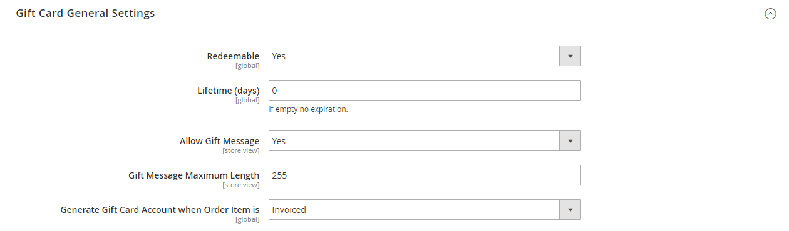

# [!UICONTROL Sales] > [!UICONTROL Gift Cards]

{{ee-feature}}

{{config}}

## [!UICONTROL Gift Card Email Settings]

<!-- zoom -->

<!-- [Gift Card Email Settings](https://experienceleague.adobe.com/zh-hans/docs/commerce-admin/stores-sales/point-of-purchase/gift-cards/product-gift-card-accounts#configure-gift-card-accounts) -->

| 字段 | [作用域](../../getting-started/websites-stores-views.md#scope-settings) | 描述 |
|--- |--- |--- |
| [!UICONTROL Gift Card Notification Email Sender] | 商店视图 | 标识显示为礼品卡通知电子邮件发件人的[商店联系人](../../getting-started/store-details.md#store-email-addresses)。 默认值： `General Contact` |
| [!UICONTROL Gift Card Notification Email Template] | 商店视图 | 确定用于礼品卡通知电子邮件的[模板](../../systems/email-templates.md)。 |

{style="table-layout:auto"}

## [!UICONTROL Gift Card General Settings]

<!-- zoom -->

<!-- [Gift Card General Settings](https://experienceleague.adobe.com/zh-hans/docs/commerce-admin/stores-sales/point-of-purchase/gift-cards/product-gift-card-accounts#configure-gift-card-accounts) -->

| 字段 | [作用域](../../getting-started/websites-stores-views.md#scope-settings) | 描述 |
|--- |--- |--- |
| [!UICONTROL Redeemable] | 全局 | 确定礼品卡的持有人是否可以将其价值兑换为现金。 选项： `Yes` / `No`。 |
| [!UICONTROL Lifetime (days)] | 全局 | 确定卡的有效天数。 如果留空，卡不会过期。   **_重要:_**&#x200B;在某些地方，在礼品卡上设置到期数据是非法的。 在为礼品卡设置生命周期之前，请查看您当地的法律。 |
| [!UICONTROL Allow Gift Message] | 商店视图 | 确定购买礼品卡的客户是否可以选择包括礼品消息。 选项： `Yes` / `No`。 |
| [!UICONTROL Gift Message Maximum Length] | 商店视图 | 确定礼品卡消息中允许的最大字符数。 默认值：255 |
| [!UICONTROL Generate Gift Card Account when Order Item is] | 全局 | 确定客户下订单时是否生成礼品卡帐户，或是否对订单开票。 选项： `Ordered` / `Invoiced` |

{style="table-layout:auto"}

## [!UICONTROL Email Sent from Gift Card Account Management]

<!-- zoom -->

<!-- [Email Sent from Gift Card Account Management](https://experienceleague.adobe.com/zh-hans/docs/commerce-admin/stores-sales/point-of-purchase/gift-cards/product-gift-card-accounts#configure-gift-card-accounts) -->

| 字段 | [作用域](../../getting-started/websites-stores-views.md#scope-settings) | 描述 |
|--- |--- |--- |
| [!UICONTROL Gift Card Email Sender] | 商店视图 | 标识显示为礼品卡电子邮件发件人的[商店联系人](../../getting-started/store-details.md#store-email-addresses)。 默认值： `General Contact` |
| [!UICONTROL Gift Card Template] | 商店视图 | 确定用于礼品卡电子邮件的[模板](../../systems/email-templates.md)。 |

{style="table-layout:auto"}

## [!UICONTROL Gift Card Account General Settings]

<!-- zoom -->

<!-- [Gift Card Account General Settings](https://experienceleague.adobe.com/zh-hans/docs/commerce-admin/stores-sales/point-of-purchase/gift-cards/product-gift-card-accounts#configure-gift-card-accounts) -->

| 字段 | [作用域](../../getting-started/websites-stores-views.md#scope-settings) | 描述 |
|--- |--- |--- |
| [!UICONTROL Code Length] | 全局 | 确定礼品卡代码的长度。 |
| [!UICONTROL Code Format] | 全局 | 确定礼品卡代码的格式。 选项： `Alphanumeric` / `Numeric` |
| [!UICONTROL Code Prefix] | 全局 | 定义添加到代码开头的任意前缀。 |
| [!UICONTROL Code Suffix] | 全局 | 定义添加到代码结尾的任何后缀。 |
| [!UICONTROL Dash Every X Characters] | 全局 | 如果要在代码中包含破折号，请确定每个破折号之间的字符数。 |
| [!UICONTROL New Pool Size] | 全局 | 确定要生成的新代码池的大小。 |
| [!UICONTROL Low Code Pool Threshold] | 全局 | 确定代码池中触发需要补充池的警报的记录数。 |
| [!UICONTROL Generate] | 全局 | 单击以生成礼品卡代码列表。 |

{style="table-layout:auto"}
