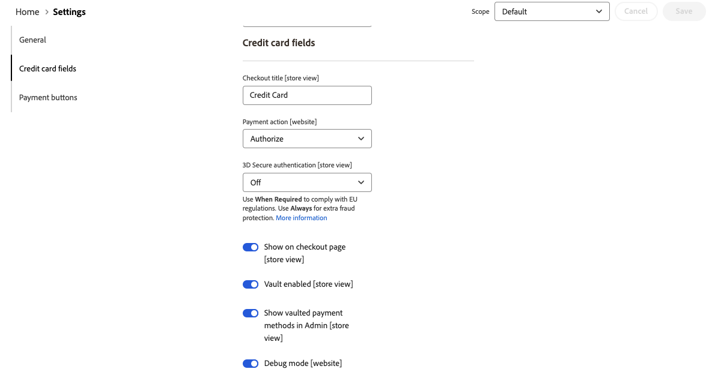

# [!UICONTROL Sales] > [!UICONTROL Payment Methods] > [!UICONTROL Payment Services]

Payment Services提供了一个全包式自助服务解决方案，包括沙盒测试和简单的设置，用于提供强大而安全的支付处理。 若要了解详细信息，请参阅&#x200B;[_Payment Services用户指南_](https://experienceleague.adobe.com/docs/commerce/payment-services/guide-overview.html)。

要访问付款服务的配置设置，请在&#x200B;_管理员_&#x200B;侧边栏中转到&#x200B;**[!UICONTROL Sales]** > **[!UICONTROL Payment Services]**，然后单击&#x200B;**[!UICONTROL Settings]**。

{width="400"}

>[!NOTE]
>
>若要使用旧版配置而不是[设置](https://experienceleague.adobe.com/docs/commerce/payment-services/configure/settings.html)，请参阅[旧版配置](https://experienceleague.adobe.com/docs/commerce/payment-services/configure/configure-admin.html)。

## [!UICONTROL General]

{width="600" zoomable="yes"}

| 字段 | [作用域](../../getting-started/websites-stores-views.md#scope-settings) | 描述 |
|---|---|---|
| [!UICONTROL Enable] | 网站 | 为您的网站启用或禁用[!DNL Payment Services]。 选项： [!UICONTROL Yes] / [!UICONTROL No] |
| [!UICONTROL Payment mode] | 商店视图 | 为存储设置方法或环境。 选项： [!UICONTROL Sandbox] / [!UICONTROL Production] |
| [!UICONTROL Sandbox Merchant ID] | 商店视图 | 您的沙盒商家ID，在沙盒载入期间自动生成。 |
| [!UICONTROL Production Merchant ID] | 商店视图 | 您的生产商家ID，在沙盒载入期间自动生成。 |
| [!UICONTROL Soft Descriptor] | 网站或商店视图 | 向您的网站和商店视图添加软描述符，以提供客户交易信息并描述品牌、商店或产品线。 [!UICONTROL Use website]切换将应用在网站级别添加的任何软描述符。 [!UICONTROL Use default]切换将应用添加为默认值的任何软描述符。 |

{style="table-layout:auto"}

## [!UICONTROL Credit card fields]

{width="600" zoomable="yes"}

| 字段 | [作用域](../../getting-started/websites-stores-views.md#scope-settings) | 描述 |
|---|---|---|
| [!UICONTROL Title] | 商店视图 | 在结帐期间在“付款方式”视图中添加文本，以显示此付款选项的标题。 |
| [!UICONTROL Payment Action] | 网站 | 指定付款方式的[付款操作](payment-methods.md#payment-actions)。 选项： [!UICONTROL Authorize] / [!UICONTROL Authorize and Capture] |
| [!UICONTROL 3DS Secure authentication] | 网站 | 启用或禁用[3DS安全身份验证](https://experienceleague.adobe.com/docs/commerce/payment-services/security-compliance/security.html#3ds)。 选项： [!UICONTROL Always] / [!UICONTROL When Required] / [!UICONTROL Off] |
| [!UICONTROL Show on checkout page] | 网站 | 启用或禁用要在结账页面上显示的信用卡字段。 选项： [!UICONTROL Yes] / [!UICONTROL No] |
| [!UICONTROL Vault enabled] | 商店视图 | 启用或禁用[信用卡保险存储](https://experienceleague.adobe.com/docs/commerce/payment-services/payments-checkout/vaulting.html)。 选项： [!UICONTROL Yes] / [!UICONTROL No] |
| [!UICONTROL Show vaulted payment methods in Admin] | 商店视图 | 启用或禁用使用保管库付款方式[&#128279;](https://experienceleague.adobe.com/docs/commerce/payment-services/payments-checkout/vaulting.html)为管理员中的客户完成订单的功能。 选项： [!UICONTROL Yes] / [!UICONTROL No] |
| [!UICONTROL Debug Mode] | 网站 | 启用或禁用调试模式。 选项： [!UICONTROL Yes] / [!UICONTROL No] |

{style="table-layout:auto"}

## [!UICONTROL Payment buttons]

{width="600" zoomable="yes"}

| 字段 | [作用域](../../getting-started/websites-stores-views.md#scope-settings) | 描述 |
|---|---|---|
| [!UICONTROL Title] | 商店视图 | 在结帐期间，在“付款方式”视图中添加要作为此付款选项的标题显示的文本。 |
| [!UICONTROL Payment Action] | 网站 | 指定付款方式的[付款操作](payment-methods.md#payment-actions){target="_blank"}。 选项： [!UICONTROL Authorize] / [!UICONTROL Authorize and Capture] |
| [!UICONTROL Show PayPal buttons on checkout page] | 商店视图 | 在签出页面上启用或禁用[!DNL PayPal Smart Buttons]。 选项： [!UICONTROL &#x200B; Yes] / [!UICONTROL No] |
| [!UICONTROL Show PayPal buttons on product detail page] | 商店视图 | 在产品详细信息页面上启用或禁用[!DNL PayPal Smart Buttons]。 选项： [!UICONTROL &#x200B; Yes] / [!UICONTROL No] |
| [!UICONTROL Show PayPal buttons in mini-cart preview] | 商店视图 | 在迷你购物车预览中启用或禁用[!DNL PayPal Smart Buttons]。 选项： [!UICONTROL Yes] / [!UICONTROL No] |
| [!UICONTROL Show PayPal buttons on cart page] | 商店视图 | 在购物车页面上启用或禁用[!DNL PayPal Smart Buttons]。 选项： [!UICONTROL Yes] / [!UICONTROL No] |
| [!UICONTROL Show PayPal Pay Later button] | 商店视图 | 启用或禁用显示付款按钮的稍后付款选项外观。 选项： [!UICONTROL Yes] / [!UICONTROL No] |
| [!UICONTROL Show PayPal Pay Later Message] | 网站 | 在购物车、产品页面、迷你购物车和结帐流程中启用或禁用“稍后付款”消息。 选项： [!UICONTROL Yes] / [!UICONTROL No] |
| [!UICONTROL Show Venmo button] | 商店视图 | 启用或禁用显示付款按钮的Venmo付款选项。 选项： [!UICONTROL Yes] / [!UICONTROL No] |
| [!UICONTROL Show Apple Pay button] | 商店视图 | 启用或禁用显示付款按钮的Apple支付付款选项。 选项： [!UICONTROL Yes] / [!UICONTROL No] |
| [!UICONTROL Show PayPal Credit and Debit card button] | 商店视图 | 启用或禁用显示付款按钮的信用卡和借记卡付款选项。 选项： [!UICONTROL Yes] / [!UICONTROL No] |
| [!UICONTROL Debug Mode] | 网站 | 启用或禁用调试模式。 选项： [!UICONTROL Yes] / [!UICONTROL No] |

{style="table-layout:auto"}

## [!UICONTROL PayPal Smart Button Styling]

{width="600" zoomable="yes"}

| 字段 | [作用域](../../getting-started/websites-stores-views.md#scope-settings) | 描述 |
|--- |--- |--- |
| [!UICONTROL Layout] | 商店视图 | 定义付款按钮的布局样式。 选项： [!UICONTROL Vertical] / [!UICONTROL Horizontal] |
| [!UICONTROL Tagline] | 商店视图 | 启用/禁用标语。 选项： [!UICONTROL Yes] / [!UICONTROL No] |
| [!UICONTROL Color] | 商店视图 | 定义付款按钮的颜色。 选项： [!UICONTROL Blue] / [!UICONTROL Gold] / [!UICONTROL Silver] / [!UICONTROL White] / [!UICONTROL Black] |
| [!UICONTROL Shape] | 商店视图 | 定义付款按钮的形状。 选项： [!UICONTROL Rectangular] / [!UICONTROL Pill] |
| [!UICONTROL Responsive Button Height] | 商店视图 | 定义付款按钮是否使用默认高度。 选项： [!UICONTROL Yes] / [!UICONTROL No] |
| [!UICONTROL Height] | 商店视图 | 定义付款按钮的高度。 默认值：无 |
| [!UICONTROL Label] | 商店视图 | 定义付款按钮中显示的标签。 选项： [!UICONTROL PayPal] / [!UICONTROL Checkout] / [!UICONTROL Buynow] / [!UICONTROL Pay] / [!UICONTROL Installment] |

{style="table-layout:auto"}
