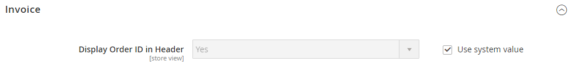

# [!UICONTROL Sales] > [!UICONTROL PDF Print-outs]

{{config}}

<!-- [Invoice](https://experienceleague.adobe.com/en/docs/commerce-admin/stores-sales/site-store/sales-documents) -->

## [!UICONTROL Invoice]

<!-- zoom -->

| 字段 | [作用域](../../getting-started/websites-stores-views.md#scope-settings) | 描述 |
|--- |--- |--- |
| [!UICONTROL Display Order ID in Header] | 商店视图 | 在发票标题中包含订单ID以供参考。 选项： `Yes` / `No` |

{style="table-layout:auto"}

## [!UICONTROL Shipment]

<!-- zoom -->

| 字段 | [作用域](../../getting-started/websites-stores-views.md#scope-settings) | 描述 |
|--- |--- |--- |
| [!UICONTROL Display Order ID in Header] | 商店视图 | 在装运装箱单的题头中包含订单ID以供参考。 选项： `Yes` / `No` |

{style="table-layout:auto"}

## [!UICONTROL Credit Memo]

<!-- zoom -->

| 字段 | [作用域](../../getting-started/websites-stores-views.md#scope-settings) | 描述 |
|--- |--- |--- |
| [!UICONTROL Display Order ID in Header] | 商店视图 | 在贷项通知单标题中包含订单ID以供参考。 选项： `Yes` / `No` |

{style="table-layout:auto"}
