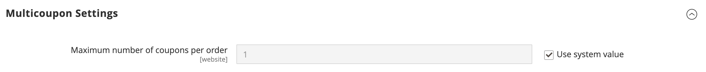

# [!UICONTROL Sales] > [!UICONTROL Sales]

{{config}}

## [!UICONTROL General]

<!-- zoom -->

<!-- [General](https://docs.magento.com/user-guide/marketing/sales-documents-ref-id.html) -->

| 字段 | [作用域](../../getting-started/websites-stores-views.md#scope-settings) | 描述 |
|--- |--- |--- |
| [!UICONTROL Hide Customer IP] | 商店视图 | 确定订单、发票、发运和贷项通知单上是否显示客户IP地址。 选项： `Yes` / `No` |

{style="table-layout:auto"}

## [!UICONTROL Checkout Totals Sort Order]

<!-- zoom -->

<!-- [Checkout Totals Sort Order](https://docs.magento.com/user-guide/sales/checkout-totals-sort-order.html) -->

| 字段 | [作用域](../../getting-started/websites-stores-views.md#scope-settings) | 描述 |
|--- |--- |--- |
| [!UICONTROL Subtotal] | 网站 | 确定小计与其他结账总计的计算时间的一个数字。 默认值： `10` |
| [!UICONTROL Discount] | 网站 | 确定折扣何时与其他结账总数相关的数字。 默认值： `20` |
| [!UICONTROL Shipping] | 网站 | 一个数字，可确定何时将配送次数与其他结账总数相比较进行计算。 默认值： `30` |
| [!UICONTROL Tax] | 网站 | 一个数字，可确定何时将税额与其他结帐总额关联计算。 默认值： `40` |
| [!UICONTROL Fixed Product Tax] | 网站 | 确定固定产品税何时与其他结帐总额相关的数字。 默认值： `50` |
| [!UICONTROL Grand Total] | 网站 | 确定总计与其他结帐总计的计算时间的一个数字。 默认值： `100` |

{style="table-layout:auto"}

## [!UICONTROL Reorder]

<!-- zoom -->

<!-- [Reorder](https://docs.magento.com/user-guide/sales/reorders-allow.html) -->

| 字段 | [作用域](../../getting-started/websites-stores-views.md#scope-settings) | 描述 |
|--- |--- |--- |
| [!UICONTROL Allow Reorder] | 商店视图 | 确定客户是否可以从其帐户重新排序。 选项： `Yes` / `No` |

{style="table-layout:auto"}

## [!UICONTROL Allow Zero Grand Total]

| 字段 | [作用域](../../getting-started/websites-stores-views.md#scope-settings) | 描述 |
|--- |--- |--- |
| [!UICONTROL Allow Zero Grand Total for Credit Memo] | 商店视图 | 确定创建总额为零的贷项通知单的可能性。 选项： `Yes` / `No` |

{style="table-layout:auto"}

## [!UICONTROL Invoice and Packing Slip Design]

<!-- zoom -->

<!-- [Invoice and Packing Slip Design](https://docs.magento.com/user-guide/marketing/sales-document-pdf-logo.html) -->

| 字段 | [作用域](../../getting-started/websites-stores-views.md#scope-settings) | 描述 |
|--- |--- |--- |
| [!UICONTROL Logo for PDF Print-outs] | 商店视图 | 标识显示在PDF发票和包装单标题中的徽标文件。 允许的文件类型：  JPG/JPEG TIF/TIFF PNG |
| [!UICONTROL Logo for HTML Print View] | 商店视图 | 标识出现在发票和装箱单的HTML打印视图标题中的徽标文件。 允许的文件类型：  JPG/JPEG GIF PNG |
| [!UICONTROL Address] | 商店视图 | 您希望显示在发票和装箱单上的商店地址。 |

{style="table-layout:auto"}

## [!UICONTROL Minimum Order Amount]

<!-- zoom -->

<!-- [Minimum Order Amount](https://docs.magento.com/user-guide/sales/cart-minimum-order-amount.html) -->

| 字段 | [作用域](../../getting-started/websites-stores-views.md#scope-settings) | 描述 |
|--- |--- |--- |
| [!UICONTROL Enable] | 网站 | 确定是否为站点设置最小订单金额。 选项： `Yes` / `No` |
| [!UICONTROL Minimum Amount] | 网站 | 指定应用折扣后的订单的最小小计。 |
| [!UICONTROL Include Discount Amount] | 网站 | 确定最小订单金额是否包括应用的折扣。 选项： `Yes` / `No` |
| [!UICONTROL Include Tax to Amount] | 网站 | 确定最小订单金额是否含税。 选项： `Yes` / `No` |
| [!UICONTROL Description Message] | 商店视图 | 确定当购物车总计小于最小订单量时显示在购物车顶部的消息。 如果留空，将显示以下默认消息： `Minimum order amount is $[minimum_amount]` |
| [!UICONTROL Error to Show in Shopping Cart] | 商店视图 | 确定当订单量小于所需的最小订单量时，从迷你购物车或结帐链接显示的消息。 如果保留为空，则会显示默认消息。 |
| [!UICONTROL Validate Each Address Separately in Multi-address Checkout] | 网站 | 对于多物料订单，确定转至单独地址的订单物料是否在很大程度上满足最小订单金额。 选项： `Yes` / `No` |
| [!UICONTROL Multi-address Description Message] | 商店视图 | 对于多地址订单，如果发送到某个地址的项目少于最小订单金额，则确定购物车中显示的消息。 |
| [!UICONTROL Multi-address Error to Show in Shopping Cart] | 商店视图 | 对于多地址订单，当订单金额小于所需的最小订单金额时，确定从迷你购物车或结帐链接显示的消息。 如果保留为空，则会显示默认消息。 |

{style="table-layout:auto"}

## [!UICONTROL Dashboard]

<!-- zoom -->

<!-- [Dashboard](https://docs.magento.com/user-guide/stores/admin-dashboard.html) -->

| 字段 | [作用域](../../getting-started/websites-stores-views.md#scope-settings) | 描述 |
|--- |--- |--- |
| [!UICONTROL Use Aggregated Data] | 全局 | 确定是否使用实时汇总的销售数据生成仪表板快照报表。 如果要处理的数据量很大，可以通过关闭实时数据的显示来提高性能。 选项： `Yes` / `No` |

{style="table-layout:auto"}

## [!UICONTROL Orders Cron Settings]

<!-- zoom -->

<!-- [Orders Cron Settings](https://docs.magento.com/user-guide/system/cron.html) -->

| 字段 | [作用域](../../getting-started/websites-stores-views.md#scope-settings) | 描述 |
|--- |--- |--- |
| [!UICONTROL Pending Payment Order Lifetime] | 网站 | 确定挂单生命周期（以分钟为单位）。 默认设置： `480`分钟（8小时） |

{style="table-layout:auto"}

## [!UICONTROL Gift Options]

<!-- zoom -->

<!-- [Gift Options](https://docs.magento.com/user-guide/sales/gift-options.html) -->

| 字段 | [作用域](../../getting-started/websites-stores-views.md#scope-settings) | 描述 |
|--- |--- |--- |
| [!UICONTROL Allow Gift Messages on Order Level] | 网站 | 指定是否可以为整个订单添加礼品消息。 |
| [!UICONTROL Allow Gift Messages on Order Items] | 网站 | 指定是否可以为单个订单物料添加礼品消息。 |
| [!UICONTROL Allow Gift Wrapping on Order Level] | 网站 | (仅限Adobe Commerce)指定是否可以为整个订单添加礼品包装。 |
| [!UICONTROL Allow Gift Wrapping for Order Items] | 网站 | (仅限Adobe Commerce)指定是否可以为单个订单项添加礼品包装。 |
| [!UICONTROL Allow Gift Receipt] | 网站 | (仅限Adobe Commerce)指定是否可以为订单添加礼品收据。 |
| [!UICONTROL Allow Printed Card] | 网站 | (仅限Adobe Commerce)指定是否可以为订单添加打印卡。 |
| [!UICONTROL Default Price for Printed Card] | 网站 | (仅限Adobe Commerce)指定打印卡片的默认价格。 |

{style="table-layout:auto"}

## [!UICONTROL Minimum Advertised Price]

<!-- zoom -->

<!-- [Minimum Advertised Price](https://docs.magento.com/user-guide/catalog/product-price-minimum-advertised.html) -->

| 字段 | [作用域](../../getting-started/websites-stores-views.md#scope-settings) | 描述 |
|--- |--- |--- |
| [!UICONTROL Enable MAP] | 网站 | 为您的商店激活最低广告价格。 选项： `Yes` / `No` |
| [!UICONTROL Display Actual Price] | 网站 | 确定客户可在何处看到产品的实际价格。 选项：  **`In Cart`**— 显示购物车中的实际产品价格。 **`Before Order Confirmation`** — 在订单确认之前显示结账流程结束时的实际产品价格。  **`On Gesture`**— 当客户单击“点击价格”或“这是什么？”时，在弹出窗口中显示实际产品价格 链接。 |
| [!UICONTROL Default Popup Text Message] | 商店视图 | 客户从类别列表或产品查看页面选择“点击价格”链接时显示的文本消息。 |
| [!UICONTROL Default "What's This" Text Message] | 商店视图 | 客户单击“这是什么？”时显示的短信 产品查看页面中的链接。 |
| [!UICONTROL Manufacturer's Suggested Retail Price] | 全局 | 制造商建议的零售价(MSRP)。 |

{style="table-layout:auto"}

## [!UICONTROL Multicoupon Settings]

{{ee-feature}}

<!-- zoom -->

| 字段 | [作用域](../../getting-started/websites-stores-views.md#scope-settings) | 描述 |
|--- |--- |--- |
| [!UICONTROL Maximum number of coupons per order] | 网站 | 确定每个订单允许的最大优惠券数量。 此功能仅在管理员、GraphQL和REST API中可用。 在店面中&#x200B;**_不可用_**。 |

{style="table-layout:auto"}

## [!UICONTROL Order by SKU Settings]

{{ee-feature}}

<!-- zoom -->

<!-- [Order by SKU Settings](https://docs.magento.com/user-guide/customers/account-dashboard-order-by-sku.html) -->

<!-- zoom -->

| 字段 | [作用域](../../getting-started/websites-stores-views.md#scope-settings) | 描述 |
|--- |--- |--- |
| [!UICONTROL Enable Order by SKU on My Account in Storefront] | 网站 | 确定客户帐户控制面板中是否提供按SKU排序的功能。 选项：  **`Yes, for Everyone`**— “按SKU排序”选项卡出现在所有客户的帐户信息板中。 **`Yes, for Specified Customer Groups`** — “按SKU排序”选项卡显示在指定组或共享目录成员的帐户仪表板中。  **`No`**- Order by SKU选项卡在客户帐户中不可用。 |
| [!UICONTROL Customer Groups] | 网站 | 确定客户组。 选项： `General` / `Retailer` / `Wholesale` |

{style="table-layout:auto"}

## [!UICONTROL Instant Purchase]

<!-- zoom -->

<!-- [Instant Purchase](https://docs.magento.com/user-guide/sales/checkout-instant-purchase.html) -->

| 字段 | [作用域](../../getting-started/websites-stores-views.md#scope-settings) | 描述 |
|--- |--- |--- |
| [!UICONTROL Enabled] | 商店视图 | 如果付款方式(如Braintree)启用了保险库，则为商店视图启用“即时购买”。 选项： `Yes` / `No` |
| [!UICONTROL Button Text] | 商店视图 | 指定在“即时购买”按钮上显示的文本。 默认文本为`Instant Purchase`。 |

{style="table-layout:auto"}

## [!UICONTROL Rate Limiting]

<!-- zoom -->

| 字段 | [作用域](../../getting-started/websites-stores-views.md#scope-settings) | 描述 |
|--------------------------------------------------------|--- |------------------------------------------------------------------------------------------------------------------------------------------------------------------------------------|
| [!UICONTROL Enable rate limiting for placing orders] | 商店视图 | 确定是否使用费率限制从商店视图下订单（默认值为`No`）。 选项： `Yes` / `No`。 |
| [!UICONTROL Requests limit per authenticated customer] | 商店视图 | 经过身份验证的客户在时段内可以发出的购买请求数。 默认限制为`10`。 |
| [!UICONTROL Requests limit per guest] | 商店视图 | 在指定时间段内，未经身份验证的客户可以发出的购买请求数。 默认值为`50`。 |
| [!UICONTROL Counter resets in a ...] | 商店视图 | 经过身份验证/未经身份验证的客户可以发出一定数量的购买请求的时段（默认值为`Minute`）。 选项： `Minute` / `Hour` /`Day` |

{style="table-layout:auto"}

## [!UICONTROL Orders, Invoices, Shipments, Credit Memos Archiving]

{{ee-feature}}

<!-- zoom -->

有关更改这些设置的详细信息，请参阅&#x200B;_商店和购买体验指南_&#x200B;中的[配置订单存档](../../stores-purchase/order-archive.md#configure-the-order-archive)。

| 字段 | [作用域](../../getting-started/websites-stores-views.md#scope-settings) | 描述 |
|--- |--- |--- |
| [!UICONTROL Enable Archiving] | 全局 | 确定是否启用存档。 选项： `Yes` / `No` |
| [!UICONTROL Archive Orders Purchased] | 全局 | 确定已完成的订单存档之前的天数。 默认值： `30` |
| [!UICONTROL Order  Statuses to be Archived] | 全局 | 确定要存档的[状态](../../stores-purchase/order-status.md)。 默认情况下，系统会将状态为“完成”或“已关闭”的订单存档。 选项： `Pending` / `Processing` / `Suspected Fraud` / `Complete` / `Closed` / `Canceled` / `On Hold` |

{style="table-layout:auto"}

## [!UICONTROL RMA Settings]

{{ee-feature}}

<!-- zoom -->

有关更改这些设置的详细信息，请参阅&#x200B;_商店和购买体验指南_&#x200B;中的[配置退货](../../stores-purchase/rma-configure.md)。

| 字段 | [作用域](../../getting-started/websites-stores-views.md#scope-settings) | 描述 |
|--- |--- |--- |
| [!UICONTROL Enable RMA on Storefront] | 网站 | 确定客户是否可以从店面创建和查看RMA请求。 RMA可同时应用于新订单和现有订单。 默认情况下，店面未启用RMA。 选项： `Yes` / `No` |
| [!UICONTROL Enable RMA on Product Level] | 网站 | 确定产品信息中“启用RMA”字段的默认值。 |
| [!UICONTROL Use Store Address] | 网站 | 确定用于退回商品装运的联系人姓名和地址。 选项：  **`Yes`**— 使用配送设置中的[原点](../../stores-purchase/shipping-settings.md#point-of-origin)地址。 **`No`** — 打开地址表单，以便输入备用地址。 |

{style="table-layout:auto"}
