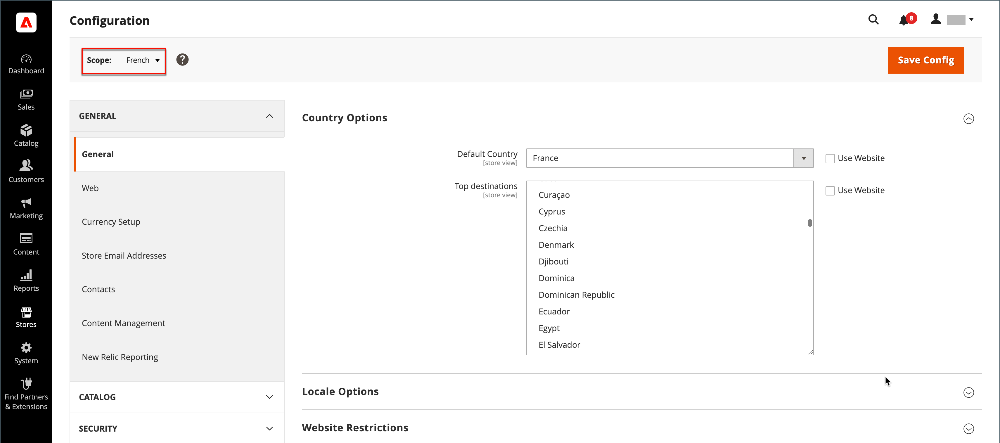

# 配置范围

位于许多配置页面左上角的商店视图选择器会过滤特定范围的页面视图，并设置Commerce使用的某些实体的值。 它按名称列出层次中的每个级别，并用于将范围更改为另一个级别。 表示当前范围的任何设置都将显示为灰色，因此只有表示当前范围设置的设置才可用。 范围最初设置为&#x200B;_默认配置_。 对于具有受限访问权限的管理员用户，可用商店视图列表仅包括用户具有[权限](../systems/permissions.md)访问权限的商店。

| 级别 | 描述 |
|--- |--- |
| [!UICONTROL Default Config] | 默认系统配置。 |
| [!UICONTROL Main Website] | 层次结构顶部的网站的名称。 |
| [!UICONTROL Main Website Store] | 与父网站关联的默认存储的名称。 |
| [!UICONTROL Default Store View] | 与父存储关联的默认存储视图的名称。 |
| [!UICONTROL Stores Configuration] | 跳转到商店网格，等同于从管理员侧边栏中选择[!UICONTROL Stores] > [!UICONTROL All Stores]。 |

{style="table-layout:auto"}

{width="700" zoomable="yes"}

## [!UICONTROL Use system value]

许多配置设置右侧的&#x200B;_[!UICONTROL Use System Value]_&#x200B;复选框用于应用或覆盖当前配置范围内的默认字段值。 选中复选框后，无法更改默认字段值。 要更改值，请清除复选框并输入新值。 每当您更改系统值时，系统都会提示您进行确认。

复选框标签会根据当前范围进行更改，并且始终指在范围层次结构中向上一级设置的父级。 由于父级别是该级别下所有项目的容器，因此父级别的范围设置将被继承，除非被覆盖。

## 默认值选项

| 复选框 | 描述 |
|--- |--- |
| [!UICONTROL Use system value] | 当配置范围设置为`Default Config`时，将出现此复选框。 |
| [!UICONTROL Use Default] | 当配置范围设置为“主要`Website`”，并引用分配给网站的默认存储区时，将出现此复选框。 |
| [!UICONTROL Use Website] | 当配置范围设置为特定存储视图时，将出现此复选框。 选中后，它会使用与商店视图关联的父网站的设置。 在这种情况下，将跳过存储级别，因为可以理解，存储级别适用于与网站关联的默认存储。 |

{style="table-layout:auto"}

## 设置范围

在进行仅应用于特定网站、商店或商店视图的配置设置之前，请执行以下操作：

1. 在&#x200B;_管理员_&#x200B;侧边栏上，执行以下操作之一：

   - 对于大多数配置设置，请转到&#x200B;**[!UICONTROL Stores]** > _[!UICONTROL Settings]_>**[!UICONTROL Configuration]**。

   - 对于[设计相关的设置](../content-design/configuration.md)，请转到&#x200B;**[!UICONTROL Content]** > _[!UICONTROL Design]_>**[!UICONTROL Configuration]**。 然后在网格中，选择适用的商店视图。

1. 导航到要更改的配置设置，然后执行以下操作：

   - 在左上角，将&#x200B;**[!UICONTROL Store View]**&#x200B;设置为应用配置的特定视图。 提示确认范围切换时，单击&#x200B;**[!UICONTROL OK]**。

     每个字段之后都会显示一个复选框，并且其他字段可能会变得可用。

   - 在要编辑的任何字段后面清除&#x200B;**[!UICONTROL Use system value]**&#x200B;复选框。 然后，更新视图的值。

   - 对页面上需要更新的每个字段重复此过程。

   {width="700" zoomable="yes"}

1. 完成后，单击&#x200B;**[!UICONTROL Save Config]**。

## 范围快速参考

| 范围 | 描述 |
|--- |--- |
| **[!UICONTROL Global]** |  |
| 管理员 | 安装中的所有网站、商店和商店视图都由同一管理员进行管理。 |
| 默认配置 | 全局[默认配置](../getting-started/websites-stores-views.md#scope-settings)设置通过存储层次结构使用，除非在较低级别覆盖它们。 |
| 目录 | 术语&#x200B;_catalog_&#x200B;是指整个产品数据库，可在整个安装过程中使用。 |
| 产品价格 | 可以在全局或网站级别为应用程序配置产品价格。 |
| 产品配置 | 用作[可配置产品](../catalog/product-create-configurable.md)选项的属性必须具有全局范围。 |
| 客户 | 客户帐户可以配置为在全球或网站级别进行应用。 每个网站都可以拥有单独的[客户帐户](../customers/customer-account-scope.md)集，或者与安装中的其他网站共享客户帐户。 |
| **[!UICONTROL Website]** |  |
| 域 | 其他[网站](../stores-purchase/introduction.md#store-structure)可以设置为主域的子域，或者具有单独的IP地址和专用域。 |
| 客户 | 客户帐户可以配置为在全球或网站级别进行应用。 每个网站都可以拥有单独的[客户帐户](../customers/customer-account-scope.md)集，或者与安装中的其他网站共享客户帐户。 |
| 货币 | 可以为每个网站分配不同的[基本货币](../stores-purchase/currency-configuration.md)。 尽管根据商店视图的区域设置，客户可能会看到不同的显示货币，但基本货币仍用于处理所有事务。 |
| 产品 | 单个产品会被分配到网站级别的层级。 “产品”网格会列出目录中的所有产品以及可提供这些产品的网站。 网站中的[产品](../catalog/settings-basic-websites.md)设置标识了产品可用的每个网站。 |
| 产品价格 | 可以在全局或网站级别为应用程序配置[产品价格](../catalog/catalog-price-scope.md)。 |
| 支付方式 | [付款方法](../stores-purchase/payments.md)是在网站级别配置的，尽管可以为每个商店视图配置标题和说明。 |
| 结帐 | [结帐流程](../stores-purchase/checkout-process.md)在网站级别进行，但可以为每个商店视图配置某些显示选项。 与网站关联的所有商店具有相同的[签出配置](../stores-purchase/checkout-process.md#checkout-options)。 |
| 允许的国家/地区 | 可以在网站级别配置允许的国家/地区。 在结账中使用[允许的国家/地区](../getting-started/store-details.md#country-options)设置来限制客户的来源。 |
| **[!UICONTROL Store]** |  |
| 域 | 如果有多个商店，每个商店可以具有相同的域、子域或截然不同的域。 有关详细信息，请参阅[添加存储](../stores-purchase/stores.md#add-stores)。 |
| 根类别 | 每个商店可以具有基于“根”类别和子类别的单独产品和主菜单集。 每个目录都有一个在存储级别分配的[根类别](../catalog/category-root.md)。 |
| **[!UICONTROL Store View]** |  |
| 子类别 | 构成主菜单（在根下）的[子类别](../catalog/category-create.md#category-structure)在存储视图级别分配。 |
| 区域设置 | 可以为每个商店视图分配不同的[区域设置](../getting-started/store-details.md#locale-options)。 显示货币、度量单位和管理界面均特定于区域设置。 |
| 语言 | 若要支持多种语言，每个商店视图的所有内容（包括产品描述）都必须经过[翻译](../stores-purchase/store-localize.md#localize-products)。 |
| 显示货币 | 尽管使用基本货币在网站级别处理事务，但每个商店视图可以使用不同的[显示货币](../stores-purchase/currency-configuration.md)。 |

{style="table-layout:auto"}
