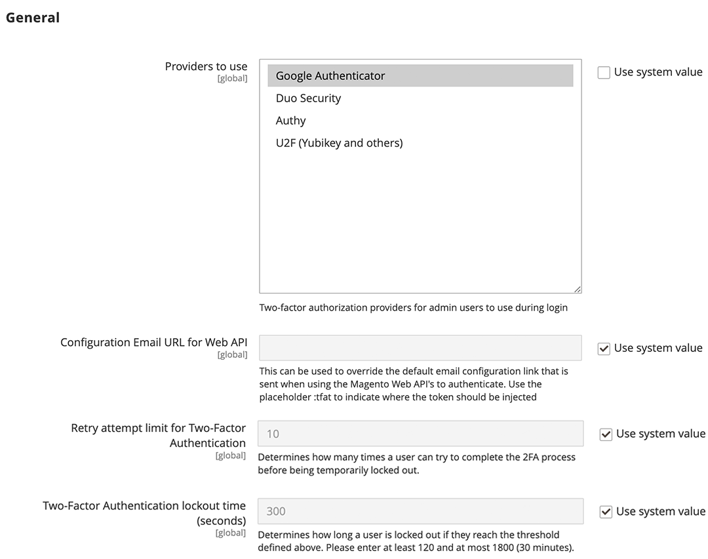

# [!UICONTROL Security] > [!UICONTROL 2FA]

>[!NOTE]
>
>启用了Adobe Identity Management Services (IMS)身份验证的存储已禁用本机Adobe Commerce和Magento Open Source双重身份验证(2FA)。 使用其Adobe凭据登录到其Adobe Commerce实例的管理员用户不需要对许多管理员任务重新进行身份验证。 当管理员用户登录到其当前会话时，身份验证由Adobe IMS处理。 请参阅[将Adobe Commerce与Adobe IMS集成概述](https://experienceleague.adobe.com/docs/commerce-admin/start/admin/ims/adobe-ims-integration-overview.html?lang=zh-Hans)。

{{config}}

有关更改这些设置的详细信息，请参阅&#x200B;_管理系统指南_&#x200B;中的[双重身份验证(2FA)](../../systems/security-two-factor-authentication.md)。

## [!UICONTROL General]

<!-- zoom -->

| 字段 | [作用域](../../getting-started/websites-stores-views.md#scope-settings) | 描述 |
|--- |--- |--- |
| [!UICONTROL Providers to use] | 全局 | 指示所需的双重身份验证方法。 如果选择多个提供程序，则每个用户在下次登录时都需要配置每个2FA方法。 |
| [!UICONTROL Configuration Email URL for Web API] | 全局 | 对于自定义实施，在首次登录时发送到&#x200B;_管理员_&#x200B;用户的备用电子邮件配置链接的URL。 在电子邮件模板中，使用占位符`:tfat`指示令牌的插入位置。 |
| [!UICONTROL Retry attempt limit for Two-Factor Authentication] | 全局 | 确定在暂时禁用管理员的帐户之前，管理员可以输入[!DNL one-time password (OTP)]的次数。 默认： `10` |
| [!UICONTROL Two-Factor Authentication lockout time (seconds)] | 全局 | 确定在暂时禁用管理员的帐户之前，管理员可以等待多长时间（以秒为单位）才能输入[!DNL one-time password (OTP)]。 默认： `300` |

{style="table-layout:auto"}

## [!UICONTROL Google]

<!-- zoom -->

| 字段 | [作用域](../../getting-started/websites-stores-views.md#scope-settings) | 描述 |
|--- |--- |--- |
| [!UICONTROL OTP Window] | 全局 | 确定系统在管理员的[!DNL one-time-password (OTP)]过期后接受多长时间（以秒为单位）。 不能超过单个OTP的生命周期（通常为30秒）。 默认： `29` |

{style="table-layout:auto"}

## [!UICONTROL Duo Security]

<!-- zoom -->

| 字段 | [作用域](../../getting-started/websites-stores-views.md#scope-settings) | 描述 |
|--- |--- |--- |
| [!UICONTROL Client Id] | 全局 | [!DNL Duo Security]帐户中的客户端ID。 |
| [!UICONTROL Client Secret] | 全局 | [!DNL Duo Security]帐户中的客户端密钥。 |
| [!UICONTROL Integration Key] | 全局 | [!DNL Duo Security] API帐户中的集成密钥。 |
| [!UICONTROL Secret Key] | 全局 | [!DNL Duo Security] API帐户中的密钥。 |
| [!UICONTROL API Hostname] | 全局 | [!DNL Duo Security]帐户中的API主机名。 |

{style="table-layout:auto"}

## [!UICONTROL Authy]

<!-- zoom -->

| 字段 | [作用域](../../getting-started/websites-stores-views.md#scope-settings) | 描述 |
|--- |--- |--- |
| [!UICONTROL API Key] | 全局 | [!DNL Authy]帐户中的API密钥。 |
| [!UICONTROL OneTouch Message] | 全局 | 登录时[!DNL Authy]验证器中显示的消息。 默认： `Login request to your Magento Admin` |

{style="table-layout:auto"}

## [!UICONTROL U2F Key]

<!-- zoom -->

| 字段 | [作用域](../../getting-started/websites-stores-views.md#scope-settings) | 描述 |
|--- |--- |--- |
| [!UICONTROL WebApi Challenge Domain] | 全局 | 用于为自定义WebAPI实施发出和处理[!DNL WebAuthn]挑战的域。 |

{style="table-layout:auto"}
